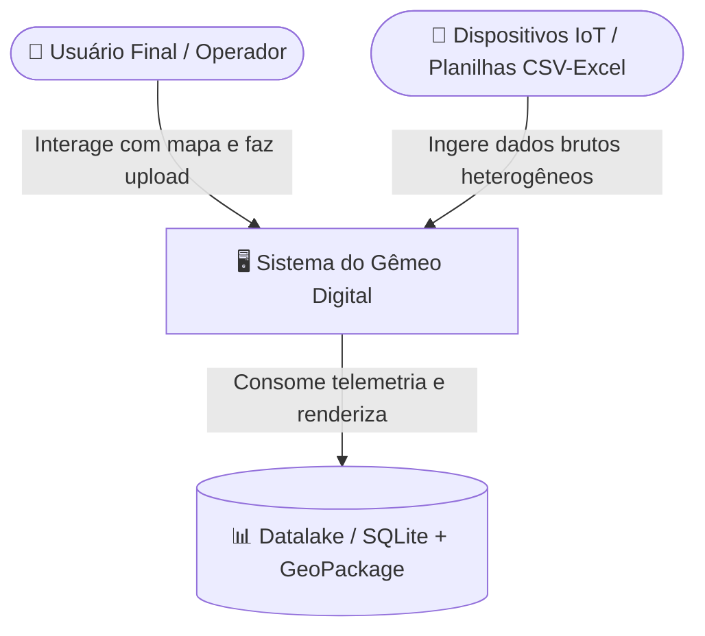
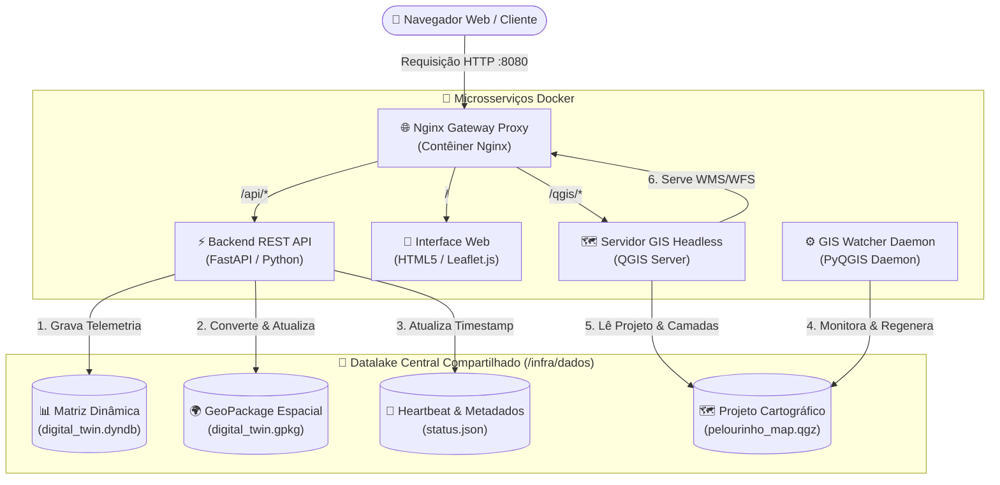

# 🏛️ Conceitos & Arquitetura C4: Gêmeo Digital IoT

Este documento apresenta a modelagem formal da arquitetura do sistema do **Gêmeo Digital da UNIFACS**, utilizando o **Modelo C4** (Contexto e Contêineres) para mapear os componentes, barramentos de comunicação e fluxos de persistência.

---

## 1. Visão de Contexto (Modelo C4 - Nível 1)

O mapa de contexto estabelece as fronteiras do sistema, mostrando como o operador/usuário final e os dispositivos/arquivos IoT interagem com a solução.

### Componentes do Nível 1:
* **Usuário Final / Operador:** Acessa o dashboard web no navegador para visualizar o estado em tempo real dos sensores e cadastrar novas coordenadas.
* **Sistema do Gêmeo Digital:** Ecossistema em contêineres que processa, valida, geoespacializa e serve os dados cartográficos.
* **Datalake Central:** Camada de persistência local contendo a matriz dinâmica `.dyndb` e o banco espacial `.gpkg`.

---

## 2. Visão de Contêineres (Modelo C4 - Nível 2)

A aplicação adota a **Topologia Estrela (Hub-and-Spoke)**, na qual 5 microsserviços Docker desacoplados orbitam um volume de dados compartilhado.

---

## 3. Padrão Adapter (Design Pattern)

A API FastAPI atua como um **Adaptador de Dados (Data Adapter)**:
1. Os dados brutos de entrada (CSV, Excel ou payloads IoT) podem possuir qualquer estrutura de colunas.
2. A API ingested esses dados e os padroniza na matriz dinâmica `.dyndb`.
3. Em seguida, a API adapta esses registros tabulares em feições geométricas vetoriais de pontos (`POINT`) dentro do arquivo GeoPackage `.gpkg`.
4. Dessa forma, o **QGIS Server** não precisa entender a lógica de negócio ou ingestão IoT; ele apenas consome a especificação padrão OGC do GeoPackage.
