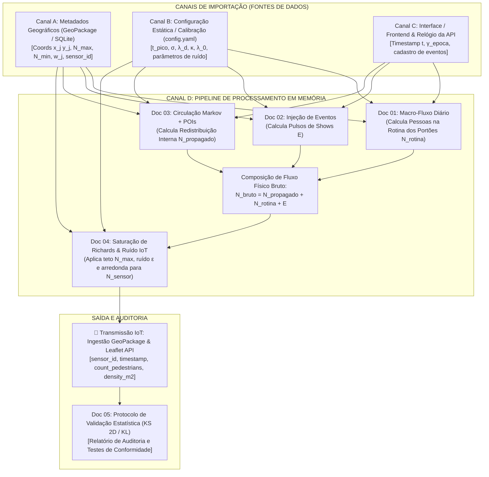

# 🏛️ Doc 00: Arquitetura de Ingestão, Barramento de Dados e Canais de Entrada
## Guia Central de Dados para a Suíte de Simulação Sintética do Pelourinho

**Classificação:** Documento Técnico Central / Arquitetura de Dados  
**Módulo Pertencente:** Container de API (`backend/src/api/` & `backend/src/dyntable/`)  
**Contexto do Projeto:** Gêmeo Digital IoT Geoespacial do Centro Histórico do Pelourinho — UNIFACS  

---

## 📌 1. Visão Geral e Propósito

Este documento é a **fonte única da verdade (*Single Source of Truth*)** sobre como os dados e parâmetros entram, transitam em memória e saem do container de API durante a simulação de dados sintéticos de pedestres.

Ao invés de duplicar regras de banco e configurações em cada formulação matemática individual, os módulos especializados da suíte (**Docs 01 a 05**) herdam as definições estruturais, tipos e canais de importação especificados neste documento.



---

## 🧭 2. Os 4 Canais Padronizados de Importação

### 2.1. Canal A — Metadados do Banco e Geometrias (GeoPackage / SQLite)
Os nós de sensoriamento do Pelourinho possuem atributos físicos e geográficos persistidos na camada vetorial de sensores do GeoPackage (`sensores_pelourinho`).

#### Schema da Tabela de Sensores:
| Coluna | Tipo SQLite | Unidade | Descrição | Exemplo |
| :--- | :---: | :---: | :--- | :--- |
| `sensor_id` | `TEXT PRIMARY KEY` | — | Identificador textual único do ponto de captura. | `"sensor_largo_pelourinho"` |
| `nome_local` | `TEXT` | — | Nome amigável do logradouro ou POI monitorado. | `"Largo do Pelourinho"` |
| `geom` | `POINT` (WGS84) | graus | Coordenadas geográficas $(x_j, y_j)$ da câmera/sensor. | `POINT(-38.5085 -12.9718)` |
| `max_capacity` ($N_{j, \max}$) | `INTEGER` | pessoas | Lotação física máxima permitida pelo espaço. | `150` |
| `min_baseline` ($N_{j, \min}$) | `INTEGER` | pessoas | Piso basal de circulação na madrugada (03h00). | `5` |
| `gate_weight` ($w_j$) | `REAL` | fração | Peso de distribuição de entrada pelo bairro ($\sum w_j = 1$). | `0.45` |
| `poi_type` | `TEXT` | — | Categoria do atrator (`IGREJA`, `SHOW`, `MUSEU`, `RUA`). | `"SHOW"` |

---

### 2.2. Canal B — Arquivo de Configuração Estática e Calibração (`config.yaml`)
Parâmetros matemáticos globais e constantes físicas de calibração que balizam as equações da suíte.

```yaml
# backend/shared/config_simulacao.yaml
simulation:
  temporal:
    peak_hour_default: 16.5       # t_pico = 16h30
    spread_hours_default: 3.0     # σ = 3.0 horas
    fundamental_period: 24.0      # T_ciclo = 24h
    step_minutes: 5.0             # Intervalo Δt do tick de simulação
  
  network_markov:
    distance_decay_lambda: 0.015  # λ_d (decaimento espacial por metro)
  
  sensor_saturation:
    richards_slope: 0.08          # κ (declividade da barreira logística)
    richards_inflection: 0.0      # λ_0 (ponto médio de inflexão)
  
  sensor_noise:
    active_method: "ORNSTEIN_UHLENBECK" # UNIFORM | GAUSSIAN | ORNSTEIN_UHLENBECK
    uniform_radius: 3.0           # R (±3 pessoas)
    gaussian_std: 2.5             # σ_ruido
    ou_mean_reversion: 1.2        # θ (taxa de reversão à média por hora)
```

---

### 2.3. Canal C — Interface do Usuário (Frontend) e Relógio da API
Parâmetros dinâmicos transmitidos em tempo real via requisições HTTP REST ou lidos do relógio operacional do servidor.

#### A. Relógio do Sistema:
* O instante contínuo de simulação $t$ é extraído do relógio:
  $$t_{\text{hora}} = \text{hora} + \frac{\text{minuto}}{60} + \frac{\text{segundo}}{3600}, \quad t_{\text{hora}} \in [0, 24)$$
  $$d_{\text{semana}} = \text{dia\_da\_semana} \in \{0 = \text{Segunda}, \dots, 6 = \text{Domingo}\}$$

#### B. Payload de Configuração da Simulação (`POST /api/v1/simulation/config`):
```json
{
  "gamma_seasonality": 1.5,
  "override_noise_method": "ORNSTEIN_UHLENBECK",
  "enable_events": true
}
```

#### C. Payload de Cadastro de Eventos (`POST /api/v1/simulation/events`):
```json
{
  "event_id": "olodum_terca_bencao_01",
  "event_name": "Ensaio do Olodum",
  "target_sensor_id": "sensor_largo_pelourinho",
  "date": "2026-09-15",
  "start_hour": 19.5,
  "duration_hours": 2.5,
  "peak_magnitude": 120
}
```

---

### 2.4. Canal D — Pipeline em Memória (Estruturas de Dados Intermediárias)
Para manter latência abaixo de $1\text{ ms}$, os módulos comunicam-se via vetores e matrizes em memória RAM através de arrays NumPy de dimensão fixa $J$ (onde $J$ é a quantidade total de sensores instalados no Pelourinho, ex: $J = 5$):

* **$\mathbf{w} \in \mathbb{R}^J$:** Vetor coluna de pesos dos portões de entrada ($\sum w_j = 1$);
* **$\mathbf{N}_{\text{rotina}}(t) \in \mathbb{R}^J$:** Pessoas na rotina dos portões no ciclo $t$ (Saída do Doc 01 em indivíduos);
* **$\mathbf{E}(t) \in \mathbb{R}^J$:** Acréscimo pontual de eventos por nó no ciclo $t$ (Saída do Doc 02 em indivíduos);
* **$\mathbf{P}(t) \in \mathbb{R}^{J \times J}$:** Matriz estocástica de transição de Markov (Calculada no Doc 03);
* **$\mathbf{N}_{\text{propagado}}(t+1) \in \mathbb{R}^J$:** Pessoas redistribuídas internamente (Saída do Doc 03 em indivíduos);
* **$\mathbf{N}_{\text{bruto}}(t+1) \in \mathbb{R}^J$:** Soma física de pedestres antes do sensoriamento:
  $$\mathbf{N}_{\text{bruto}}(t+1) = \mathbf{N}_{\text{propagado}}(t+1) + \mathbf{N}_{\text{rotina}}(t) + \mathbf{E}(t)$$
* **$\mathbf{N}^{\text{sensor}}(t+1) \in \mathbb{N}^J$:** Vetor final de telemetria discretizada dos sensores (Saída do Doc 04).

---

## 📖 3. Dicionário Global de Variáveis Padronizadas

Todas as equações dos Docs 01 a 05 utilizam as duas convenções de notação mapeadas abaixo:

| Categoria | Opção A (Clássica / Artigo) | Opção B (Mnemônica / Código) | Unidade | Significado Físico / Conceito | Canal de Origem |
| :--- | :---: | :---: | :---: | :--- | :---: |
| **Tempo** | $t$ | $t$ | $\text{h}$ | Tempo acumulado contínuo ($t \ge 0$). | Canal C |
| | $h(t)$ | $t_{\text{hora}}$ | $\text{h}$ | Hora do dia ($t \pmod{24} \in [0, 24)$). | Canal C |
| | $T$ | $T_{\text{ciclo}}$ | $\text{h}$ | Período fundamental ($24\text{ h}$ ou $168\text{ h}$). | Canal B |
| | $\tau$ ou $t_{\text{pico}}$ | $t_{\text{pico}}$ | $\text{h}$ | Horário do ápice turístico ($16\text{h}30$). | Canal B |
| | $\sigma$ | $t_{\text{duracao}}$ | $\text{h}$ | Espalhamento temporal do fluxo diário. | Canal B |
| **Capacidade** | $N_{\max}$ ou $N_{j, \max}$ | $N_{j, \max}$ | $\text{indivíduos}$ | Capacidade física máxima da rua monitorada. | Canal A |
| | $N_{\min}$ ou $N_{j, \min}$ | $N_{j, \min}$ | $\text{indivíduos}$ | Piso basal de circulação na madrugada. | Canal A |
| | $w_j$ | $w_j$ | $\text{adimensional}$ | Peso de portão de entrada do sensor $j$. | Canal A |
| **Eventos** | $A_{jm}$ | $A_{\text{evento}, jm}$ | $\text{indivíduos}$ | Lotação máxima agregada pelo evento $m$. | Canal C / A |
| | $\gamma$ | $\gamma_{\text{epoca}}$ | $\text{fator}$ | Multiplicador sazonal (verão/Carnaval). | Canal C |
| **Rede** | $\mathbf{P}(t) = [P_{ij}]$ | $\mathbf{P}_{\text{markov}}(t)$ | $\text{probabilidade}$ | Matriz de transição de probabilidades. | Canal D |
| | $d_{ij}$ | $d_{ij}$ | $\text{metros}$ | Distância euclidiana geográfica entre sensores. | Canal A |
| | $\alpha_j(t)$ | $\alpha_{\text{atracao}, j}(t)$ | $\text{adimensional}$ | Peso de atratividade instantânea do POI $j$. | Canal B / C |
| | $\lambda_d$ | $\lambda_{\text{distancia}}$ | $\text{m}^{-1}$ | Taxa de decaimento de atração por distância. | Canal B |
| **Saturação/Ruído**| $\kappa_j$ | $\kappa_{\text{declive}, j}$ | $\text{h}^{-1}$ | Declividade logística da barreira de Richards. | Canal B |
| | $\epsilon_j(t)$ | $\epsilon_{\text{ruido}, j}(t)$ | $\text{indivíduos}$ | Perturbação estocástica do hardware. | Canal D |
| | $\theta$ | $\theta_{\text{reversao}}$ | $\text{h}^{-1}$ | Taxa de reversão à média de Ornstein-Uhlenbeck. | Canal B |

---

## 📡 4. Padrão de Exportação e Ingestão no Datalake

A telemetria final gerada no final do pipeline (Doc 04) é emitida em dois formatos estruturados:

### 4.1. Registro Tabular no Datalake GeoPackage (`telemetria_sensores`)
```sql
INSERT INTO telemetria_sensores (
    sensor_id, 
    timestamp, 
    contagem_pedestres, 
    densidade_m2, 
    status_aglomeracao
) VALUES (
    'sensor_largo_pelourinho',
    '2026-09-15T16:30:00.000Z',
    58,
    0.38,
    'NORMAL'
);
```

### 4.2. Payload JSON para a API do Leaflet / QGIS Server
```json
{
  "sensor_id": "sensor_largo_pelourinho",
  "nome_local": "Largo do Pelourinho",
  "timestamp": "2026-09-15T16:30:00Z",
  "metrics": {
    "count_pedestrians": 58,
    "max_capacity": 150,
    "occupancy_rate_pct": 38.67,
    "density_m2": 0.38
  },
  "status": "NORMAL",
  "coordinates": {
    "latitude": -12.9718,
    "longitude": -38.5085
  }
}
```
