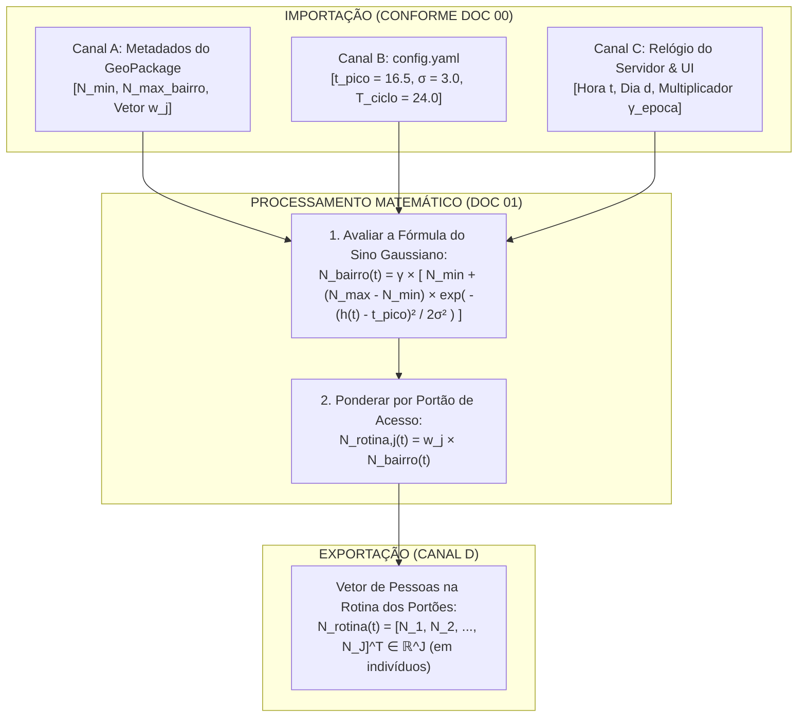

# 🌅 Doc 01: Macro-Fluxo Circadiano & Distribuição por Portões de Entrada ($w_j$)
## Especificação Técnica para Simulação do Volume Diário de Pedestres no Pelourinho

**Classificação:** Especificação Técnica de Subsistema / Modelo Matemático  
**Módulo Pertencente:** Container de API (`backend/src/api/` — Subsistema de Macro-Fluxo)  
**Documento Central de Referência:** [`00_arquitetura_ingestao_e_fluxo_dados.md`](file:///c:/Users/joaof/Documents/Unifacs/ICs/digital_twins/docs/explanation/dados_sinteticos/00_arquitetura_ingestao_e_fluxo_dados.md)  

---

## 📌 1. Visão Geral e Contextualização Urbana

O Centro Histórico do Pelourinho opera como um **sistema urbano aberto**: o público não é fixo dentro do bairro. Ao longo do dia, turistas e moradores entram pelas portas principais de acesso (Elevador Lacerda, Praça da Sé, Ladeira do Carmo) pela manhã e dispersam de volta aos hotéis e residências no período noturno.

A responsabilidade deste módulo é calcular o **volume diário basal de pedestres no Pelourinho ($N_{\text{bairro}}(t)$)** utilizando a **exata fórmula do Sino Gaussiano apresentada ao orientador** e alocar essa quantidade nos sensores posicionados nos portões de entrada física através do vetor de pesos $\mathbf{w}$.



---

## 📋 2. Requisitos do Subsistema

### 2.1. Requisitos Funcionais (RFs)
* **RF01 — Curva Exata do Sino Gaussiano:** O módulo deve computar a lotação global do Pelourinho $N_{\text{bairro}}(t)$ aplicando a exata fórmula fechada com 4 parâmetros ($N_{\min}$, $N_{\max}$, $t_{\text{pico}} \approx 16\text{h}30$, $\sigma \approx 3\text{h}$);
* **RF02 — Distribuição por Portões ($w_j$):** O módulo deve alocar o volume $N_{\text{bairro}}(t)$ entre os sensores através do vetor de pesos $\mathbf{w} \in \mathbb{R}^J$, onde cada elemento $w_j \in [0, 1]$ representa a fatia do público que acessa o bairro por aquele portão;
* **RF03 — Conservação de Fluxo:** A soma de todos os pesos de portão deve ser estritamente unitária ($\sum_{j=1}^J w_j = 1.0$). Sensores internos sem entrada física externa possuem $w_j = 0.0$;
* **RF04 — Modulação Sazonal ($\gamma$):** O módulo deve multiplicar a curva pelo fator sazonal $\gamma$ (ex: $\gamma = 1.0$ dias úteis; $\gamma = 1.5$ alta estação; $\gamma = 3.5$ Carnaval);
* **RF05 — Relógio Circadiano Contínuo:** O módulo deve calcular a hora circadiana através do operador módulo $h(t) = t \pmod{24}$, garantindo simulação ininterrupta 24 horas por dia.

### 2.2. Requisitos Não-Funcionais (RNFs)
* **RNF01 — Complexidade Temporal $O(1)$:** A avaliação analítica da função exponencial executa em tempo constante ($< 10\ \mu\text{s}$) por ciclo;
* **RNF02 — Exportação Direta em Indivíduos:** A função deve retornar diretamente a **quantidade de pessoas físicas calculadas** para cada sensor (em unidades de indivíduos), pronta para soma no barramento;
* **RNF03 — Compatibilidade e Tipagem:** Operações aritméticas estritamente compatíveis com NumPy float64 e Python 3.11+.

---

## 🧮 3. Formulação Matemática Crua (A Exata Equação da Apresentação)

### 3.1. Equação do Volume Global do Bairro $N_{\text{bairro}}(t)$
$$N_{\text{bairro}}(t) = \gamma \cdot \left[ N_{\min} + (N_{\max, \text{bairro}} - N_{\min}) \cdot \exp\left( -\frac{(h(t) - t_{\text{pico}})^2}{2\sigma^2} \right) \right]$$

Onde:
* $h(t) = t \pmod{24}$ é a hora do dia no relógio circadiano ($h \in [0, 24)$);
* $N_{\min}$ é a população flutuante residual da madrugada ($03\text{h}00$);
* $N_{\max, \text{bairro}}$ é a capacidade máxima total acumulada no centro histórico;
* $t_{\text{pico}}$ é o horário central de ápice de visitação (ex: $16.5 = 16\text{h}30$);
* $\sigma$ é a largura temporal da janela turística (ex: $\sigma = 3.0\text{ h}$);
* $\gamma$ é o multiplicador sazonal ($\gamma = 1.0$ dias normais; $\gamma > 1.0$ eventos/verão).

---

### 3.2. Ponderação Espacial por Portão de Entrada ($w_j$)
A quantidade de pessoas da rotina diária no sensor $j$ no instante $t$ é:

$$N_{j, \text{rotina}}(t) = w_j \cdot N_{\text{bairro}}(t)$$

Em notação vetorial para os $J$ nós da rede:
$$\mathbf{N}_{\text{rotina}}(t) = \mathbf{w} \cdot N_{\text{bairro}}(t) = \begin{bmatrix} w_1 \\ w_2 \\ \vdots \\ w_J \end{bmatrix} \cdot \gamma \cdot \left[ N_{\min} + (N_{\max, \text{bairro}} - N_{\min}) \cdot \exp\left( -\frac{(h(t) - t_{\text{pico}})^2}{2\sigma^2} \right) \right]$$

Com a restrição física de conservação:
$$\sum_{j=1}^J w_j = 1.0$$

---

## 📖 4. Dicionário de Variáveis e Tipagem do Módulo

| Símbolo (Opção A) | Símbolo (Opção B) | Tipo Primitivo | Unidade | Descrição / Valor Típico | Canal de Origem |
| :---: | :---: | :---: | :---: | :--- | :---: |
| $t$ | $t$ | `float64` | horas | Tempo acumulado contínuo ($t \ge 0$). | Canal C |
| $h(t)$ | $t_{\text{hora}}$ | `float64` | horas | Hora do dia ($h \in [0, 24)$). | Canal C |
| $N_{\max, \text{bairro}}$ | $N_{\text{max\_bairro}}$ | `int` | indivíduos | Lotação máxima global do Pelourinho ($300$). | Canal A |
| $N_{\min}$ | $N_{\text{min\_bairro}}$ | `int` | indivíduos | Piso basal da madrugada ($15$). | Canal A |
| $t_{\text{pico}}$ | $t_{\text{pico}}$ | `float64` | horas | Horário central do pico ($16.5 = 16\text{h}30$). | Canal B |
| $\sigma$ | $t_{\text{duracao}}$ | `float64` | horas | Espalhamento do pico ($3.0\text{ h}$). | Canal B |
| $\gamma$ | $\gamma_{\text{epoca}}$ | `float64` | adimensional | Multiplicador de época ($1.0$ a $3.5$). | Canal C |
| $\mathbf{w}$ | $\mathbf{w}_{\text{portoes}}$ | `ndarray (J,)` | frações | Vetor de pesos dos portões ($\sum w_j = 1$). | Canal A |
| $\mathbf{N}_{\text{rotina}}(t)$ | $\mathbf{N}_{\text{rotina}}(t)$ | `ndarray (J,)` | **indivíduos** | **Vetor de saída com a contagem de pessoas**. | Canal D (Saída) |

---

## 📥 5. Formato de Importação (Entradas da Função)

O desenvolvedor deve estruturar a classe/função deste módulo para receber as seguintes entradas conforme o [Doc 00](file:///c:/Users/joaof/Documents/Unifacs/ICs/digital_twins/docs/explanation/dados_sinteticos/00_arquitetura_ingestao_e_fluxo_dados.md):

### 5.1. Parâmetros de Configuração e Metadados
* **`w_weights` (`np.ndarray` float64 de tamanho $J$):** Lidos da coluna `gate_weight` da tabela de sensores no GeoPackage.  
  * *Exemplo para 4 nós:* `w_weights = np.array([0.45, 0.35, 0.20, 0.00])`  
  *(Sensor 1: Elevador Lacerda 45%; Sensor 2: Praça da Sé 35%; Sensor 3: Ladeira do Carmo 20%; Sensor 4: Largo interno 0%)*.
* **`N_max` (`int`):** Capacidade global do bairro (ex: `300`).
* **`N_min` (`int`):** Piso basal do bairro (ex: `15`).
* **`t_peak` (`float`):** `16.5`.
* **`sigma` (`float`):** `3.0`.

### 5.2. Parâmetros Dinâmicos de Execução (Por Ciclo)
* **`current_time_hours` (`float`):** Timestamp atual $t$ convertido em horas fracionárias (ex: `16.5` para 16h30).
* **`gamma_seasonality` (`float`):** Fator sazonal (ex: `1.0` ou `1.5`).

---

## 📤 6. Formato de Exportação (Saída para o Canal D)

A função deve exportar um array NumPy 1D contendo a **contagem exata de pessoas da rotina geradas para cada nó**:

```python
# Especificação do Retorno da Função:
# N_rotina -> np.ndarray de shape (J,), dtype=np.float64
# Exemplo de saída às 16h30 (Ápice turístico com N_bairro = 300 pessoas no total):
# N_rotina = np.array([135.0, 105.0, 60.0, 0.0])
```

Este vetor é transmitido diretamente em memória RAM para o **Doc 04**, onde será somado à circulação de Markov (Doc 03) e aos eventos pontuais (Doc 02).
