# 🎭 Doc 02: Injeção Dinâmica de Eventos e Padrões Culturais
## Especificação Técnica para Injeção de Picos de Shows e Celebrações no Pelourinho

**Classificação:** Especificação Técnica de Subsistema / Modelo Matemático  
**Módulo Pertencente:** Container de API (`backend/src/api/` — Subsistema de Eventos)  
**Documento Central de Referência:** [`00_arquitetura_ingestao_e_fluxo_dados.md`](file:///c:/Users/joaof/Documents/Unifacs/ICs/digital_twins/docs/explanation/dados_sinteticos/00_arquitetura_ingestao_e_fluxo_dados.md)  

---

## 📌 1. Visão Geral e Contextualização Urbana

O Pelourinho possui uma agenda vibrante de manifestações culturais e celebrações religiosas periódicas que alteram drasticamente a rotina de visitação. Exemplos clássicos incluem a tradicional **Terça da Benção** (ensaios de blocos afro como o Olodum no Largo do Pelourinho), as **Missas Dominicais** na Igreja do Rosário dos Pretos e **Festivais de Rua** nas Portas do Carmo.

A responsabilidade deste subsistema é calcular o **acréscimo pontual de público ($\mathbf{E}(t) \in \mathbb{R}^J$)** injetado em nós específicos da rede durante os horários de eventos, sem que a equipe dependa de datasets históricos prévios.

```mermaid
flowchart TD
    subgraph Entradas["IMPORTAÇÃO (CONFORME DOC 00)"]
        CA["Canal A: GeoPackage\n[Capacidade Máxima N_j_max do nó]"]
        CC["Canal C: Agenda de Eventos & Relógio\n[Lista de Eventos JSON, Timestamp t, Dia d]"]
    end

    subgraph ModosIngestao["MODOS DE PROCESSAMENTO DE EVENTOS"]
        M1["Modo 1: Calendário Cultural Fixo\n(Terça Olodum, Domingo Rosário)"]
        M2["Modo 2: Agenda Externa JSON\n(Eventos agendados pelo operador)"]
        M3["Modo 3: Monte Carlo Estocástico\n(Manifestações espontâneas p=0.15)"]
    end

    subgraph Calculo["CÁLCULO DO PULSO GAUSSIANO"]
        Pulso["E_j(t) = Σ A_jm × exp( -(t - τ_jm)² / 2σ_jm² )\nTrava de Segurança: A ≤ 0.95 × N_j_max"]
    end

    subgraph Saida["EXPORTAÇÃO (CANAL D)"]
        VetorOut["Vetor de Injeção de Eventos:\nE(t) = [E_1, E_2, ..., E_J]^T ∈ ℝ^J"]
    end

    CA & CC --> M1 & M2 & M3
    M1 & M2 & M3 --> Pulso
    Pulso --> VetorOut
```



---

## 📋 2. Requisitos do Subsistema

### 2.1. Requisitos Funcionais (RFs)
* **RF01 — Modelagem por Pulso Gaussiano:** O acréscimo de pessoas $E_j(t)$ no nó $j$ deve ser modelado como uma soma de pulsos gaussianos suaves, garantindo ascensão natural antes do início do show e dispersão gradual após o encerramento;
* **RF02 — Zero Acoplamento Condicional (*Sem IFs rígidos*):** A função deve avaliar a equação contínua de distância temporal $\Delta t = |t - \tau_m|$, onde eventos distantes no tempo decaem naturalmente para zero ($e^{-\dots} \approx 0.0$), permitindo listar dezenas de eventos sem quebrar o código;
* **RF03 — Suporte aos 3 Modos de Ingestão de Eventos:**
  * *Modo 1 (Determinístico / Calendário):* Regras culturais intrínsecas ao centro histórico;
  * *Modo 2 (Tabela Configurável):* Leitura de eventos agendados dinamicamente via arquivo JSON ou tabela do GeoPackage;
  * *Modo 3 (Estocástico / Monte Carlo):* Sorteio probabilístico ($p = 0.15$) de manifestações culturais não-agendadas durante a tarde;
* **RF04 — Calibração por Capacidade Física:** A magnitude máxima $A_{\text{evento}}$ deve ser limitada à geometria do espaço monitorado pelo sensor ($0.30 N_{j, \max} \le A_{\text{evento}} \le 0.95 N_{j, \max}$), evitando aglomerações fisicamente impossíveis;
* **RF05 — Saída Vetorial Nodal:** O módulo deve gerar um vetor de dimensão $J$, contendo zero para sensores sem eventos ativos e o acréscimo calculado para sensores com eventos em andamento.

### 2.2. Requisitos Não-Funcionais (RNFs)
* **RNF01 — Complexidade Temporal $O(M)$:** A avaliação deve ser proporcional apenas ao número de eventos ativos $M$ no instante $t$ ($< 20\ \mu\text{s}$);
* **RNF02 — Vetorização e Memória:** A saída $\mathbf{E}(t)$ deve ser escrita em array NumPy float64 pré-alocado de dimensão $J$.

---

## 🧮 3. Formulação Matemática Crua

### 3.1. Equação do Pulso de Evento no Nó $j$
Para cada sensor $j \in \{1, \dots, J\}$, o volume agregado de pessoas devido a $M_j$ eventos simultâneos ou sequenciais é dado por:

$$E_j(t) = \sum_{m=1}^{M_j} A_{jm} \cdot \exp\left( -\frac{(t - \tau_{jm})^2}{2\sigma_{jm}^2} \right)$$

Onde:
* $t$ é o horário contínuo atual de simulação em horas;
* $A_{jm}$ é a magnitude de pico de público do evento $m$ no sensor $j$ (em indivíduos);
* $\tau_{jm}$ é o horário central de ápice do evento $m$ (ex: $\tau = 20.0$ para $20\text{h}00$);
* $\sigma_{jm}$ é a dispersão temporal / duração da atração em horas (ex: $\sigma = 1.5\text{ h}$).

---

### 3.2. Os 3 Mecanismos de Acionamento

#### A. Modo 1: Regras Editáveis de Calendário Cultural (Semanal / Recorrente)
Para não deixar essas regras travadas no código Python, elas são lidas de um arquivo de configuração editável (`backend/shared/calendario_cultural.json` ou `config.yaml`), permitindo que a equipe adicione, edite ou remova eventos semanais facilmente:

```json
[
  {
    "regra_id": "terca_bencao_olodum",
    "dia_semana": 1,
    "hora_pico": 20.0,
    "duracao_h": 1.5,
    "magnitude": 80,
    "sensor_alvo": "sensor_largo_pelourinho"
  },
  {
    "regra_id": "missa_rosario_domingo",
    "dia_semana": 6,
    "hora_pico": 9.5,
    "duracao_h": 1.0,
    "magnitude": 50,
    "sensor_alvo": "sensor_igreja_rosario"
  }
]
```

* **Como a função avalia:** A cada ciclo, o módulo lê o dia da semana atual ($d$) e a hora ($h$). Se houver correspondência com o calendário, dispara o pulso gaussiano correspondente.

---

#### B. Modo 2: Agenda de Eventos Pontuais (JSON / GeoPackage)
Para eventos que acontecem em datas específicas do ano (ex: 15 de Novembro, Lavagem do Bonfim, Carnaval):

$$\Delta t_m = |t - \tau_m|$$
$$E_{j_m}(t) = \sum_{m} A_m \cdot \exp\left( -\frac{\Delta t_m^2}{2\sigma_m^2} \right)$$

> **📌 Nota de Engenharia sobre a Interface com o Frontend:**  
> * **Fase Atual (Backend/Simulação):** A lista de eventos é carregada diretamente de um arquivo estático (`backend/shared/agenda_eventos.json`) ou da tabela `eventos_agenda` do GeoPackage.  
> * **Fase Futura (Frontend/UI):** Será desenvolvida uma tela de formulário/CRUD no painel administrativo do Gêmeo Digital que permitirá ao usuário cadastrar eventos visualmente, enviando os dados via `POST /api/v1/simulation/events` para atualizar essa mesma tabela sem reiniciar o servidor.

---

#### C. Modo 3: Eventos Estocásticos Espontâneos (Monte Carlo)
A cada ciclo de simulação no período vespertino ($14\text{h}00 \le h \le 18\text{h}00$), sorteia-se uma variável aleatória $U \sim \mathcal{U}(0, 1)$:
$$\text{Se } U \le 0.15 \implies \begin{cases} j_{\text{alvo}} \sim \text{UniformeDiscreta}(1, J) \\ A_{\text{sorteado}} \sim \mathcal{N}(35, 10^2) \\ \sigma_{\text{sorteado}} \sim \mathcal{U}(0.5, 1.2)\text{ horas} \end{cases}$$

---

### 3.3. Calibração de Magnitude por Capacidade do Espaço
Para evitar superpopulação aritmeticamente absurda em logradouros pequenos, a amplitude $A$ é truncada:

$$A_{jm} = \operatorname{clip}\left( A_{jm}, \;\; 0.30 \times N_{j, \max}, \;\; 0.95 \times N_{j, \max} \right)$$

---

## 📖 4. Dicionário de Variáveis e Tipagem do Módulo

| Símbolo (Opção A) | Símbolo (Opção B) | Tipo Primitivo | Unidade | Descrição / Valor Típico | Canal de Origem |
| :---: | :---: | :---: | :---: | :--- | :---: |
| $t$ | $t$ | `float64` | horas | Horário contínuo atual. | Canal C |
| $A_{jm}$ | $A_{\text{evento}, jm}$ | `float64` | indivíduos | Lotação máxima agregada pelo evento. | Canal C / A |
| $\tau_{jm}$ | $t_{\text{pico}, jm}$ | `float64` | horas | Horário central de ápice do show. | Canal C |
| $\sigma_{jm}$ | $t_{\text{duracao}, jm}$ | `float64` | horas | Duração/largura do evento em horas. | Canal C |
| $N_{j, \max}$ | $N_{j, \max}$ | `int` | indivíduos | Capacidade do sensor do evento. | Canal A |
| $\mathbf{E}(t)$ | $\mathbf{E}_{\text{eventos}}(t)$ | `ndarray (J,)` | indivíduos | Vetor de acréscimo de eventos nos nós. | Canal D (Saída) |

---

## 📥 5. Formato de Importação (Entradas da Função)

O módulo consome as seguintes estruturas conforme o [Doc 00](file:///c:/Users/joaof/Documents/Unifacs/ICs/digital_twins/docs/explanation/dados_sinteticos/00_arquitetura_ingestao_e_fluxo_dados.md):

1. **`current_time_hours` (`float`):** Hora fracionária atual $t \in [0, 24)$ (Canal C);
2. **`day_of_week` (`int`):** Dia da semana $0 \dots 6$ (Canal C);
3. **`node_capacities` (`np.ndarray` int de tamanho $J$):** Vetor com $N_{j, \max}$ de cada sensor lido do GeoPackage (Canal A);
4. **`events_registry` (`list[dict]`):** Lista de eventos ativos ou agendados (Canal C / A):
   ```json
   [
     {
       "event_id": "olodum_ensaio",
       "sensor_index": 0,
       "peak_hour": 20.0,
       "duration_hours": 1.5,
       "magnitude": 80
     }
   ]
   ```

---

## 📤 6. Formato de Exportação (Saída para o Canal D)

A função deve exportar um array NumPy 1D contendo o bônus de público em cada nó:

```python
# Especificação do Retorno da Função:
# E_eventos -> np.ndarray de shape (J,), dtype=np.float64
# Exemplo de saída às 20h00 (Show ativo no Sensor 0 do Largo do Pelourinho):
# E_eventos = np.array([79.85, 0.00, 0.00, 0.00])
```

Este vetor é transmitido diretamente em memória para o **Doc 04**, somando-se à circulação interna de Markov (Doc 03) e ao fluxo diário (Doc 01).
