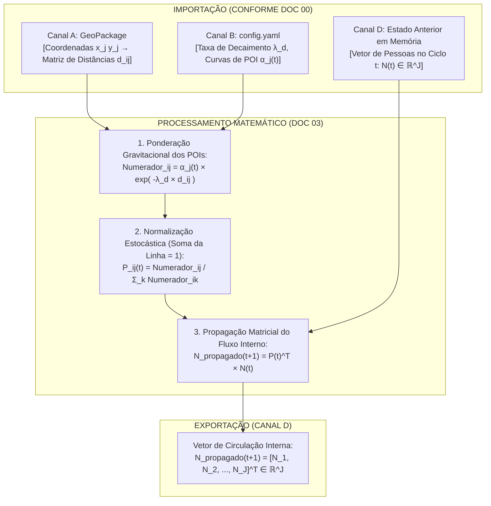

# 🔄 Doc 03: Circulação de Rede via Cadeias de Markov & Gravidade de POIs
## Especificação Técnica para Propagação do Fluxo Interno de Pedestres entre Ruas Conectadas

**Classificação:** Especificação Técnica de Subsistema / Modelo Matemático  
**Módulo Pertencente:** Container de API (`backend/src/api/` — Subsistema de Rede e Roteamento)  
**Documento Central de Referência:** [`00_arquitetura_ingestao_e_fluxo_dados.md`](file:///c:/Users/joaof/Documents/Unifacs/ICs/digital_twins/docs/explanation/dados_sinteticos/00_arquitetura_ingestao_e_fluxo_dados.md)  

---

## 📌 1. Visão Geral e Contextualização Urbana

Sensores em um centro histórico não operam isolados no vácuo. Se $100$ turistas estão no **Largo do Pelourinho (Sensor 1)** às 17h, no ciclo seguinte parte desse público caminha em direção ao **Terreiro de Jesus (Sensor 2)**, parte desce a **Ladeira do Carmo (Sensor 3)** e parte permanece no mesmo local tirando fotos ou visitando museus.

A responsabilidade deste subsistema é modelar essa **rede viva de circulação interna**, calculando a **Matriz Dinâmica de Transição Estocástica ($\mathbf{P}(t) \in \mathbb{R}^{J \times J}$)** moldada pela "gravidade" (atratividade $\alpha_j(t)$) de cada Ponto de Interesse (POI) e pela proximidade geográfica entre as ruas.



---

## 📋 2. Requisitos do Subsistema

### 2.1. Requisitos Funcionais (RFs)
* **RF01 — Matriz Dinâmica de Markov ($\mathbf{P}(t)$):** O módulo deve computar a matriz de transição de probabilidades $\mathbf{P}(t)$ de dimensão $J \times J$, onde $P_{ij}(t)$ representa a probabilidade de um pedestre localizado no nó $i$ transitar para o nó $j$ no próximo passo de tempo;
* **RF02 — Modulação por Campos Atratores de POIs ($\alpha_j(t)$):** A probabilidade de destino $j$ deve ser diretamente proporcional ao peso de atratividade instantânea do local $\alpha_j(t)$ (ex: igrejas atraem mais pela manhã $\alpha \approx 2.0$; bares e palcos atraem mais à noite $\alpha \approx 3.0$);
* **RF03 — Decaimento de Atração por Distância Euclidiana ($d_{ij}$):** A probabilidade de transição $P_{ij}$ deve decair exponencialmente com a distância física $d_{ij}$ entre os sensores ($e^{-\lambda_d d_{ij}}$), modelando que turistas tendem a caminhar para ruas adjacentes antes de logradouros distantes;
* **RF04 — Conservação Estocástica Rigorosa:** Cada linha $i$ da matriz $\mathbf{P}(t)$ deve satisfazer a propriedade estocástica unitária ($\sum_{j=1}^J P_{ij}(t) = 1.0 \quad \forall i$), garantindo que nenhum pedestre seja criado ou destruído durante a redistribuição interna;
* **RF05 — Propagação por Álgebra Linear:** A redistribuição das pessoas deve ser obtida multiplicando o vetor de estado do ciclo anterior $\mathbf{N}(t)$ pela matriz transposta $\mathbf{P}(t)^T$.

### 2.2. Requisitos Não-Funcionais (RNFs)
* **RNF01 — Complexidade Matricial $O(J^2)$:** Para uma rede com $J = 5$ a $10$ sensores, a multiplicação matricial deve executar em menos de $50\ \mu\text{s}$ no backend;
* **RNF02 — Vetorização Estrita com NumPy:** Proibido o uso de loops `for` aninhados em Python para o cálculo das probabilidades e propagação do vetor.

---

## 🧮 3. Formulação Matemática Crua

### 3.1. Probabilidade de Transição Gravitacional-Markoviana ($P_{ij}(t)$)
Para qualquer par de sensores de origem $i$ e destino $j$, a probabilidade de deslocamento é dada pelo modelo gravitacional normalizado:

$$P_{ij}(t) = \frac{\alpha_j(t) \cdot \exp\left(-\lambda_d \cdot d_{ij}\right)}{\sum_{k=1}^J \alpha_k(t) \cdot \exp\left(-\lambda_d \cdot d_{ik}\right)}$$

Onde:
* $\alpha_j(t) > 0$ é a atratividade horária do POI no sensor de destino $j$;
* $d_{ij} = \|\mathbf{p}_i - \mathbf{p}_j\| = \sqrt{(x_i - x_j)^2 + (y_i - y_j)^2}$ é a distância euclidiana em metros entre o sensor $i$ e o sensor $j$;
* $\lambda_d > 0$ é a constante de atrito espacial (ex: $\lambda_d = 0.015\text{ m}^{-1}$);
* O denominador $\sum_{k=1}^J \alpha_k(t) \cdot e^{-\lambda_d d_{ik}}$ garante que a soma de cada linha resulte estritamente em $1.0$.

---

### 3.2. Estrutura da Matriz de Markov $\mathbf{P}(t)$
$$\mathbf{P}(t) = \begin{bmatrix} P_{11}(t) & P_{12}(t) & \cdots & P_{1J}(t) \\ P_{21}(t) & P_{22}(t) & \cdots & P_{2J}(t) \\ \vdots & \vdots & \ddots & \vdots \\ P_{J1}(t) & P_{J2}(t) & \cdots & P_{JJ}(t) \end{bmatrix}, \quad \text{com } \sum_{j=1}^J P_{ij}(t) = 1.0 \quad (\forall i)$$

* A diagonal principal $P_{ii}(t)$ representa a probabilidade de permanência no mesmo logradouro;
* Os termos fora da diagonal $P_{ij}(t)$ representam o fluxo de migração entre as ruas.

---

### 3.3. Propagação Matricial do Fluxo Interno
A quantidade de pedestres redistribuída para o sensor $j$ no ciclo seguinte é a soma ponderada de todos os que vieram de outros nós $i$:

$$N_{j, \text{propagado}}(t+1) = \sum_{i=1}^J P_{ij}(t) \cdot N_i(t)$$

Em forma matricial fechada:
$$\mathbf{N}_{\text{propagado}}(t+1) = \mathbf{P}(t)^T \cdot \mathbf{N}(t)$$

---

## 📖 4. Dicionário de Variáveis e Tipagem do Módulo

| Símbolo (Opção A) | Símbolo (Opção B) | Tipo Primitivo | Unidade | Descrição / Valor Típico | Canal de Origem |
| :---: | :---: | :---: | :---: | :--- | :---: |
| $J$ | $J_{\text{sensores}}$ | `int` | nós | Quantidade total de sensores na malha ($5$). | Canal A |
| $d_{ij}$ | $d_{ij}$ | `ndarray (J, J)` | metros | Matriz de distâncias euclidianas entre nós. | Canal A |
| $\lambda_d$ | $\lambda_{\text{distancia}}$ | `float64` | $\text{m}^{-1}$ | Coeficiente de decaimento por distância ($0.015$). | Canal B |
| $\boldsymbol{\alpha}(t)$ | $\boldsymbol{\alpha}_{\text{atracao}}(t)$ | `ndarray (J,)` | adimensional | Vetor de atratividade instantânea dos POIs. | Canal B / C |
| $\mathbf{P}(t)$ | $\mathbf{P}_{\text{markov}}(t)$ | `ndarray (J, J)` | probabilidade | Matriz estocástica de transição de Markov. | Canal D (Interno) |
| $\mathbf{N}(t)$ | $\mathbf{N}_{\text{atual}}(t)$ | `ndarray (J,)` | indivíduos | Vetor de ocupação no instante atual $t$. | Canal D (Buffer) |
| $\mathbf{N}_{\text{propagado}}(t+1)$ | $\mathbf{N}_{\text{propagado}}(t+1)$ | `ndarray (J,)` | indivíduos | Vetor de saída de circulação redistribuída. | Canal D (Saída) |

---

## 📥 5. Formato de Importação (Entradas da Função)

O módulo consome as seguintes estruturas conforme o [Doc 00](file:///c:/Users/joaof/Documents/Unifacs/ICs/digital_twins/docs/explanation/dados_sinteticos/00_arquitetura_ingestao_e_fluxo_dados.md):

1. **`dist_matrix` (`np.ndarray` float64 de shape $(J, J)$):** Matriz pré-calculada contendo a distância geográfica em metros entre cada par de sensores (Canal A);
2. **`alpha_attraction` (`np.ndarray` float64 de shape $(J,)$):** Vetor de atratividade atual dos POIs no instante $t$ (Canal B / C);
3. **`lambda_decay` (`float`):** Constante $\lambda_d = 0.015$ (Canal B);
4. **`previous_state_N` (`np.ndarray` float64 de shape $(J,)$):** Vetor $\mathbf{N}(t)$ com as pessoas presentes no ciclo anterior (Canal D).

---

## 📤 6. Formato de Exportação (Saída para o Canal D)

A função deve exportar um array NumPy 1D contendo a circulação interna propagada:

```python
# Especificação do Retorno da Função:
# N_propagado -> np.ndarray de shape (J,), dtype=np.float64
# Exemplo de saída para J=4 sensores:
# N_propagado = np.array([45.20, 32.15, 18.40, 12.25])
```

> **📌 Marco de Arquitetura:**  
> A soma dos resultados do **Doc 01** ($\mathbf{N}_{\text{rotina}}$), **Doc 02** ($\mathbf{E}$) e **Doc 03** ($\mathbf{N}_{\text{propagado}}$) encerra a primeira metade do pipeline, gerando a **Massa de Fluxo Físico Bruto**:
> $$\mathbf{N}_{\text{bruto}}(t+1) = \mathbf{N}_{\text{propagado}}(t+1) + \mathbf{N}_{\text{rotina}}(t) + \mathbf{E}(t)$$
> Este vetor é o insumo direto de entrada para o **Doc 04**.
