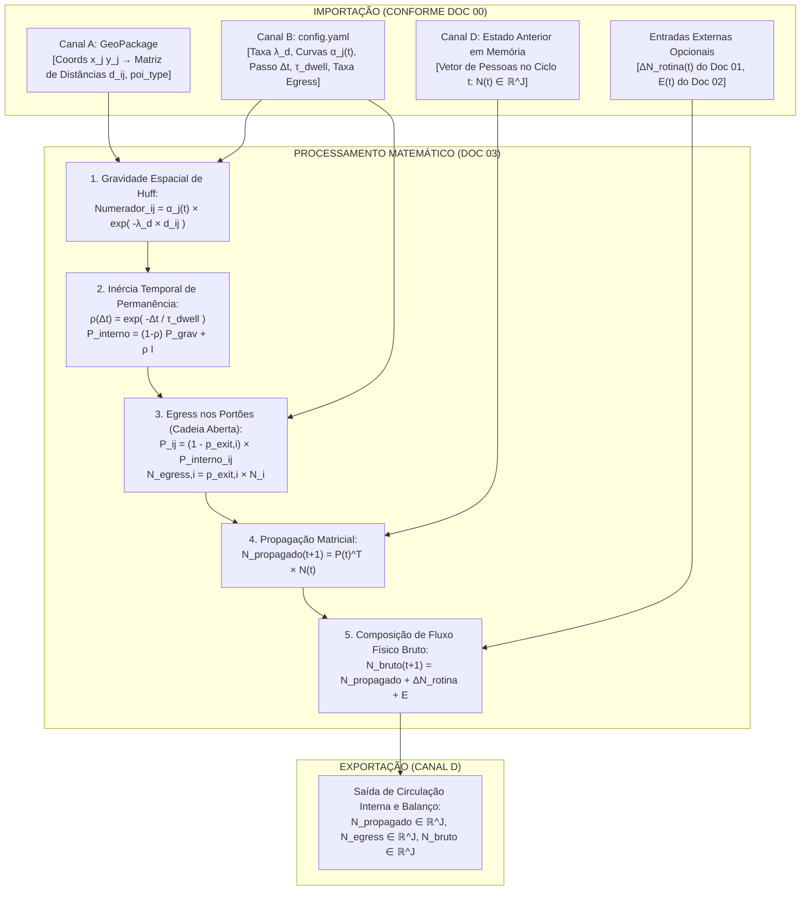

# 🔄 Doc 03: Circulação de Rede via Cadeias de Markov & Gravidade de POIs
## Especificação Técnica para Propagação do Fluxo Interno de Pedestres entre Ruas Conectadas

**Classificação:** Especificação Técnica de Subsistema / Modelo Matemático  
**Módulo Pertencente:** Container de API (`backend/src/api/` — Subsistema de Rede e Roteamento)  
**Documento Central de Referência:** [`00_arquitetura_ingestao_e_fluxo_dados.md`](file:///c:/Users/joaof/Documents/Unifacs/ICs/digital_twins/docs/explanation/dados_sinteticos/00_arquitetura_ingestao_e_fluxo_dados.md)  

---

## 📌 1. Visão Geral e Contextualização Urbana

Sensores em um centro histórico não operam isolados no vácuo. Se $100$ turistas estão no **Largo do Pelourinho (Sensor 1)** às 17h, no ciclo seguinte parte desse público caminha em direção ao **Terreiro de Jesus (Sensor 2)**, parte desce a **Ladeira do Carmo (Sensor 3)** e parte permanece no mesmo local tirando fotos ou visitando museus. Além disso, no fim da tarde, uma parcela desses pedestres deixa o bairro através dos portões de saída (Elevador Lacerda, Praça da Sé, Ladeira do Carmo).

A responsabilidade deste subsistema é modelar essa **rede viva de circulação urbana**, calculando:
1. A **Matriz Dinâmica de Transição Estocástica ($\mathbf{P}(t) \in \mathbb{R}^{J \times J}$)** moldada pela "gravidade" (atratividade $\alpha_j(t)$) de cada Ponto de Interesse (POI), proximidade geográfica e inércia temporal de permanência ($\rho(\Delta t)$);
2. A **Taxa de Egress Circadiana ($P_{i, \text{exit}}(t)$)** nos portões de acesso, transformando o modelo em uma **Cadeia de Markov Aberta** capaz de dispersar o público no período noturno;
3. A orquestração da **Massa de Fluxo Físico Bruto ($\mathbf{N}_{\text{bruto}}(t+1)$)** somando o fluxo propagado, os novos ingressos ($\Delta \mathbf{N}_{\text{rotina}}$ do Doc 01) e os pulsos de eventos ($\mathbf{E}(t)$ do Doc 02), pronta para a camada de sensoriamento do **Doc 04**.


```mermaid
flowchart TD
    subgraph Entradas["IMPORTAÇÃO (CONFORME DOC 00)"]
        CA["Canal A: GeoPackage\n[Coords x_j y_j → Matriz de Distâncias d_ij, poi_type]"]
        CB["Canal B: config.yaml\n[Taxa λ_d, Curvas α_j(t), Passo Δt, τ_dwell, Taxa Egress]"]
        CD["Canal D: Estado Anterior em Memória\n[Vetor de Pessoas no Ciclo t: N(t) ∈ ℝ^J]"]
        Ext["Entradas Externas Opcionais\n[ΔN_rotina(t) do Doc 01, E(t) do Doc 02]"]
    end

    subgraph Processamento["PROCESSAMENTO MATEMÁTICO (DOC 03)"]
        Grav["1. Gravidade Espacial de Huff:\nNumerador_ij = α_j(t) × exp( -λ_d × d_ij )"]
        Inercia["2. Inércia Temporal de Permanência:\nρ(Δt) = exp( -Δt / τ_dwell )\nP_interno = (1-ρ) P_grav + ρ I"]
        Egress["3. Egress nos Portões (Cadeia Aberta):\nP_ij = (1 - p_exit,i) × P_interno_ij\nN_egress,i = p_exit,i × N_i"]
        Prop["4. Propagação Matricial:\nN_propagado(t+1) = P(t)^T × N(t)"]
        Bruto["5. Composição de Fluxo Físico Bruto:\nN_bruto(t+1) = N_propagado + ΔN_rotina + E"]
    end

    subgraph Saida["EXPORTAÇÃO (CANAL D)"]
        VetorOut["Saída de Circulação Interna e Balanço:\nN_propagado ∈ ℝ^J, N_egress ∈ ℝ^J, N_bruto ∈ ℝ^J"]
    end

    CA & CB --> Grav
    Grav --> Inercia
    Inercia & CB --> Egress
    Egress & CD --> Prop
    Prop & Ext --> Bruto
    Bruto --> VetorOut
```

---

## 📋 2. Requisitos do Subsistema

### 2.1. Requisitos Funcionais (RFs)
* **RF01 — Matriz Dinâmica de Markov ($\mathbf{P}(t)$):** O módulo deve computar a matriz de transição de probabilidades $\mathbf{P}(t)$ de dimensão $J \times J$, onde $P_{ij}(t)$ representa a probabilidade de um pedestre localizado no nó $i$ transitar para o nó $j$ no próximo passo de tempo;
* **RF02 — Modulação por Campos Atratores de POIs ($\alpha_j(t)$):** A probabilidade de destino $j$ deve ser diretamente proporcional ao peso de atratividade instantânea do local $\alpha_j(t)$ (igrejas atraem mais pela manhã $\alpha \approx 2.0$; palcos e largos culturais atraem mais à tarde/noite $\alpha \approx 2.5$ a $3.0$);
* **RF03 — Decaimento de Atração por Distância Euclidiana ($d_{ij}$):** A probabilidade de transição $P_{ij}$ deve decair exponencialmente com a distância física $d_{ij}$ entre os sensores ($e^{-\lambda_d d_{ij}}$);
* **RF04 — Inércia Temporal e Granularidade de Passo ($\Delta t$):** O módulo deve parametrizar a probabilidade de permanência no mesmo local através de um modelo de retenção convexo $\rho(\Delta t) = \exp(-\Delta t / \tau_{\text{dwell}})$, refletindo que em passos curtos ($\Delta t = 1$ min) a imensa maioria dos pedestres continua na mesma rua, enquanto em passos longos ($\Delta t = 15$ min) a migração espacial atinge seu regime estocástico completo;
* **RF05 — Cadeia de Markov Aberta com Egress ($P_{i, \text{exit}}(t)$):** Sensores classificados como portões de acesso físico (`GATE`) devem possuir probabilidade de saída do bairro $P_{i, \text{exit}}(t)$ modulada circadianamente (baixa pela manhã, ápice entre 17h e 23h). A conservação estrita de balanço satisfaz $\sum_{j=1}^J N_{j, \text{propagado}}(t+1) + \sum_{i=1}^J N_{i, \text{egress}}(t) = \sum_{i=1}^J N_i(t)$;
* **RF06 — Orquestração da Massa de Fluxo Físico Bruto ($\mathbf{N}_{\text{bruto}}$):** O módulo deve ser capaz de somar elemento a elemento $\mathbf{N}_{\text{bruto}}(t+1) = \mathbf{N}_{\text{propagado}}(t+1) + \Delta \mathbf{N}_{\text{rotina}}(t) + \mathbf{E}(t)$, gerando o insumo integrado para a saturação logística e ruído do **Doc 04**.

### 2.2. Requisitos Não-Funcionais (RNFs)
* **RNF01 — Complexidade Matricial $O(J^2)$:** Para uma rede com $J = 5$ a $10$ sensores, a multiplicação matricial deve executar em menos de $50\ \mu\text{s}$ no backend;
* **RNF02 — Vetorização Estrita com NumPy:** Proibido o uso de loops `for` aninhados em Python para o cálculo das probabilidades e propagação do vetor.

---

## 🧮 3. Formulação Matemática Crua

### 3.1. Probabilidade de Transição Gravitacional-Markoviana
Para qualquer par de sensores de origem $i$ e destino $j$, o numerador gravitacional espacial de Huff é:

$$\text{Numerador}_{ij}(t) = \alpha_j(t) \cdot \exp\left(-\lambda_d \cdot d_{ij}\right)$$

Com a matriz espacial normalizada por linha:
$$P_{ij}^{\text{grav}}(t) = \frac{\text{Numerador}_{ij}(t)}{\sum_{k=1}^J \text{Numerador}_{ik}(t)}$$

---

### 3.2. Inércia Temporal de Permanência ($\rho(\Delta t)$)
Dado o tempo médio de permanência $\tau_{\text{dwell}} \approx 20\text{ minutos}$ e o passo de simulação $\Delta t$ (ex: 5 minutos):

$$\rho(\Delta t) = \exp\left(-\frac{\Delta t}{\tau_{\text{dwell}}}\right)$$

A matriz interna com inércia é uma combinação convexa:
$$P_{ii}^{\text{interno}}(t) = \rho(\Delta t) + (1 - \rho(\Delta t)) \cdot P_{ii}^{\text{grav}}(t)$$
$$P_{ij}^{\text{interno}}(t) = (1 - \rho(\Delta t)) \cdot P_{ij}^{\text{grav}}(t) \quad (\forall j \neq i)$$

---

### 3.3. Egress nos Portões de Acesso (Cadeia Aberta)
Para nós classificados como portões de entrada e saída (`poi_type == "GATE"`):

$$P_{i, \text{exit}}(t) = \text{base\_egress} \cdot \left[ 0.2 + 0.8 \cdot \frac{1}{1 + \exp\left(-0.6 \cdot (h(t) - 17.5)\right)} \right] \cdot \left(\frac{\Delta t}{5.0}\right)$$

Para nós internos (`poi_type != "GATE"`), $P_{i, \text{exit}}(t) = 0.0$.

A matriz de transição final da rede com egress é:
$$P_{ij}(t) = (1 - P_{i, \text{exit}}(t)) \cdot P_{ij}^{\text{interno}}(t)$$

Satisfazendo a conservação de fluxo aberto:
$$\sum_{j=1}^J P_{ij}(t) = 1.0 - P_{i, \text{exit}}(t) \le 1.0$$

---

### 3.4. Propagação Matricial e Balanço Físico
A quantidade de pessoas redistribuída internamente para o nó $j$ é:
$$N_{j, \text{propagado}}(t+1) = \sum_{i=1}^J P_{ij}(t) \cdot N_i(t) \implies \mathbf{N}_{\text{propagado}}(t+1) = \mathbf{P}(t)^T \cdot \mathbf{N}(t)$$

E a quantidade de pessoas que deixam o Pelourinho pelo portão $i$ é:
$$N_{i, \text{egress}}(t) = P_{i, \text{exit}}(t) \cdot N_i(t)$$

Lei de Conservação do Balanço Aberto:
$$\sum_{j=1}^J N_{j, \text{propagado}}(t+1) + \sum_{i=1}^J N_{i, \text{egress}}(t) = \sum_{i=1}^J N_i(t)$$

---

### 3.5. Orquestração da Massa de Fluxo Físico Bruto ($\mathbf{N}_{\text{bruto}}$)
Somando os novos pedestres que entraram pelos portões ($\Delta \mathbf{N}_{\text{rotina}}(t)$ do Doc 01) e o acréscimo de eventos culturais ($\mathbf{E}(t)$ do Doc 02):

$$\mathbf{N}_{\text{bruto}}(t+1) = \mathbf{N}_{\text{propagado}}(t+1) + \Delta \mathbf{N}_{\text{rotina}}(t) + \mathbf{E}(t)$$

Este vetor $\mathbf{N}_{\text{bruto}}(t+1)$ é o insumo direto para a camada de sensoriamento do **Doc 04**.

---

## 📖 4. Dicionário de Variáveis e Tipagem do Módulo

| Símbolo | Tipo Primitivo | Unidade | Descrição / Valor Típico | Canal de Origem |
| :---: | :---: | :---: | :--- | :---: |
| $J$ | `int` | nós | Quantidade total de sensores na malha ($5$). | Canal A |
| $d_{ij}$ | `ndarray (J, J)` | metros | Matriz de distâncias euclidianas entre nós. | Canal A |
| $\lambda_d$ | `float64` | $\text{m}^{-1}$ | Coeficiente de decaimento espacial ($0.015$). | Canal B |
| $\Delta t$ | `float64` | minutos | Granularidade do passo de simulação ($5.0$). | Canal B / C |
| $\tau_{\text{dwell}}$ | `float64` | minutos | Tempo médio de permanência em um POI ($20.0$). | Canal B |
| $\boldsymbol{\alpha}(t)$ | `ndarray (J,)` | adimensional | Vetor de atratividade instantânea dos POIs. | Canal B / C |
| $P_{i, \text{exit}}$ | `float64` | probabilidade | Taxa de saída externa nos nós de portão ($0.02$ a $0.20$). | Canal B / C |
| $\mathbf{P}(t)$ | `ndarray (J, J)` | probabilidade | Matriz estocástica de transição de Markov. | Canal D (Interno) |
| $\mathbf{N}(t)$ | `ndarray (J,)` | indivíduos | Vetor de ocupação no ciclo anterior. | Canal D (Buffer) |
| $\mathbf{N}_{\text{propagado}}(t+1)$ | `ndarray (J,)` | indivíduos | Vetor de saída de circulação redistribuída. | Canal D (Saída) |
| $\mathbf{N}_{\text{egress}}(t)$ | `ndarray (J,)` | indivíduos | Vetor de pedestres que deixaram o bairro pelos portões. | Canal D (Saída) |
| $\mathbf{N}_{\text{bruto}}(t+1)$ | `ndarray (J,)` | indivíduos | Massa de fluxo físico bruto integrada para o Doc 04. | Canal D (Saída) |

---

## 📥 5. Formato de Importação (Entradas da Função)

```python
# Assinatura principal de cálculo:
propagate_markov_flow(
    current_state_N: Optional[Sequence[float]] = None,
    current_time_hours: Optional[float] = None,
    gamma_seasonality: float = 1.0,
    config: Optional[MarkovCirculationConfig] = None,
    alpha_override: Optional[Sequence[float]] = None,
    step_minutes: Optional[float] = 5.0,
    enable_egress: Optional[bool] = True,
    use_inertia: Optional[bool] = True,
    include_raw_flow: bool = True,
    delta_N_rotina: Optional[Sequence[float]] = None,
    vector_E_eventos: Optional[Sequence[float]] = None,
) -> MarkovCirculationResponse
```

---

## 📤 6. Formato de Exportação (Saída para o Canal D / Doc 04)

```python
# Exemplo de saída integrada:
# vector_N_propagado = [42.15, 33.40, 19.80, 85.20, 68.10]
# vector_N_egress    = [ 4.20,  3.10,  1.80,  0.00,  0.00] (apenas nos 3 portões)
# vector_N_bruto     = [46.35, 35.50, 20.80, 130.20, 68.10] (com ΔN_rotina e Show no Nó 3)
```

O vetor `vector_N_bruto` é entregue diretamente ao **Doc 04**, onde passará pela função logística de saturação de Richards e pelo gerador de ruído instrumental IoT.
