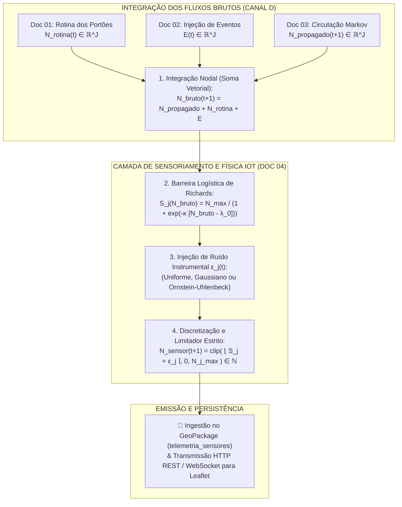

# 📡 Doc 04: Saturação Física de Richards, Ruído Instrumental IoT & Integração do Pipeline
## Especificação Técnica para Sensoriamento, Emissão de Telemetria e Ingestão no Datalake

**Classificação:** Especificação Técnica de Subsistema / Modelo Matemático e Integração  
**Módulo Pertencente:** Container de API (`backend/src/api/` — Subsistema de Sensoriamento e Datalake)  
**Documento Central de Referência:** [`00_arquitetura_ingestao_e_fluxo_dados.md`](file:///c:/Users/joaof/Documents/Unifacs/ICs/digital_twins/docs/explanation/dados_sinteticos/00_arquitetura_ingestao_e_fluxo_dados.md)  

---

## 📌 1. Visão Geral e Papel da Integração

Nas etapas anteriores, os **Docs 01, 02 e 03** modelaram o comportamento puramente físico e humano da multidão no Pelourinho. No entanto, um Gêmeo Digital IoT não lê "pessoas teóricas"; ele ingere o **sinal capturado por dispositivos físicos de sensoriamento** (câmeras de contagem com visão computacional, sensores térmicos e feixes infravermelhos).

A responsabilidade deste subsistema é dupla:
1. **Acoplar e Integrar os Três Fluxos Físicos** (Entrada diária + Eventos + Circulação de Markov);
2. **Aplicar a Física de Sensoriamento IoT**, impondo a barreira de saturação logística de Richards (espaço físico intransponível $N_{j, \max}$), injetando o ruído estocástico instrumental $\epsilon_j(t)$ e formatando o payload final de telemetria emitido para o banco GeoPackage e para o mapa Leaflet.



---

## 📋 2. Requisitos do Subsistema

### 2.1. Requisitos Funcionais (RFs)
* **RF01 — Integração de Fluxos Nodal:** O módulo deve receber obrigatoriamente os vetores $\mathbf{N}_{\text{propagado}}(t+1)$ (Doc 03), $\mathbf{N}_{\text{rotina}}(t)$ (Doc 01) e $\mathbf{E}(t)$ (Doc 02), computando a soma física elemento a elemento:
  $$\mathbf{N}_{\text{bruto}}(t+1) = \mathbf{N}_{\text{propagado}}(t+1) + \mathbf{N}_{\text{rotina}}(t) + \mathbf{E}(t)$$
* **RF02 — Barreira de Capacidade de Richards:** O módulo deve passar o fluxo bruto pela função logística de saturação de Richards, garantindo que mesmo em picos extremos de eventos o número nunca ultrapasse a capacidade física $N_{j, \max}$ do espaço;
* **RF03 — Três Métodos Selecionáveis de Ruído Instrumental $\epsilon_j(t)$:**
  * *Método 1 (Uniforme $\mathcal{U}(-R, +R)$):* Perturbação rápida sem memória;
  * *Método 2 (Gaussiano $\mathcal{N}(0, \sigma_{\text{ruido}}^2)$):* Incerteza clássica com média zero;
  * *Método 3 (Ornstein-Uhlenbeck):* Processo estocástico com reversão à média ($d\epsilon = -\theta \epsilon dt + \sigma dW$) para simular inércia física do hardware (oclusões de câmera persistem por alguns instantes antes de relaxar);
* **RF04 — Discretização e Não-Negatividade:** O sinal contínuo resultante deve ser arredondado para o inteiro mais próximo ($\lfloor \dots \rceil$) e limitado pelo intervalo $[0, N_{j, \max}]$ via operador $\operatorname{clip}$, garantindo $N_j^{\text{sensor}} \in \mathbb{N}$;
* **RF05 — Emissão e Persistência:** A telemetria final deve ser persistida na tabela `telemetria_sensores` do GeoPackage e disponibilizada na rota HTTP `/api/v1/telemetry/latest`.

### 2.2. Requisitos Não-Funcionais (RNFs)
* **RNF01 — Latência de Streaming $< 1\text{ ms}$:** A transformação completa de todos os sensores da rede deve executar em menos de $1$ milissegundo;
* **RNF02 — Estabilidade Estocástica:** O ruído de Ornstein-Uhlenbeck deve manter o estado anterior $\epsilon(t)$ em memória estática sem risco de vazamento de memória.

---

## 🧮 3. Formulação Matemática Crua

### 3.1. A Equação Unificada de Sensoriamento Nodal
Para cada sensor $j \in \{1, \dots, J\}$, a leitura emitida no ciclo $t+1$ é dada pela equação fechada:

$$N_j^{\text{sensor}}(t+1) = \operatorname{clip}\left( \left\lfloor \frac{N_{j, \max}}{1 + \exp\left( -\kappa_j \cdot \left[ N_{\text{bruto}, j}(t+1) - \lambda_{0, j} \right] \right)} + \epsilon_j(t) \right\rceil, \; 0, \; N_{j, \max} \right)$$

Onde:
* $N_{\text{bruto}, j}(t+1) = N_{j, \text{propagado}}(t+1) + N_{j, \text{rotina}}(t) + E_j(t)$ é a soma dos três módulos físicos;
* $N_{j, \max}$ é a capacidade máxima do sensor $j$ (Canal A);
* $\kappa_j$ é a declividade da saturação logística (Canal B, ex: $\kappa = 0.08$);
* $\lambda_{0, j}$ é o ponto médio de inflexão da curva (Canal B);
* $\epsilon_j(t)$ é a perturbação estocástica do sensor.

---

### 3.2. Os 3 Métodos de Ruído Instrumental $\epsilon_j(t)$

#### Método 1: Ruído Uniforme Limitado $\mathcal{U}(-R, +R)$
$$\epsilon_j(t) \sim \mathcal{U}(-R, +R), \quad \mathbb{E}[\epsilon] = 0, \quad \operatorname{Var}(\epsilon) = \frac{R^2}{3}$$
* *Parâmetro:* $R = 3.0$ (variação aleatória de até $\pm 3$ pessoas).

---

#### Método 2: Ruído Branco Gaussiano $\mathcal{N}(0, \sigma_{\text{ruido}}^2)$
$$\epsilon_j(t) \sim \mathcal{N}(0, \sigma_{\text{ruido}}^2), \quad f(\epsilon) = \frac{1}{\sigma_{\text{ruido}} \sqrt{2\pi}} \exp\left( -\frac{\epsilon^2}{2\sigma_{\text{ruido}}^2} \right)$$
* *Parâmetro:* $\sigma_{\text{ruido}} = 2.5$ pessoas.

---

#### Método 3: Processo de Reversão à Média de Ornstein-Uhlenbeck
Modela a **inércia temporal do hardware**. Se a câmera sofre uma oclusão parcial, o erro persiste suavemente antes de voltar a zero:

$$d\epsilon_j(t) = -\theta \cdot \epsilon_j(t) \, dt + \sigma_{\text{sensor}} \, dW(t)$$

*Equação Recorrente Discreta ($\Delta t$ em horas):*
$$\epsilon_j(t + \Delta t) = \epsilon_j(t) \cdot e^{-\theta \Delta t} + \sigma_{\text{sensor}} \sqrt{\frac{1 - e^{-2\theta \Delta t}}{2\theta}} \cdot Z_t, \quad Z_t \sim \mathcal{N}(0, 1)$$

* *Parâmetros:* $\theta = 1.2\text{ h}^{-1}$ (taxa de recuperação), $\sigma_{\text{sensor}} = 2.0$.

---

## 📖 4. Dicionário de Variáveis e Tipagem do Módulo

| Símbolo (Opção A) | Símbolo (Opção B) | Tipo Primitivo | Unidade | Descrição | Origem |
| :---: | :---: | :---: | :---: | :--- | :---: |
| $\mathbf{N}_{\text{bruto}}$ | $\mathbf{N}_{\text{bruto}}$ | `ndarray (J,)` | indivíduos | Soma dos fluxos físicos brutos. | Docs 01+02+03 |
| $N_{j, \max}$ | $N_{j, \max}$ | `int` | indivíduos | Teto físico intransponível da rua. | Canal A |
| $\kappa_j$ | $\kappa_{\text{declive}}$ | `float64` | $\text{h}^{-1}$ | Declividade de Richards ($0.08$). | Canal B |
| $\lambda_{0, j}$ | $\lambda_{\text{inflexao}}$ | `float64` | indivíduos | Inflexão de capacidade. | Canal B |
| $\epsilon_j(t)$ | $\epsilon_{\text{ruido}}$ | `float64` | indivíduos | Perturbação instrumental. | Calculado |
| $\theta$ | $\theta_{\text{reversao}}$ | `float64` | $\text{h}^{-1}$ | Reversão à média OU ($1.2$). | Canal B |
| $\mathbf{N}^{\text{sensor}}(t+1)$ | $\mathbf{N}_{\text{sensor}}(t+1)$ | `ndarray (J,)` | $\mathbb{N}$ (inteiros) | Leitura final emitida do sensor. | Saída Final |

---

## 📥 5. Formato de Importação (Entradas da Função)

O módulo consome as seguintes estruturas conforme o [Doc 00](file:///c:/Users/joaof/Documents/Unifacs/ICs/digital_twins/docs/explanation/dados_sinteticos/00_arquitetura_ingestao_e_fluxo_dados.md):

1. **`N_rotina` (`np.ndarray` float64 de shape $(J,)$):** Saída do **Doc 01** (contagem de pessoas da rotina nos portões);
2. **`E_eventos` (`np.ndarray` float64 de shape $(J,)$):** Saída do **Doc 02**;
3. **`N_propagado` (`np.ndarray` float64 de shape $(J,)$):** Saída do **Doc 03**;
4. **`node_capacities` (`np.ndarray` int de shape $(J,)$):** Capacidade $N_{j, \max}$ (Canal A);
5. **`noise_config` (`dict`):** Método de ruído ativo e parâmetros (Canal B).

---

## 📤 6. Formato de Exportação (Saída Final para Datalake e Leaflet)

A função retorna o vetor de contagens discretas e gera o payload final de telemetria IoT:

```python
# Retorno em Memória para o Pipeline:
# N_sensor -> np.ndarray de shape (J,), dtype=np.int64
# Exemplo para 4 sensores:
# N_sensor = np.array([58, 42, 19, 35])
```

### Payload de Telemetria Emitido para o Leaflet / QGIS Server:
```json
{
  "timestamp": "2026-09-15T16:30:00Z",
  "sensors": [
    {
      "sensor_id": "sensor_largo_pelourinho",
      "count": 58,
      "max_capacity": 150,
      "occupancy_pct": 38.67,
      "density_m2": 0.38,
      "status": "NORMAL"
    },
    {
      "sensor_id": "sensor_terreiro_jesus",
      "count": 42,
      "max_capacity": 200,
      "occupancy_pct": 21.00,
      "density_m2": 0.21,
      "status": "NORMAL"
    }
  ]
}
```

> **📌 Marco de Arquitetura:**  
> A saída do **Doc 04** conclui o pipeline de produção do container de API, gravando os dados no GeoPackage e servindo o mapa do Gêmeo Digital.
