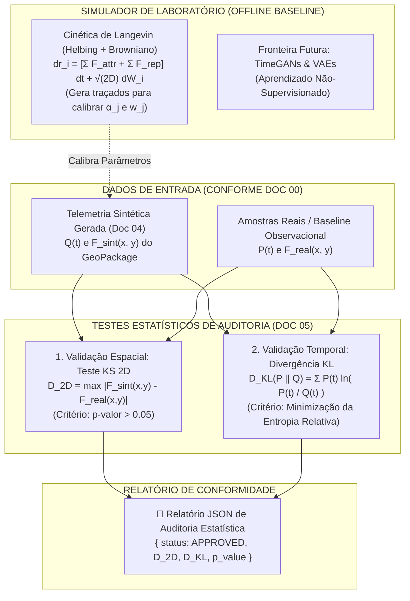

# 🧪 Doc 05: Protocolos de Validação Matemática & Simulação de Laboratório (Langevin)
## Especificação Técnica para Auditoria Estatística e Calibração Física Offline

**Classificação:** Especificação Técnica de Subsistema / Auditoria, Validação e Laboratório  
**Módulo Pertencente:** Container de API (`backend/tests/` & Scripts de Auditoria de Dados Sintéticos)  
**Documento Central de Referência:** [`00_arquitetura_ingestao_e_fluxo_dados.md`](file:///c:/Users/joaof/Documents/Unifacs/ICs/digital_twins/docs/explanation/dados_sinteticos/00_arquitetura_ingestao_e_fluxo_dados.md)  

---

## 📌 1. Visão Geral e Propósito Científico

A maior barreira na geração de dados sintéticos para Gêmeos Digitais é atestar a sua **aderência científica ao comportamento real do espaço urbano**. Se o gerador produzir dados sem validação, o Gêmeo Digital pode induzir a erros críticos de planejamento urbano e tomada de decisão.

A responsabilidade deste subsistema é dupla:
1. **Auditoria Estatística Rigorosa:** Executar testes não-paramétricos (Kolmogorov-Smirnov 2D e Divergência de Kullback-Leibler) comparando a telemetria gerada pelo **Doc 04** contra dados observacionais ou amostras de calibração;
2. **Simulador de Laboratório Offline (Langevin / Forças Sociais):** Fornecer um motor físico microscópico executado fora do ambiente de produção (em workstations locais) para balizar e calibrar os parâmetros das fórmulas analíticas rápidas.



---

## 📋 2. Requisitos do Subsistema

### 2.1. Requisitos Funcionais (RFs)
* **RF01 — Teste Kolmogorov-Smirnov Bidimensional ($D_{2D}$):** O módulo deve calcular a máxima discrepância pontual entre a distribuição espacial sintética $F_{\text{sint}}(x, y)$ e a distribuição empírica observada $F_{\text{real}}(x, y)$ no mapa do Pelourinho;
* **RF02 — Critério de Aceitação Espacial:** O sistema deve aprovar a distribuição espacial se $D_{2D} < D_{\text{crit}}$, assegurando que as manchas térmicas do QGIS Server não apresentem distorções geográficas estatisticamente significativas ($p > 0.05$);
* **RF03 — Divergência de Kullback-Leibler ($D_{KL}$):** O módulo deve mensurar o ganho de informação relativo (entropia) entre o fluxo temporal esperado $P(t)$ e a curva gerada pelo sensor $Q(t)$ ao longo de um horizonte de $24\text{ h}$ ou $168\text{ h}$;
* **RF04 — Motor de Langevin de Laboratório (*Offline*):** O módulo deve disponibilizar a formulação de partículas com Forças Sociais (Atração por POIs + Repulsão interpessoal + Movimento Browniano) para execução em rotinas de bancada/calibração;
* **RF05 — Emissão de Laudo de Auditoria:** O módulo deve gerar um relatório estruturado em JSON com as métricas calculadas e o veredito de aprovação do dataset sintético.

### 2.2. Requisitos Não-Funcionais (RNFs)
* **RNF01 — Isolamento do Pipeline de Produção:** O subsistema de validação deve rodar em background ou sob demanda via pipeline de CI/CD / testes, sem disputar CPU com a rota de streaming da API;
* **RNF02 — Reprodutibilidade:** As rotinas estocásticas de validação e Langevin devem aceitar sementes aleatórias (*random seeds*) para garantir auditorias reproduzíveis.

---

## 🧮 3. Formulação Matemática Crua

### 3.1. Validação Espacial: Teste Kolmogorov-Smirnov 2D ($D_{2D}$)
Generalização de Peacock para avaliar a aderência das coordenadas geográficas geradas:

$$D_{2D} = \max_{(x, y)} \left| F_{\text{sintetico}}(x, y) - F_{\text{real}}(x, y) \right|$$

* **Limiar Crítico:**
  $$D_{\text{crit}} = \frac{c(\alpha)}{\sqrt{N_{\text{amostras}}}}, \quad \text{onde } c(0.05) \approx 1.36$$
* **Regra de Decisão:**
  $$\text{Se } D_{2D} < D_{\text{crit}} \implies \mathbf{p > 0.05 \ (Aprovado \ Sem \ Distorção)}$$

---

### 3.2. Validação Temporal de Séries: Divergência de Kullback-Leibler ($D_{KL}$)
Mede a perda de informação ao aproximar a distribuição de probabilidades horária real $P(t)$ pela distribuição gerada $Q(t)$:

$$D_{KL}(P \parallel Q) = \sum_{t \in T} P(t) \cdot \ln\left( \frac{P(t)}{Q(t)} \right)$$

* $P(t) = \frac{N_{\text{real}}(t)}{\sum_{t} N_{\text{real}}(t)}$ e $Q(t) = \frac{N_{\text{sensor}}(t)}{\sum_{t} N_{\text{sensor}}(t)}$ são as probabilidades normalizadas de fluxo ao longo do dia;
* **Regra de Decisão:** Quanto mais próximo de $0.0$, maior a fidelidade do gerador ao perfil de tráfego do Pelourinho.

---

### 3.3. Simulador de Laboratório: Cinética Microscópica de Langevin (Offline)
Para cada pedestre $i$ localizado em $\mathbf{r}_i(t) = (x_i(t), y_i(t))$ no mapa:

$$d\mathbf{r}_i(t) = \left( \sum_{j} \mathbf{F}_{ij}^{\text{attr}} + \sum_{k \neq i} \mathbf{F}_{ik}^{\text{rep}} \right) dt + \sqrt{2D_{\text{dif}}} \, d\mathbf{W}_i(t)$$

Onde:
1. **Força Atratora do POI $j$:** $\mathbf{F}_{ij}^{\text{attr}} = \alpha_j(t) \cdot \frac{\mathbf{p}_j - \mathbf{r}_i}{\|\mathbf{p}_j - \mathbf{r}_i\|^2 + \epsilon_r}$;
2. **Força de Repulsão Interpessoal:** $\mathbf{F}_{ik}^{\text{rep}} = \beta \cdot \exp\left( -\frac{\|\mathbf{r}_i - \mathbf{r}_k\|}{\sigma_r} \right) \hat{\mathbf{r}}_{ik}$;
3. **Processo de Wiener $d\mathbf{W}_i(t)$:** Movimento browniano de exploração com coeficiente de difusão $D_{\text{dif}}$.

---

### 3.4. Fronteira Futura: Modelos Generativos Profundos (TimeGANs e VAEs)
Quando o projeto dispuser de séries temporais reais contínuas coletadas por câmeras no Pelourinho, o framework prevê o treinamento de redes neurais generativas não-supervisionadas:
* **TimeGAN (Minimax Game):** $\min_G \max_D \mathbb{E}[\ln D(x)] + \mathbb{E}[\ln(1 - D(G(z)))]$;
* **VAE (Maximização de ELBO):** $\mathcal{L}_{\text{ELBO}} = \mathbb{E}_{q_\phi}[\ln p_\theta(x \mid z)] - D_{KL}(q_\phi(z \mid x) \,\|\, p(z))$.

---

## 📖 4. Dicionário de Variáveis e Tipagem do Módulo

| Símbolo | Tipo Primitivo | Unidade | Descrição |
| :---: | :---: | :---: | :--- |
| $D_{2D}$ | `float64` | adimensional | Estatística de suprema discrepância KS 2D. |
| $p\text{-valor}$ | `float64` | probabilidade | Nível de significância estatística ($p > 0.05 \implies$ Aprovado). |
| $D_{KL}$ | `float64` | nats | Entropia relativa entre fluxo real e sintético. |
| $\mathbf{r}_i(t)$ | `ndarray (2,)` | metros | Posição geográfica do agente $i$ no mapa. |
| $\mathbf{F}^{\text{attr}}, \mathbf{F}^{\text{rep}}$ | `ndarray (2,)` | $\text{N}$ (força) | Vetores de atração por POI e repulsão interpessoal. |
| $D_{\text{dif}}$ | `float64` | $\text{m}^2/\text{s}$ | Coeficiente de difusão browniana de pedestres. |

---

## 📥 5. Formato de Importação (Entradas da Auditoria)

O módulo de validação consome as seguintes estruturas conforme o [Doc 00](file:///c:/Users/joaof/Documents/Unifacs/ICs/digital_twins/docs/explanation/dados_sinteticos/00_arquitetura_ingestao_e_fluxo_dados.md):

1. **`synthetic_series` (`np.ndarray` int de shape $(T, J)$):** Histórico de contagens geradas pelo **Doc 04** e lidas da tabela `telemetria_sensores` do GeoPackage;
2. **`baseline_series` (`np.ndarray` float de shape $(T, J)$):** Séries observacionais de referência em CSV/Parquet;
3. **`langevin_config` (`dict`):** Parâmetros $\alpha, \beta, \sigma_r, D_{\text{dif}}$ para rotinas de calibração em laboratório.

---

## 📤 6. Formato de Exportação (Laudo de Auditoria Estatística)

A função de validação exporta o relatório de certificação científica:

```json
{
  "audit_timestamp": "2026-09-15T18:00:00Z",
  "dataset_evaluated": "telemetria_sensores_pelourinho_setembro",
  "total_samples": 2016,
  "metrics": {
    "spatial_ks_2d": {
      "statistic_D2D": 0.0382,
      "critical_value_95": 0.0453,
      "p_value": 0.184,
      "passed": true
    },
    "temporal_kullback_leibler": {
      "divergence_nats": 0.0142,
      "relative_entropy_loss_pct": 1.42,
      "passed": true
    }
  },
  "verdict": "APPROVED_FOR_DIGITAL_TWIN"
}
```
