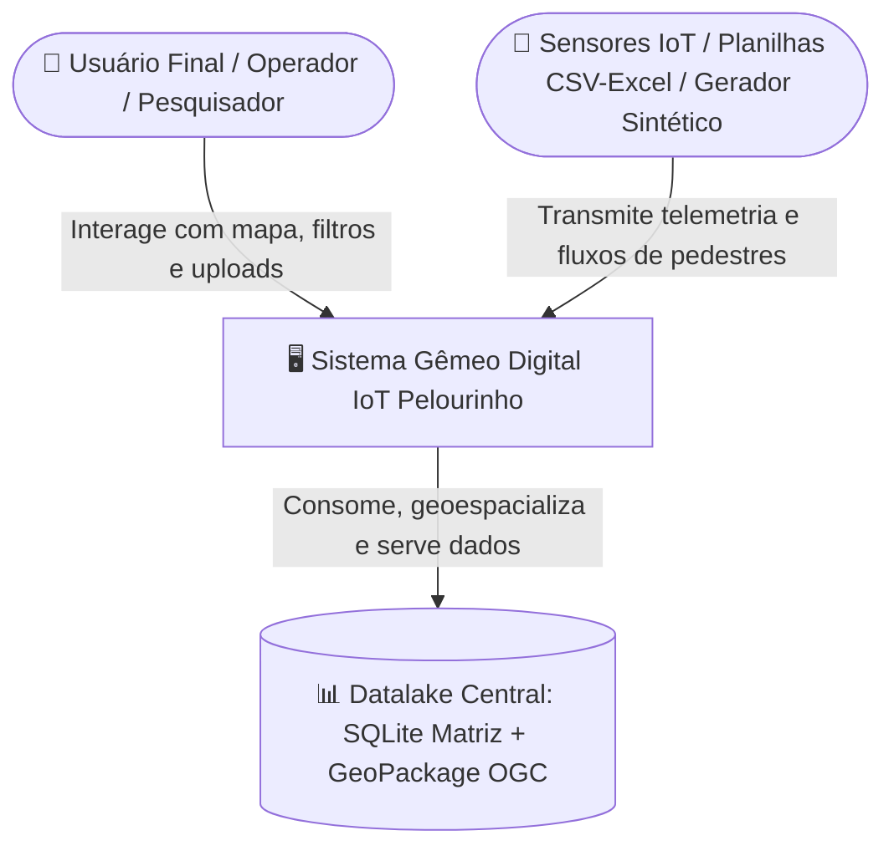
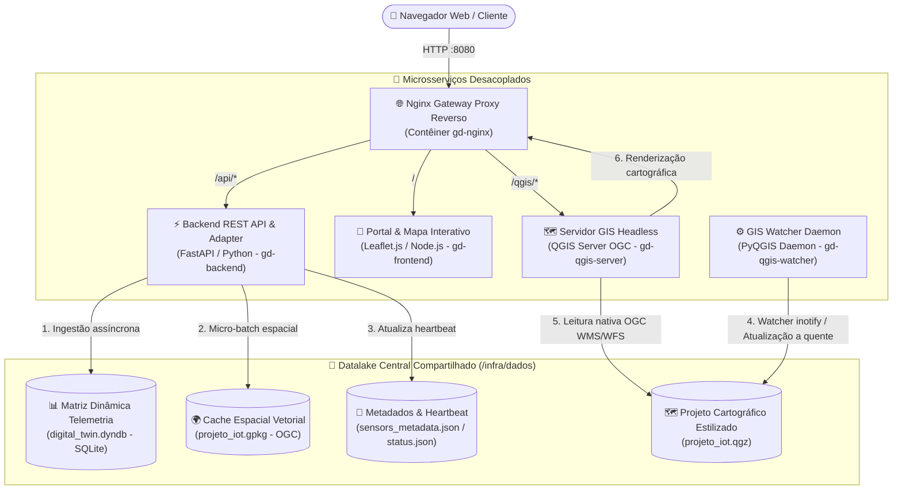

# 🌐 Gêmeo Digital IoT — Arquitetura de Sistema Integrada
## UNIFACS — Centro Histórico do Pelourinho, Salvador/BA

---

## 📌 1. Visão Executiva & Contexto do Projeto

O **Gêmeo Digital IoT do Pelourinho** é um ecossistema computacional modular projetado para ingestão assíncrona, espacialização e monitoramento cartográfico em tempo real de sensores físicos e dados sintéticos de fluxo de pedestres e variáveis ambientais no Centro Histórico de Salvador/BA.

O sistema adota o paradigma **Docs-as-Code** (Diátaxis Framework), a metodologia **Modelo C4** para modelagem de arquitetura de software, o padrão **Adapter** para isolamento entre telemetria bruta e renderização cartográfica, e o padrão **Hub-and-Spoke** para desacoplamento de microsserviços.

---

## 🏛️ 2. Modelagem Arquitetural C4

### 2.1. Nível 1: Visão de Contexto
Mapeia as fronteiras do sistema e as interações com operadores humanos e fontes de dados:



### 2.2. Nível 2: Visão de Contêineres (Topologia Hub-and-Spoke)
A orquestração do ecossistema é distribuída em 5 contêineres Docker independentes gravitando em torno do Datalake central compartilhado (`/infra/dados`):



---

## 🗄️ 3. Datalake Central & Esquemas de Persistência

### 3.1. Matriz Dinâmica (`digital_twin.dyndb`)
* **Mecanismo:** SQLite com modo WAL (*Write-Ahead Logging*) ativo para concorrência sem bloqueio de leitura.
* **Tabelas Principais:**
  * `sensores_cadastro`: Cadastro cadastral e posicional dos nós.
  * `leituras_telemetria`: Série temporal com carimbo `timestamp`, tipo de variável, valor lido e índice de confiabilidade.
  * `eventos_calendario`: Cadastro de eventos programados (shows, festivais, feriados) com impacto no fluxo.

### 3.2. Banco Espacial Vetorial GeoPackage (`projeto_iot.gpkg`)
* **Padrão:** OGC GeoPackage (base SQLite espacial).
* **Camada:** `sensores_pelourinho` (tipo de geometria: `POINT`, CRS: EPSG:4326 - WGS84).
* **Atributos Essenciais:** `sensor_id`, `nome_local`, `max_capacity`, `min_baseline`, `gate_weight`, `poi_type`, `count_pedestrians`, `density_m2`, `status_operacional`, `geom`.

### 3.3. Projeto Cartográfico (`projeto_iot.qgz`)
* Contém a simbologia, regras de gradiente de calor, rótulos e camadas base (ortofoto recortada `pelourinho_recortado.tif` e polígonos dos largos).

---

## 📦 4. Mapeamento dos 10 Sub-módulos do Sistema

| # | Módulo | Diretório / Arquivo | Responsabilidade |
|---|---|---|---|
| **01** | `dyntable_engine` | `backend/src/dyntable/` | Motor dinâmico SQLite para criação de esquemas flexíveis e ingestão sem perda de atributos. |
| **02** | `fastapi_api` | `backend/src/fastapi_api/` | Endpoints REST de ingestão assíncrona, consulta de status, telemetria e integração com o frontend. |
| **03** | `gpkg_exporter` | `backend/src/gpkg_exporter/` | Adaptador espacial que sincroniza registros tabulares do SQLite no GeoPackage vetorial. |
| **04** | `qgis_server` | `infra/docker/` / `qgis-server` | Servidor cartográfico headless responsável por renderizar camadas WMS e fornecer WFS via OGC. |
| **05** | `qgis_watcher_daemon` | `qgis_integration/qgis_bridge/` | Daemon PyQGIS em segundo plano que monitora alterações de dados e força recarga a quente no QGIS. |
| **06** | `frontend_mapa_leaflet` | `frontend/src/` | Mapa interativo com Leaflet.js, consumo de camadas WMS/WFS e auto-introspecção de variáveis. |
| **07** | `frontend_georeferenciamento` | `frontend/src/geo/` | Interface visual de calibração espacial e alocação de novos nós de sensores no mapa. |
| **08** | `frontend_ingestao_upload` | `frontend/src/upload/` | Portal web para drag-and-drop de planilhas CSV/Excel com validação estrutural prévia. |
| **09** | `infraestrutura_gateway_nginx` | `infra/docker/nginx.conf` | Gateway unificado com balanceamento, proxy reverso, cabeçalhos de segurança e terminação. |
| **10** | `infraestrutura_orquestracao_oci` | `docker-compose.yml` / OCI | Configuração de deploy em nuvem (Oracle Cloud), swapfile de 4GB e restart automático de serviços. |

---

## 🔬 5. Suíte Matemática de Simulação Sintética (`docs/explanation/dados_sinteticos/`)

O projeto dispõe de uma formulação estocástica para modelagem e estresse de carga do gêmeo digital:

```
[Canal A: Metadados Geográficos] + [Canal B: Calibração config.yaml] + [Canal C: Frontend/Tempo]
                                │
                                ▼
 ┌────────────────────────────────────────────────────────────────────────────────┐
 │ 1. Doc 01: Macro-Fluxo Diário: Sino Gaussiano nos Portões (N_rotina)           │
 │ 2. Doc 02: Injeção de Eventos: Pulsos Sigmoidais e Fatores de Atração (E)      │
 │ 3. Doc 03: Circulação Espacial: Cadeia de Markov e Matriz de POIs (N_prop)    │
 └────────────────────────────────────────────────────────────────────────────────┘
                                │
                                ▼
       Composição do Fluxo Físico: N_bruto = N_propagado + N_rotina + E
                                │
                                ▼
 ┌────────────────────────────────────────────────────────────────────────────────┐
 │ 4. Doc 04: Saturação de Richards (teto N_max) + Ruído de Medição IoT ε         │
 │ 5. Doc 05: Protocolo de Auditoria e Validação Estatística (KS 2D, KL, Langevin)│
 └────────────────────────────────────────────────────────────────────────────────┘
                                │
                                ▼
            [GeoPackage OGC / API REST / Visualização Leaflet]
```

---

## 🎯 6. Status da Memória Viva & Itens para Requisição

Conforme o **Protocolo do Supervisor Residente** (`.agents/SUPERVISOR.md`):

### 💡 Ideias Registradas no Cofre (`.agents/ideas.md`)
* **[27/08/2026] Gerador CLI/API de Dados Sintéticos**: Implementar um gerador que consuma os parâmetros da suíte matemática (`docs/explanation/dados_sinteticos/`) para popular dinamicamente as tabelas do GeoPackage e testar o estresse de visualização no QGIS Server e Leaflet.

### 📋 Próximos Passos de Desenvolvimento Disponíveis para Requisição
1. **Mecanismo de Ingestão de Dados Sintéticos (Backend/CLI)**:
   * Criar script CLI ou endpoint FastAPI (`POST /api/v1/simulation/generate`) aplicando as formulações dos Docs 00 a 05.
2. **Implementação e Ativação dos Módulos REST FastAPI**:
   * Completar os endpoints de consulta do GeoPackage (`/api/v1/sensors/live`, `/api/v1/status`).
3. **Tela de Gerenciamento & Parâmetros no Frontend**:
   * Interface para calibrar curvas gaussianas, peso dos portões e injeção de eventos no mapa Leaflet.
4. **Bateria de Testes Automatizados (Pytest)**:
   * Validar consistência geométrica, transações WAL no SQLite e exportação para o GeoPackage.
5. **Configuração e Execução dos Ambientes Locais / Contêineres**:
   * Auxiliar na execução via Docker Compose ou ambiente Python/Node.
