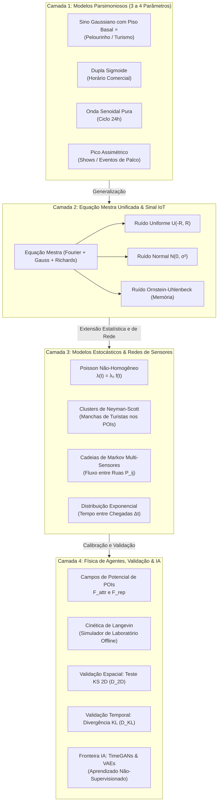
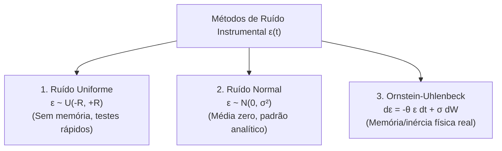
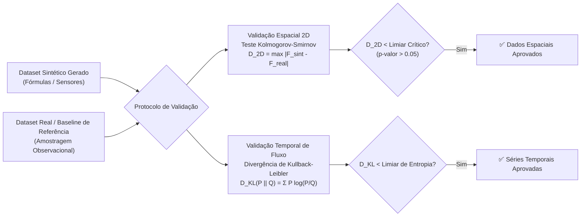
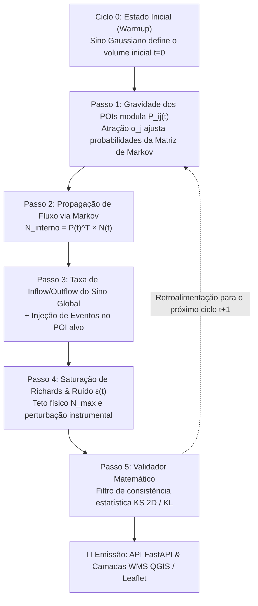

# 📄 Framework Unificado para Geração e Validação de Dados Sintéticos em Gêmeos Digitais IoT
## Da Telemetria Analítica à Física de Agentes, Modelos Estocásticos e Redes Generativas

**Autores:** João Spinola Falcão, Daniel Costa Santos, Perrone & Equipe de Pesquisa em Gêmeos Digitais  
**Instituição:** Universidade Salvador (UNIFACS)  
**Projeto:** Gêmeo Digital IoT Geoespacial (Pelourinho / Centro Histórico de Salvador)  
**Data:** Setembro de 2026  
**Classificação:** Relatório Técnico Unificado / Artigo Metodológico de Engenharia  

---

## 📌 Resumo (*Abstract*)

O desenvolvimento de Gêmeos Digitais (*Digital Twins*) para cidades inteligentes e monitoramento de centros históricos densos — como o Pelourinho em Salvador — demanda fluxos contínuos e realistas de telemetria IoT. No entanto, a obtenção de dados reais esbarra em limitações de infraestrutura física, conformidade com a LGPD e na carência de registros de situações anômalas ou de emergência. 

Este documento consolida e unifica três linhas de pesquisa desenvolvidas na UNIFACS em um **Framework Integrado de Quatro Camadas**:
1. **Camada 1 — Modelos Parsimoniosos de Telemetria (3 a 4 Parâmetros):** Equações analíticas compactas e ultraleves ($O(1)$) para simulação rápida de sensores de contagem e densidade em tempo real (destaque para o *Modelo do Sino Gaussiano com Piso Basal*, recomendado para o Pelourinho);
2. **Camada 2 — Equação Mestra Unificada e Modelagem de Ruído Instrumental:** Generalização contínua que acopla Séries de Fourier, Misturas Gaussianas, limites mecânicos de Richards e três processos de ruído estocástico (Uniforme, Gaussiano e Ornstein-Uhlenbeck);
3. **Camada 3 — Variantes Estocásticas e Transição de Rede (Poisson Não-Homogêneo, Neyman-Scott e Cadeias de Markov):** Simulação de agrupamentos turísticos em pontos de interesse (POIs), intervalos entre chegadas e matrizes de probabilidade de deslocamento entre sensores vizinhos;
4. **Camada 4 — Simulação Microscópica por Forças Sociais (Langevin), Validação Não-Paramétrica (KS 2D / Divergência KL) e Fronteira com IA (GANs/VAEs):** Modelagem de atração por potenciais de POIs, repulsão de espaço pessoal e protocolo matemático estrito para validar o realismo dos dados sintetizados.

---

## 1. Visão Geral da Arquitetura em Quatro Camadas

A síntese de dados para o Gêmeo Digital estrutura-se em uma hierarquia que conecta desde a execução instantânea em servidores com recursos limitados até a validação microscópica com rigor físico:



---

## 2. Camada 1: Modelos Parsimoniosos e Minimalistas (3 a 4 Variáveis)

Projetados para máxima eficiência computacional ($O(1)$) e facilidade de ajuste, esses modelos isolam os comportamentos elementares do fluxo humano.

### 2.1. Modelo do Sino Gaussiano com Piso Basal — ⭐ [RECOMENDADO PARA O PELOURINHO]
As ruas turísticas históricas (Largo do Pelourinho, Terreiro de Jesus, Rua das Portas do Carmo) possuem um ciclo circadiano claro: circulação residual de moradores/seguranças de madrugada ($N_{\min}$), crescimento gradual durante a tarde, **ápice turístico no fim da tarde/pôr do sol** ($t_{\text{pico}} \approx 16\text{h}30$) e dispersão suave à noite ($\sigma \approx 3\text{h}$).

$$N(t) = N_{\min} + (N_{\max} - N_{\min}) \cdot \exp\left( -\frac{(t - t_{\text{pico}})^2}{2\sigma^2} \right)$$

* **Parâmetros:**
  1. $N_{\min}$: Piso de circulação na madrugada (ex: $5$ pessoas);
  2. $N_{\max}$: Lotação máxima no ápice turístico (ex: $60$ pessoas no campo de visão do sensor);
  3. $t_{\text{pico}}$: Horário central do pico de turistas (ex: $16.5$ = 16h30);
  4. $\sigma$: Duração/dispersão do período turístico (ex: $3.0\text{ h}$).

---

### 2.2. Modelo da Dupla Sigmoide (Horário Comercial com Platô Estável)
Indicado para espaços fechados (museus, bibliotecas, laboratórios e lojas) que abrem, enchem rápido, **mantêm a lotação estável ao longo do expediente** e esvaziam no fechamento:

$$N(t) = \frac{N_{\max}}{\left(1 + \exp\left(-\kappa (t - t_{\text{abre}})\right)\right) \cdot \left(1 + \exp\left(\kappa (t - t_{\text{fecha}})\right)\right)}$$

* **Parâmetros:** $N_{\max}$ (lotação de expediente), $t_{\text{abre}}$ (abertura), $t_{\text{fecha}}$ (fechamento), $\kappa$ (rapidez de transição).

---

### 2.3. Modelo da Onda Senoidal Pura (Oscilação Diurna/Noturna)
Indicado para grandes vias públicas e calçadas com tráfego contínuo e suave de 24 horas:

$$N(t) = \max\left(0, \;\; \mu + A \cdot \sin\left( \frac{2\pi (t - t_0)}{24} \right) \right)$$

* **Parâmetros:** $\mu$ (média diária), $A$ (amplitude de oscilação), $t_0$ (início da subida matutina).

---

### 2.4. Modelo do Pico Assimétrico (Chegada Rápida e Saída Lenta)
Indicado para eventos pontuais de palco, shows culturais e apresentações onde o público chega rapidamente pouco antes do início e dispersa lentamente:

$$N(t) = N_{\min} + (N_{\max} - N_{\min}) \cdot \left( \frac{t}{t_{\text{pico}}} \right)^\alpha \cdot \exp\left( -\alpha \cdot \left(\frac{t - t_{\text{pico}}}{t_{\text{pico}}}\right) \right)$$

* **Parâmetros:** $N_{\min}$, $N_{\max}$, $t_{\text{pico}}$ e $\alpha$ (coeficiente de assimetria).

---

### 2.5. Extensão Temporal para Simulações de Longo Prazo (Dias, Semanas e Meses)
Para executar simulações contínuas que alimentem o banco de dados sem interrupções:

1. **Abordagem por Operador Módulo ($t \pmod{24}$):**
   $$h(t) = t \pmod{24} \implies N(t) = N_{\min} + (N_{\max} - N_{\min}) \cdot \exp\left( -\frac{(h(t) - t_{\text{pico}})^2}{2\sigma^2} \right)$$
2. **Abordagem por Dupla Variável $(d, h)$ com Multiplicador de Época ($\gamma$):**
   $$N(d, h) = \gamma(d) \cdot N_{\text{rotina}}(h) + E(d, h)$$
   * $\gamma(d) = 1.0$ (dias úteis), $\gamma(d) = 1.5$ (alta estação/verão), $\gamma(d) = 3.0$ (Carnaval);
   * $E(d, h)$ é a superposição de eventos/shows sem necessidade de comandos condicionais rígidos.
3. **Abordagem por Ciclo Semanal ($T = 168\text{h}$):** $h_{\text{semana}} = t \pmod{168}$.

---

## 3. Camada 2: A Equação Mestra Unificada e Variantes do Sinal IoT

Quando o cenário exige múltiplos eventos simultâneos, diferenciação automática de fins de semana, saturação mecânica estrita e ruído instrumental, adota-se a **Equação Mestra Unificada**:

### 3.1. Formulação Mestra da Densidade Observada $D(t)$
$$D_{\text{obs}}(t) = \max\left( 0, \;\; \frac{D_{\max}}{1 + \exp\left( -\kappa \cdot \left[ \beta_0 (1 - \delta_{\text{fds}} \mathbb{I}_{\text{fds}}(t)) + \sum_{k=1}^{K} \left( a_k \cos\left(\frac{2\pi k t}{T}\right) + b_k \sin\left(\frac{2\pi k t}{T}\right) \right) + \sum_{m=1}^{M} A_m e^{-\frac{(t - \tau_m)^2}{2\sigma_m^2}} - \lambda_0 \right] \right)} + \epsilon(t) \right)$$

---

### 3.2. Variante para Contagem Discreta de Indivíduos $N_{\text{det}}(t)$
$$N_{\text{det}}(t) = \operatorname{clip}\left( \left\lfloor \frac{N_{\max}}{1 + \exp\left( -\kappa \cdot \left[ \beta_0 (1 - \delta_{\text{fds}} \mathbb{I}_{\text{fds}}(t)) + \sum_{k=1}^{K} \left( a_k \cos\left(\frac{2\pi k t}{T}\right) + b_k \sin\left(\frac{2\pi k t}{T}\right) \right) + \sum_{m=1}^{M} A_m e^{-\frac{(t - \tau_m)^2}{2\sigma_m^2}} - \lambda_0 \right] \right)} + \epsilon(t) \right\rceil, \; 0, \; N_{\max} \right)$$

---

### 3.3. Projeção Espaço-Temporal Bidimensional no GIS $D(t, \mathbf{x})$
Para renderização de *Heatmaps* contínuos no Leaflet.js e QGIS Server a partir de uma rede de $J$ sensores posicionados em $\mathbf{x}_{s,j} = (x_{s,j}, y_{s,j})$ com raios de abrangência $R_{s,j}$:

$$D_{\text{total}}(t, \mathbf{x}) = \sum_{j=1}^{J} D_j(t) \cdot \exp\left( -\frac{\|\mathbf{x} - \mathbf{x}_{s,j}\|^2}{2 R_{s,j}^2} \right)$$

---

## 4. Modelagem Estocástica do Ruído Instrumental $\epsilon(t)$

A perturbação do sensor é modelada através de três métodos estocásticos selecionáveis:



### 4.1. Método 1: Ruído Uniforme Limitado $\mathcal{U}(-R, +R)$
$$\epsilon(t) \sim \mathcal{U}(-R, +R), \quad \mathbb{E}[\epsilon] = 0, \quad \operatorname{Var}(\epsilon) = \frac{R^2}{3}$$
* *Uso:* Testes unitários e mocks de interface.

### 4.2. Método 2: Ruído Branco Gaussiano $\mathcal{N}(0, \sigma_{\text{ruido}}^2)$
$$\epsilon(t) \sim \mathcal{N}(0, \sigma_{\text{ruido}}^2), \quad f(\epsilon) = \frac{1}{\sigma_{\text{ruido}} \sqrt{2\pi}} \exp\left( -\frac{\epsilon^2}{2\sigma_{\text{ruido}}^2} \right)$$
* *Uso:* Simulação padrão de sensores industriais e testes de Filtros de Kalman.

### 4.3. Método 3: Processo de Reversão à Média de Ornstein-Uhlenbeck
$$d\epsilon(t) = -\theta \cdot \epsilon(t) \, dt + \sigma_{\text{sensor}} \, dW(t)$$
*Equação Recorrente Discreta ($\Delta t$):*
$$\epsilon(t + \Delta t) = \epsilon(t) \cdot e^{-\theta \Delta t} + \sigma_{\text{sensor}} \sqrt{\frac{1 - e^{-2\theta \Delta t}}{2\theta}} \cdot Z_t, \quad Z_t \sim \mathcal{N}(0, 1)$$
* *Uso:* Modela a inércia física do hardware (oclusões e desvios persistem por alguns segundos antes de amortecerem de volta a zero).

---

## 5. Camada 3: Variantes Estocásticas e Redes de Sensores (Contribuições de Daniel)

Esta camada expande a síntese analítica incorporando modelos clássicos de processos pontuais, matrizes de transição espacial e distribuições de permanência:

### 5.1. Processo de Poisson Não-Homogêneo Modulado
A intensidade média esperada $\lambda(t)$ varia no tempo modulada pela curva comportamental $f(t)$ (Sino Gaussiano ou Fourier):

$$\lambda(t) = \lambda_0 \cdot f(t)$$
$$P(N(t) = k) = \frac{\lambda(t)^k \cdot e^{-\lambda(t)}}{k!}, \quad k \in \{0, 1, 2, \dots\}$$

* *Aplicação:* Geração de séries temporais com variabilidade estocástica discreta de pessoas que chegam de forma independente.

---

### 5.2. Processo de Agrupamentos Espaciais de Neyman-Scott (Clusters de Turistas nos POIs)
Turistas no Pelourinho movem-se tipicamente em grupos guiados (famílias, excursões, blocos). O modelo de Neyman-Scott estrutura essa dinâmica em duas etapas:

1. **Pontos-Pai (Centros de Atração Turística / POIs):** O número de grupos formados segue uma distribuição de Poisson:
   $$N_{\text{grupos}} \sim \operatorname{Poisson}(\lambda_{\text{pai}})$$
2. **Pontos-Filho (Membros do Grupo ao Redor do POI):** A quantidade de pessoas por grupo segue $\operatorname{Poisson}(\lambda_{\text{filho}})$, e a posição geográfica de cada membro $\mathbf{x}_{\text{filho}}$ é dispersa radialmente ao redor do centro do POI $\mathbf{x}_{\text{pai}}$:
   $$\mathbf{x}_{\text{filho}} = \mathbf{x}_{\text{pai}} + \Delta \mathbf{x}, \quad \text{onde } \Delta \mathbf{x} \sim \mathcal{N}(0, \sigma_{\text{cluster}}^2 \mathbf{I})$$

* *Aplicação:* Renderização de manchas de aglomeração heterogêneas e realistas no QGIS Server e Leaflet, evitando a uniformidade artificial.

---

### 5.3. Cadeias de Markov para Transição Multi-Sensores (Fluxo entre Ruas)
Para modelar o fluxo coordenado entre sensores distribuídos no Pelourinho (ex: Sensor 1 no Largo do Pelourinho, Sensor 2 no Terreiro de Jesus, Sensor 3 nas Portas do Carmo), define-se uma **Matriz de Transição Estocástica** $\mathbf{P}$:

$$P(X_{t+1} = j \mid X_t = i) = P_{ij}, \quad \text{onde } \sum_{j} P_{ij} = 1$$

$$\mathbf{P} = \begin{bmatrix} P_{11} & P_{12} & P_{13} \\ P_{21} & P_{22} & P_{23} \\ P_{31} & P_{32} & P_{33} \end{bmatrix}$$

* *Aplicação:* Se o Sensor 1 registra um pico de 100 pessoas saindo do Largo às 17h, a cadeia de Markov propaga automaticamente $60$ pessoas para o Sensor 2 e $40$ pessoas para o Sensor 3 no intervalo seguinte, garantindo consistência de fluxo em toda a rede de monitoramento.

---

### 5.4. Distribuição Exponencial para Tempos entre Chegadas (*Interarrival Times*)
Para simular o intervalo temporal $\Delta t$ (em segundos) entre pedestres sucessivos cruzando o feixe de um sensor:

$$f(\Delta t) = \lambda_{\text{chegada}} \cdot e^{-\lambda_{\text{chegada}} \Delta t}, \quad \Delta t \ge 0, \quad \mathbb{E}[\Delta t] = \frac{1}{\lambda_{\text{chegada}}}$$

* *Aplicação:* Simulação em nível de eventos discretos para catracas e câmeras com contagem linha a linha.

---

## 6. Camada 4A: Campos de Potencial e Forças Sociais (Contribuições de Perrone)

Para entender a dinâmica microscópica que origina os fluxos macroscópicos, integra-se a modelagem baseada em campos de força e equações estocásticas de movimento:

### 6.1. Força de Atração por Pontos de Interesse (POIs no Pelourinho)
Cada atração cultural $j$ localizada em $\mathbf{p}_j = (x_j, y_j)$ exerce um campo de atração sobre o pedestre $i$ localizado em $\mathbf{r}_i = (x_i, y_i)$:

$$\mathbf{F}_{ij}^{\text{attr}} = -\nabla U_j(\mathbf{r}_i) = \alpha_j(t) \cdot \frac{\mathbf{p}_j - \mathbf{r}_i}{\|\mathbf{p}_j - \mathbf{r}_i\|^2 + \epsilon_r}$$

* Onde $\alpha_j(t)$ é o **peso de atratividade horária** do POI (ex: alto para igrejas pela manhã e alto para bares/casas de show à noite), e $\epsilon_r > 0$ é a constante de regularização contra singularidades no centro do alvo.
* **Uso Prático na Calibração de Sensores:** O peso $\alpha_j$ serve como fator multiplicador direto da amplitude $N_{\max}$ do sensor instalado naquele POI.

---

### 6.2. Força de Repulsão Interpessoal (Espaço Pessoal de Pedestres)
Para evitar que múltiplos agentes sintéticos se sobreponham no espaço físico:

$$\mathbf{F}_{ik}^{\text{rep}} = \beta \cdot \exp\left( -\frac{\|\mathbf{r}_i - \mathbf{r}_k\|}{\sigma_r} \right) \hat{\mathbf{r}}_{ik}$$

* Onde $\beta$ é a magnitude de repulsão e $\sigma_r$ é o raio do espaço pessoal de conforto.

---

### 6.3. Cinética de Langevin como Simulador de Laboratório (*Offline Baseline*)
A trajetória de um agente $i$ no mapa é resolvida pela Equação Diferencial Estocástica de Langevin:

$$d\mathbf{r}_i(t) = \left( \sum_{j} \mathbf{F}_{ij}^{\text{attr}} + \sum_{k} \mathbf{F}_{ik}^{\text{rep}} \right) dt + \sqrt{2D_{\text{dif}}} \, d\mathbf{W}_i(t)$$

* Onde $\mathbf{W}_i(t)$ é o processo de Wiener bidimensional (movimento browniano) que introduz a exploração imprevisível do pedestre, e $D_{\text{dif}}$ é o coeficiente de difusão.
* **Papel no Gêmeo Digital:** Executado *offline* em ambiente de laboratório para gerar traçados de calibração que balizam os parâmetros das fórmulas analíticas rápidas de telemetria.

---

## 7. Camada 4B: Protocolo Formal de Validação Matemática (Contribuições de Perrone)

Para garantir que os dados sintéticos gerados possuam validade científica perante dados observacionais ou baselines de projeto, adota-se um protocolo não-paramétrico estrito:



### 7.1. Validação Espacial: Teste Kolmogorov-Smirnov Bidimensional ($D_{2D}$)
Avalia se a distribuição espacial de calor no mapa gerada pelas fórmulas sintéticas converge para a distribuição empírica observada:

$$D_{2D} = \max_{(x, y)} \left| F_{\text{sintetico}}(x, y) - F_{\text{real}}(x, y) \right|$$

* **Critério de Aceitação:** O valor $D_{2D}$ deve situar-se abaixo do valor crítico $D_{\text{crit}} = \frac{c(\alpha)}{\sqrt{N_{\text{amostras}}}}$, garantindo que a mancha de densidade do Pelourinho não apresente distorções geográficas estatisticamente significativas ($p > 0.05$).

---

### 7.2. Validação Temporal de Fluxos: Divergência de Kullback-Leibler ($D_{KL}$)
Mede a entropia relativa (perda de informação) entre a densidade teórica/observada $P(t)$ e a densidade sintetizada pelo gerador $Q(t)$ ao longo do horizonte temporal $T$:

$$D_{KL}(P \parallel Q) = \sum_{t \in T} P(t) \cdot \ln\left( \frac{P(t)}{Q(t)} \right)$$

* **Critério de Aceitação:** A calibração dos parâmetros de Fourier e Gaussianos é considerada ótima quando $D_{KL}(P \parallel Q) \to 0$, assegurando que as curvas horárias preservam a dinâmica do fluxo diário.

---

## 8. Fronteira com IA: Modelos Generativos Profundos (GANs e VAEs)

Como perspectiva de evolução futura para quando o projeto dispuser de séries temporais reais contínuas coletadas no Pelourinho, o framework prevê a integração de modelos generativos neurais:

### 8.1. Classificação Teórica
> **Esclarecimento Metodológico:** Redes Adversárias Generativas (GANs) e Autoencoders Variacionais (VAEs) pertencem à classe de **Aprendizado Generativo Não-Supervisionado (ou Auto-Supervisionado)**. Eles não exigem anotações ou rótulos humanos ($X \to Y$); aprendem diretamente a distribuição de probabilidade latente $p_{\text{data}}(x)$ a partir de amostras brutas $X$.

---

### 8.2. Redes Adversárias Generativas para Séries Temporais (TimeGANs)
Dois modelos neurais são treinados em um jogo de soma zero (*Minimax Game*):
* **Gerador ($G$):** Mapeia um vetor de ruído latente $z \sim p_z(z)$ em uma série temporal sintética de contagem de sensor $G(z)$;
* **Discriminador ($D$):** Estima a probabilidade de uma série temporal ter vindo dos sensores reais do Pelourinho ($x$) ou do gerador ($G(z)$).

$$\min_{G} \max_{D} V(D, G) = \mathbb{E}_{x \sim p_{\text{data}}(x)}\left[ \ln D(x) \right] + \mathbb{E}_{z \sim p_z(z)}\left[ \ln\left( 1 - D(G(z)) \right) \right]$$

---

### 8.3. Autoencoders Variacionais (VAEs)
O VAE mapeia a série temporal de entrada em uma distribuição de probabilidade latente $q_\phi(z \mid x)$ (encoder) e amostra desse espaço para reconstruir o sinal $p_\theta(x \mid z)$ (decoder), maximizando o Limite Inferior da Evidência (*ELBO*):

$$\mathcal{L}_{\text{ELBO}}(\theta, \phi; x) = \mathbb{E}_{q_\phi(z \mid x)}\left[ \ln p_\theta(x \mid z) \right] - D_{KL}\left( q_\phi(z \mid x) \,\|\, p(z) \right)$$

---

## 9. O Modelo Acoplado em Malha (Rede Gravitacional-Markoviana) e Gestão Dinâmica de Eventos

Como síntese integradora de todas as frentes de pesquisa investigadas, formaliza-se a arquitetura de **Rede Gravitacional-Markoviana com Injeção de Fluxo e Validação em Malha**. Este modelo unifica a gravidade dos POIs (Perrone), as transições estocásticas de rede (Daniel), o envelope temporal analítico de sensores (João) e os testes de validação matemática.



---

### 9.1. A Equação Mestra Completa da Rede em Malha (Formulação Fechada)

Podemos expressar a dinâmica de toda a rede de sensores de duas formas matematicamente fechadas:

#### A. Forma Vetorial-Matricial Compacta (Toda a Rede de Sensores)
$$\mathbf{N}^{\text{sensor}}(t+1) = \operatorname{clip}\left( \left\lfloor S\left( \mathbf{P}(t)^T \cdot \mathbf{N}(t) + \mathbf{w} \cdot \Delta N_{\text{bairro}}(t) + \mathbf{E}(t) \right) + \boldsymbol{\epsilon}(t) \right\rceil, \; \mathbf{0}, \; \mathbf{N}_{\max} \right)$$

---

#### B. Forma Escalar Expandida Nó a Nó (Para o Sensor $j$ no Instante $t+1$)
Esta é a **equação mestra definitiva** que junta todos os blocos teóricos da pesquisa em uma única expressão matemática:

$$N_j^{\text{sensor}}(t+1) = \operatorname{clip}\left( \left\lfloor \frac{N_{j, \max}}{1 + \exp\left( -\kappa_j \cdot \left[ \underbrace{\sum_{i=1}^{J} \left( \frac{\alpha_j(t) e^{-\lambda_d d_{ij}}}{\sum_{k=1}^J \alpha_k(t) e^{-\lambda_d d_{ik}}} \right) N_i(t)}_{\text{1. Circulação dos Sensores Vizinhos (Markov + Gravidade POI)}} + \underbrace{w_j \cdot \frac{d N_{\text{bairro}}(t)}{dt}}_{\text{2. Entradas/Saídas Diárias (Sino)}} + \underbrace{\sum_{m=1}^{M_j} A_{jm} e^{-\frac{(t - \tau_{jm})^2}{2\sigma_{jm}^2}}}_{\text{3. Injeção de Eventos no POI}} - \lambda_{0,j} \right] \right)} + \underbrace{\epsilon_j(t)}_{\text{4. Ruído IoT}} \right\rceil, \; 0, \; N_{j, \max} \right)$$

---

### 9.2. Decomposição Termo a Termo da Equação Mestra

1. **Circulação Interna (Markov + Gravidade de POIs):**  
   $\sum_{i=1}^J P_{ij}(t) N_i(t)$ calcula quantas pessoas saíram de todos os outros sensores vizinhos $i$ e caminharam em direção ao sensor $j$, puxadas pela atratividade $\alpha_j(t)$ daquele ponto turístico;
2. **Entradas/Saídas Diárias do Bairro (Derivada do Sino Gaussiano):**  
   $w_j \frac{d N_{\text{bairro}}}{dt}$ injeta novos pedestres pela manhã (quando o Pelourinho está enchendo) e retira pedestres à noite (quando os turistas voltam aos hotéis), com peso $w_j$ proporcional à proximidade de portões de entrada (Elevador Lacerda, Praça da Sé);
3. **Injeção Pontual de Eventos no POI:**  
   $\sum A_{jm} e^{-\frac{(t - \tau_{jm})^2}{2\sigma_{jm}^2}}$ adiciona os picos de shows e celebrações agendados especificamente no local do sensor $j$;
4. **Curva Logística de Richards (Porta/Paredes):**  
   $\frac{N_{j, \max}}{1 + e^{-\kappa_j [\dots]}}$ atua como a barreira de capacidade física, impedindo superlotação que viole a geometria da rua;
5. **Ruído Instrumental $\epsilon_j(t)$ & Trava Discreta:**  
   Adiciona a oscilação do sensor físico e arredonda $\lfloor \dots \rceil$ com $\operatorname{clip}(0, N_{j, \max})$ para garantir contagem inteira válida.

---

### 9.3. Mecanismos de Gestão de Eventos (Sem Dependência de Datasets Prévios)

Para que o gerador sintético conheça e processe eventos culturais e sazonais sem a exigência de dados históricos reais pré-existentes, o framework estabelece três mecanismos complementares:

#### A. Modo 1: Regras Determinísticas de Calendário (100% Autônomo)
O sistema avalia regras fixas baseadas no relógio de calendário (dia da semana $d \in \{0, \dots, 6\}$ e hora $h \in [0, 24)$):
* **Terça da Benção (Olodum no Largo):** Se $d = 1$ (terça) e $19.0 \le h \le 22.0 \implies E_{\text{Largo}}(t) = 80 \cdot \exp\left(-\frac{(h - 20.0)^2}{2(1.5)^2}\right)$;
* **Missa Tradicional na Igreja do Rosário:** Se $d = 6$ (domingo) e $08.3 \le h \le 11.0 \implies E_{\text{Igreja}}(t) = 50 \cdot \exp\left(-\frac{(h - 09.5)^2}{2(1.0)^2}\right)$;
* **Sexta Cultural nas Portas do Carmo:** Se $d = 4$ (sexta) e $20.0 \le h \le 23.5 \implies E_{\text{Carmo}}(t) = 60 \cdot \exp\left(-\frac{(h - 21.5)^2}{2(1.2)^2}\right)$.

#### B. Modo 2: Tabela de Agendamento Configurável (JSON / GeoPackage)
Para testes controlados e flexibilidade operacional, o operador do Gêmeo Digital pode cadastrar eventos futuros ou cenários de estresse em uma estrutura de dados externa:
```json
[
  { "evento": "Ensaio Geral Olodum", "data": "2026-09-15", "hora": 19.5, "poi_id": "sensor_largo", "magnitude": 100, "duracao_h": 2.5 },
  { "evento": "Lavagem Cultural", "data": "2026-09-20", "hora": 10.0, "poi_id": "sensor_rosario", "magnitude": 250, "duracao_h": 4.0 },
  { "evento": "Circuito de Carnaval", "data_inicio": "2027-02-10", "data_fim": "2027-02-16", "multiplicador_gamma": 3.5 }
]
```
A função avalia a diferença de tempo $\Delta t = |t_{\text{atual}} - t_{\text{evento}}|$ e ativa o termo correspondente sem necessidade de alterações no código-fonte.

#### C. Modo 3: Geração Estocástica de Imprevistos (Monte Carlo)
Para simular eventos espontâneos (rodas de capoeira, apresentações de rua não agendadas):
* A cada ciclo vespertino ($14\text{h} \le h \le 18\text{h}$), o motor sorteia com probabilidade $p = 0.15$ um evento pontual com magnitude sorteada $A \sim \mathcal{N}(35, 10^2)$ e duração $\sigma \sim \mathcal{U}(0.5, 1.2)\text{ h}$.

#### D. Calibração de Magnitude Baseada na Capacidade Física ($N_{\max}$)
A magnitude de cada evento é balizada pela capacidade física máxima do espaço monitorado pelo sensor, evitando anomalias biologicamente impossíveis:
$$A_{\text{evento}} \sim \operatorname{clip}\left( \mathcal{N}\left( \mu_{\text{evento}}, \sigma_{\text{evento}}^2 \right), \;\; 0.3 \times N_{\max}, \;\; 0.95 \times N_{\max} \right)$$

---

### 9.3. Matriz Geral de Decisão Arquitetural

| Camada / Método | Domínio Matemático | Complexidade | Hardware Ideal | Função no Gêmeo Digital UNIFACS |
| :--- | :--- | :---: | :--- | :--- |
| **Sino Gaussiano com Piso (Camada 1)** | Analítico $N(t) \in \mathbb{N}$ | $O(1)$ | VM OCI (1 GB RAM) | **Produção em tempo real: telemetria leve para Pelourinho.** |
| **Equação Mestra (Camada 2)** | Analítico com Richards | $O(K + M)$ | VM OCI (1 GB RAM) | **Testes de estresse, superlotação e múltiplos eventos.** |
| **Neyman-Scott & Markov (Camada 3)** | Processo Pontual / Matriz | $O(J^2)$ | Backend FastAPI | **Simulação de redes integradas de sensores e clusters GIS.** |
| **Langevin / Forças Sociais (Camada 4A)**| SDE Microscópica | $O(N^2)$ | Workstation Local | **Baseline de laboratório offline para calibrar parâmetros.** |
| **Testes KS 2D e KL (Camada 4B)** | Estatística Não-Paramétrica | $O(T)$ | Pipeline de Testes | **Certificação científica e validação de acurácia dos dados.** |
| **Rede Acoplada em Malha (Seção 9)** | Gravitacional-Markoviana | $O(J^2)$ | Backend FastAPI | **Motor integrado completo para simulação de rede viva.** |
| **TimeGAN / VAE (Fronteira IA)** | Redes Neurais Profundas | Alta (GPU) | Servidor Dedicado | **Geração avançada condicionada a dados históricos reais.** |

---

### 9.4. Mapa e Dicionário de Variáveis Padronizadas (Equalização Global)

Para eliminar ambiguidades e permitir que a equipe decida qual padrão adotar (artigo acadêmico vs. código de engenharia), o framework mapeia **duas convenções de notação perfeitamente equivalentes**:
* **Opção A (Notação Clássica / Literatura Acadêmica):** Utiliza letras gregas consagradas ($\tau, \sigma$) e símbolos tradicionais;
* **Opção B (Notação Mnemônica / Engenharia de Software):** Unifica todas as grandezas temporais sob o prefixo $t_{\text{subíndice}}$, facilitando a leitura imediata de que a unidade é sempre em horas.

| Categoria | Opção A (Clássica) | Opção B (Mnemônica) | Unidade | Significado Físico / Conceito | Onde Aparece |
| :--- | :---: | :---: | :---: | :--- | :--- |
| **Tempo e Calendário** | $t$ | $t$ | $\text{horas}$ | **Tempo contínuo acumulado** de simulação ($t \in [0, \infty)$). | Em todas as equações. |
| | $h(t)$ | $t_{\text{hora}}$ | $\text{horas}$ | **Hora do dia** no relógio circadiano ($t \pmod{24} \in [0, 24)$). | Seção 2.5, 9.1. |
| | $d$ | $d_{\text{calendario}}$ | $\text{dias}$ | **Dia do mês** ($1 \dots 30$) ou dia da semana ($0 \dots 6$). | Seção 2.5, 9.2. |
| | $T$ | $T_{\text{ciclo}}$ | $\text{horas}$ | **Período fundamental** ($24\text{ h}$ diário ou $168\text{ h}$ semanal). | Seção 2.5, 3.1. |
| | $\tau$ | $t_{\text{pico}}$ | $\text{horas}$ | **Horário central de ápice** do evento ou fluxo turístico. | Seção 2.1, 3.1, 9.1. |
| | $\sigma$ | $t_{\text{duracao}}$ | $\text{horas}$ | **Duração temporal / espalhamento** do evento ou pico. | Seção 2.1, 3.1, 9.1. |
| **Saída e Estado** | $N(t)$ | $N(t)$ | $\text{indivíduos}$ | **Contagem discreta de pessoas** no sensor (saída da API). | Em todos os modelos. |
| | $D(t)$ | $D(t)$ | $\text{pessoas/m}^2$ | **Densidade contínua** estimada de ocupação. | Seção 3.1, 4. |
| | $D(t, \mathbf{x})$ | $D(t, \mathbf{x})$ | $\text{pessoas/m}^2$ | **Mancha espacial contínua** 2D na coordenada $\mathbf{x}=(x,y)$. | Seção 3.3. |
| **Capacidade e Saturação**| $N_{\max}$ | $N_{\max}$ | $\text{indivíduos}$ | **Capacidade física máxima / Teto intransponível**. | Em todas as equações com limite. |
| | $N_{\min}$ | $N_{\min}$ | $\text{indivíduos}$ | **Piso basal de ocupação** na madrugada (moradores/segurança). | Seção 2.1, 2.4. |
| | $\kappa$ | $\kappa_{\text{declive}}$ | $\text{h}^{-1}$ | **Declividade de saturação logística** de Richards. | Seção 2.2, 3.1, 9.1. |
| | $\lambda_0$ | $\lambda_{\text{inflexao}}$ | $\text{adimensional}$ | **Ponto médio de inflexão** da barreira de capacidade. | Seção 3.1, 9.1. |
| **Rede e Geografia** | $J$ | $J_{\text{sensores}}$ | $\text{unidades}$ | **Quantidade total de sensores/nós** no Pelourinho. | Seção 3.3, 5.3, 9. |
| | $i, j$ | $i, j$ | $\text{adimensional}$ | Índices de nós ($i$ = origem, $j$ = destino). | Seção 5.3, 6.1, 9.1. |
| | $\mathbf{P}(t)$ | $\mathbf{P}_{\text{markov}}(t)$ | $\text{probabilidade}$ | **Matriz de Transição de Markov** ($P_{ij}$ = chance $i \to j$). | Seção 5.3, 9.1. |
| | $d_{ij}$ | $d_{ij}$ | $\text{metros}$ | **Distância euclidiana** entre o sensor $i$ e o sensor $j$. | Seção 9.1. |
| | $\lambda_d$ | $\lambda_{\text{distancia}}$ | $\text{m}^{-1}$ | Coeficiente de **decaimento de atração por distância**. | Seção 9.1. |
| | $w_j$ | $w_j$ | $\text{fração}$ | **Peso de porta de entrada** do sensor $j$ no bairro ($\sum w_j = 1$). | Seção 9.1. |
| **Eventos e POIs** | $A$ | $A_{\text{evento}}$ | $\text{indivíduos}$ | **Amplitude / Lotação de pico** do show/evento no sensor $j$. | Seção 2.3, 3.1, 9.1. |
| | $\alpha_j(t)$ | $\alpha_{\text{atracao}, j}(t)$| $\text{adimensional}$ | **Peso de atratividade gravitacional** do POI $j$ na hora $t$. | Seção 6.1, 9.1. |
| | $\gamma$ | $\gamma_{\text{epoca}}$ | $\text{fator}$ | **Multiplicador sazonal de época** (verão, Carnaval). | Seção 2.5, 9.2. |
| **Ruído e Estocástica** | $\epsilon(t)$ | $\epsilon_{\text{ruido}}(t)$ | $\text{indivíduos}$ | **Perturbação estocástica / Ruído instrumental** do sensor IoT. | Seção 3.1, 4, 9.1. |
| | $\theta$ | $\theta_{\text{reversao}}$ | $\text{h}^{-1}$ | Taxa de **reversão à média** do ruído (Ornstein-Uhlenbeck). | Seção 4.3. |
| **Validação** | $D_{2D}$ | $D_{2D}$ | $\text{adimensional}$ | Estatística de suprema divergência do **Teste KS 2D**. | Seção 7.1. |
| | $D_{KL}$ | $D_{KL}$ | $\text{nats / bits}$ | **Divergência de Kullback-Leibler** (entropia de fluxo). | Seção 7.2. |

---

### 9.5. Matriz de Presença: Quais Variáveis Aparecem em Cada Equação?

Esta matriz evidencia como as variáveis se propagam e se acumulam da fórmula mais simples até a rede completa:

| Variável Padronizada | Sino Gaussiano (Sec 2.1) | Dupla Sigmoide (Sec 2.2) | Equação Mestra (Sec 3.1) | Neyman-Scott (Sec 5.2) | Rede Acoplada (Sec 9.1) |
| :--- | :---: | :---: | :---: | :---: | :---: |
| $t$ (Tempo contínuo) | ✅ | ✅ | ✅ | ✅ | ✅ |
| $N_{\max}$ (Capacidade máxima) | ✅ | ✅ | ✅ | — | ✅ |
| $N_{\min}$ (Piso de madrugada) | ✅ | — | — | — | ✅ (no Ciclo 0) |
| $t_{\text{pico}} / \tau$ (Horário de pico) | ✅ | — | ✅ | — | ✅ |
| $\sigma$ (Duração do pico) | ✅ | — | ✅ | ✅ (espacial) | ✅ |
| $\kappa$ (Declividade de Richards) | — | ✅ | ✅ | — | ✅ |
| $A$ (Amplitude de Eventos) | — | — | ✅ | — | ✅ |
| $\epsilon(t)$ (Ruído do Sensor) | — | — | ✅ | — | ✅ |
| $P_{ij}$ (Transição de Markov) | — | — | — | — | ✅ |
| $\alpha_j(t)$ (Gravidade dos POIs)| — | — | — | — | ✅ |
| $d_{ij}$ (Distância entre sensores)| — | — | — | — | ✅ |
| $w_j$ (Peso de portas do bairro) | — | — | — | — | ✅ |

---

## 10. Conclusão e Integração no Ecossistema de Software

O framework unificado apresentado estabelece uma ponte sólida entre o rigor da modelagem matemática e a praticidade da engenharia de software:

1. **Alimentação da API FastAPI e Datalake SQLite/GeoPackage:**  
   O *Modelo do Sino Gaussiano com Piso Basal* (Camada 1) e a *Equação Mestra* (Camada 2) operam com consumo desprezível de CPU e memória, permitindo gerar milhares de pontos de telemetria por segundo sem gargalos nas tabelas dinâmicas do GeoPackage;
2. **Publicação Cartográfica no QGIS Server e Leaflet.js:**  
   A projeção bidimensional $D(t, \mathbf{x})$ e os clusters de *Neyman-Scott* (Camada 3) produzem mapas térmicos dinâmicos fiéis à topografia e aos atratores históricos do Pelourinho via WMS/WFS;
3. **Respaldo e Rigor Acadêmico:**  
   A incorporação dos *Campos de Potencial de POIs*, da dinâmica de *Langevin* e do *Protocolo de Validação por Teste KS 2D e Divergência KL* (Camada 4) assegura que o projeto atenda aos mais exigentes critérios metodológicos de publicações científicas e relatórios institucionais da UNIFACS.

---

## 11. Referências Bibliográficas (Formato ABNT)

1. BROCKMANN, D.; HUFNAGEL, L.; GEISEL, T. The scaling laws of human travel. **Nature**, v. 444, n. 7118, p. 462–465, 2006.
2. CAMERON, A. C.; TRIVEDI, P. K. **Regression Analysis of Count Data**. 2. ed. Cambridge: Cambridge University Press, 2013.
3. COX, D. R. Some statistical methods connected with series of events. **Journal of the Royal Statistical Society: Series B (Methodological)**, v. 17, n. 2, p. 129–157, 1955.
4. ERLANG, A. K. The theory of probabilities and telephone conversations. **Nyt Tidsskrift for Matematik B**, v. 20, p. 33–41, 1909.
5. GONZÁLEZ, M. C.; HIDALGO, C. A.; BARABÁSI, A.-L. Understanding individual human mobility patterns. **Nature**, v. 453, n. 7196, p. 779–782, 2008.
6. GOODFELLOW, I. et al. Generative adversarial nets. **Advances in Neural Information Processing Systems (NeurIPS)**, v. 27, p. 2672–2680, 2014.
7. GREENSHIELDS, B. D. A study of traffic capacity. In: **Highway Research Board Proceedings**, v. 14, p. 448–477, 1935.
8. HELBING, D.; MOLNAR, P. Social force model for pedestrian dynamics. **Physical Review E**, v. 51, n. 5, p. 4282–4286, 1995.
9. KINGMAN, J. F. C. **Poisson Processes**. Oxford: Oxford University Press, 1993.
10. KINGMA, D. P.; WELLING, M. Auto-encoding variational bayes. In: **International Conference on Learning Representations (ICLR)**, 2014.
11. KULLBACK, S.; LEIBLER, R. A. On information and sufficiency. **The Annals of Mathematical Statistics**, v. 22, n. 1, p. 79–86, 1951.
12. NEYMAN, J.; SCOTT, E. L. A theory of the spatial distribution of galaxies. **The Astrophysical Journal**, v. 116, p. 144–163, 1952.
13. PEACOCK, J. A. Two-dimensional goodness-of-fit testing in astronomy. **Monthly Notices of the Royal Astronomical Society**, v. 202, n. 3, p. 615–627, 1983. (Generalização bidimensional de Kolmogorov-Smirnov).
14. RICHARDS, F. J. A flexible growth function for empirical use. **Journal of Experimental Botany**, v. 10, n. 2, p. 290–300, 1959.
15. UHLENBECK, G. E.; ORNSTEIN, L. S. On the theory of the Brownian motion. **Physical Review**, v. 36, n. 5, p. 823–841, 1930.
16. YOON, J.; JARRETT, D.; VAN DER SCHAAR, M. Time-series generative adversarial networks. **Advances in Neural Information Processing Systems (NeurIPS)**, v. 32, 2019. (TimeGAN).
