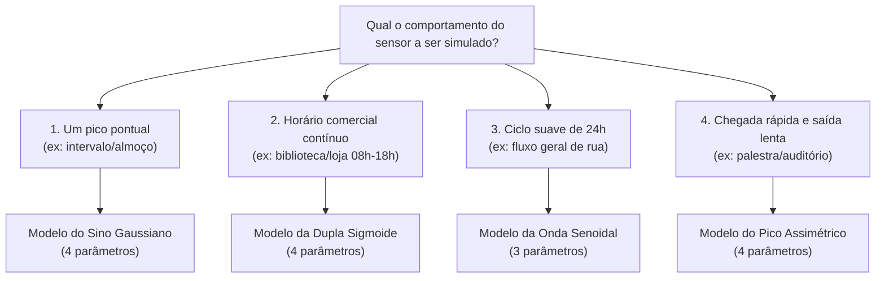
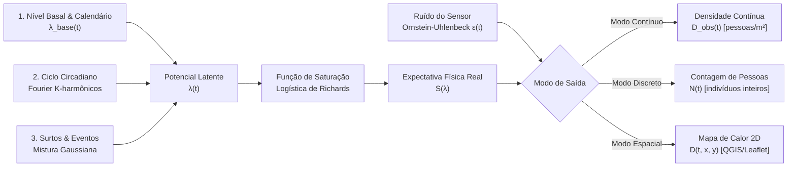
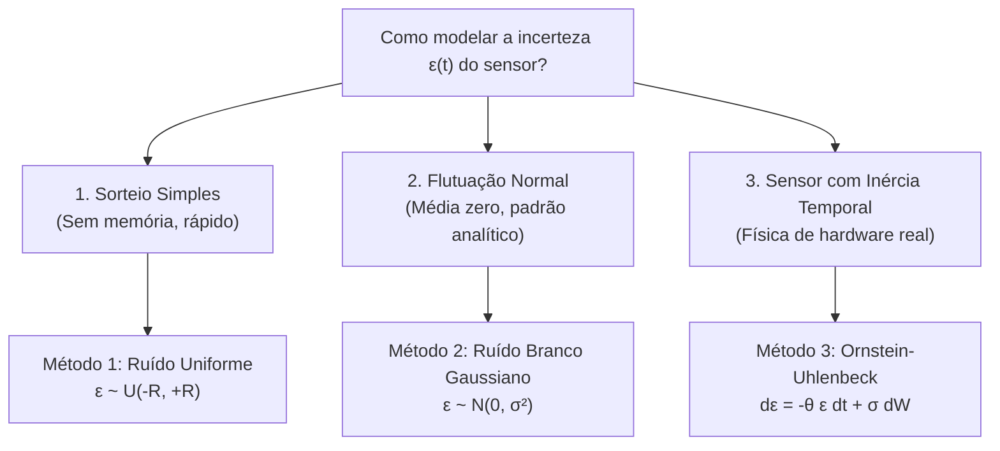

# 📄 Modelagem Matemática e Estocástica para Geração de Séries Temporais Sintéticas de Densidade e Contagem de Pedestres em Gêmeos Digitais IoT

**Autores:** João Spinola Falcão & Equipe de Pesquisa em Gêmeos Digitais  
**Instituição:** Universidade Salvador (UNIFACS)  
**Projeto:** Gêmeo Digital IoT Geoespacial (Pelourinho / Ambientes Confinados)  
**Data:** Agosto de 2026  
**Classificação:** Relatório Técnico / Artigo Metodológico de Pesquisa  

---

## 📌 Resumo (*Abstract*)

O desenvolvimento e validação de Gêmeos Digitais (*Digital Twins*) geoespaciais voltados ao monitoramento urbano e predial demandam fluxos volumosos e heterogêneos de telemetria IoT. No entanto, a coleta de dados reais de fluxo de pessoas esbarra frequentemente em entraves regulatórios de privacidade (LGPD), limitações orçamentárias de hardware e na escassez de eventos anômalos ou críticos em condições normais de operação. 

Este artigo apresenta a fundamentação teórica e a formulação matemática de um arcabouço analítico-estocástico para geração de dados sintéticos de sensoriamento de pedestres estruturado em dois níveis de maturidade:
1. **Nível 1 (Modelos Parsimoniosos / Minimalistas):** Quatro equações compactas (de 3 a 4 parâmetros) calibradas para testes rápidos de prova de conceito;
2. **Nível 2 (Equação Mestra Unificada):** A generalização matemática que unifica ritmos circadianos via Séries de Fourier, surtos de aglomeração via Misturas Gaussianas, limites físicos de saturação via Curvas Logísticas de Richards e imperfeições instrumentais via Processos Estocásticos de Reversão à Média (Ornstein-Uhlenbeck) e Distribuições Sobredispersas (Poisson Não-Homogêneo e Binomial Negativa).

São apresentadas as equações para densidade contínua ($\text{pessoas/m}^2$), contagem discreta de indivíduos ($N \in \mathbb{N}$) e dispersão espacial bidimensional ($2\text{D}$), acompanhadas de um guia de calibração de parâmetros e referências bibliográficas seminais.

---

## 1. Introdução e Motivação

Um Gêmeo Digital consiste na representação digital contínua e em tempo real de um ativo físico ou espaço geográfico, sincronizado por fluxos de sensoriamento IoT e modelos analíticos. No contexto de cidades inteligentes (*Smart Cities*) e edifícios inteligentes (*Smart Buildings*), o monitoramento da dinâmica de pedestres é fundamental para:
1. Gestão de fluxo e prevenção de superlotação em gargalos históricos ou corredores;
2. Dimensionamento de rotas de evacuação e resposta a emergências;
3. Otimização de climatização, iluminação e eficiência energética baseada em ocupação;
4. Teste de carga e validação de pipelines de dados geoespaciais (OGC WMS/WFS, QGIS Server, Leaflet).

### O Desafio da Geração de Dados Sintéticos Realistas
Abordagens ingênuas de geração de dados — como o uso de ruído branco uniforme/gaussiano desprovido de memória ou funções senoidais isoladas — falham em reproduzir a dinâmica humana por desconsiderarem quatro axiomas fundamentais:
* **Periodicidade Não-Linear:** O comportamento humano obedece a ciclos de 24 horas e 7 dias, mas as transições não são perfeitamente harmônicas simples.
* **Elasticidade a Eventos:** O fluxo é frequentemente perturbado por eventos determinísticos ou estocásticos (início de aulas, palestras, paradas de transporte, apresentações culturais).
* **Capacidade de Carga Mecânica:** Áreas físicas possuem um limite intransponível de densidade de empacotamento ($D_{\max}$), além do qual a ocupação física atinge a saturação.
* **Comportamento Instrumental de Hardware:** Sensores físicos de baixo custo sofrem com oclusões, flutuações de sinal e erros correlacionados no tempo, diferindo de geradores puramente matemáticos.

---

## 2. Modelos Minimalistas e Parsimoniosos (3 a 4 Variáveis)

Seguindo o **Princípio da Parcimônia (Navalha de Occam)**, apresentamos inicialmente quatro modelos matemáticos compactos. Cada um foi desenhado para isolar um padrão comportamental humano específico utilizando o menor número possível de parâmetros ajustáveis.

---

### 2.1. Modelo 1: O "Sino Gaussiano" com Piso Basal (4 Variáveis) — ⭐ [RECOMENDADO PARA O PROJETO]
> **Por que este modelo é o recomendado para o Gêmeo Digital do Pelourinho?**  
> As ruas históricas e turísticas de Salvador (Largo do Pelourinho, Terreiro de Jesus, Rua das Portas do Carmo) possuem um ciclo muito bem definido: madrugada deserta ($N_{\min}$), aumento gradual com a chegada de passeios e abertura do comércio ao meio-dia, **ápice de circulação no fim da tarde/pôr do sol** ($t_{\text{pico}} \approx 16\text{h}30$) e dispersão suave ao anoitecer ($\sigma \approx 3\text{h}$). Com apenas **4 parâmetros**, ele sintetiza com máxima fidelidade a rotina de visitação sem complexidade desnecessária.

* **Comportamento:** O local permanece em circulação mínima na maior parte do tempo, registrando uma elevação suave até o ápice turístico e retornando gradualmente ao piso.
* **Equação:**
  $$N(t) = N_{\min} + (N_{\max} - N_{\min}) \cdot \exp\left( -\frac{(t - t_{\text{pico}})^2}{2\sigma^2} \right)$$
* **Parâmetros:**
  1. $N_{\min}$: Lotação mínima na madrugada/fora de pico (ex: $5$ pessoas — moradores/segurança).
  2. $N_{\max}$: Lotação máxima no ápice turístico (ex: $60$ pessoas no campo de visão do sensor).
  3. $t_{\text{pico}}$: Horário central do pico de turistas (ex: $16.5$ = 16h30).
  4. $\sigma$: Duração/espalhamento do fluxo turístico em horas (ex: $3.0\text{ h}$, cobrindo das 13h30 às 19h30).

---

### 2.2. Modelo 2: A "Dupla Sigmoide" (Horário Comercial com Platô — 4 Variáveis)
* **Comportamento:** Espaços como bibliotecas, laboratórios, salas de aula ou lojas que abrem, enchem rapidamente, **mantêm um platô estável de ocupação** e esvaziam no final do expediente.
* **Equação:**
  $$N(t) = \frac{N_{\max}}{\left(1 + \exp\left(-\kappa (t - t_{\text{abre}})\right)\right) \cdot \left(1 + \exp\left(\kappa (t - t_{\text{fecha}})\right)\right)}$$
* **Parâmetros:**
  1. $N_{\max}$: Capacidade de ocupação mantida durante o expediente (ex: $40$ pessoas).
  2. $t_{\text{abre}}$: Horário de abertura do local (ex: $08.0$ = 08h00).
  3. $t_{\text{fecha}}$: Horário de fechamento/saída (ex: $18.0$ = 18h00).
  4. $\kappa$: Declividade/rapidez de enchimento e esvaziamento (ex: $\kappa = 2.0$).

---

### 2.3. Modelo 3: A "Onda Senoidal Pura" (Oscilação Diurna/Noturna — 3 Variáveis)
* **Comportamento:** Ruas abertas, praças públicas ou fluxos contínuos onde o tráfego sobe gradualmente ao amanhecer e desce suavemente de madrugada.
* **Equação:**
  $$N(t) = \max\left(0, \;\; \mu + A \cdot \sin\left( \frac{2\pi (t - t_0)}{24} \right) \right)$$
* **Parâmetros:**
  1. $\mu$: Ocupação média diária (ex: $20$ pessoas).
  2. $A$: Amplitude de variação diurna (ex: $15\text{ pessoas} \implies$ oscilação suave entre $5$ e $35$).
  3. $t_0$: Horário de início da ascensão matutina (ex: $06.0$ = 06h00).

---

### 2.4. Modelo 4: O "Pico Assimétrico" (Chegada Rápida e Saída Lenta — 4 Variáveis)
* **Comportamento:** Auditórios, palestras ou eventos culturais onde as pessoas chegam quase simultaneamente pouco antes do início, mas dispersam lentamente ao longo do tempo.
* **Equação:**
  $$N(t) = N_{\min} + (N_{\max} - N_{\min}) \cdot \left( \frac{t}{t_{\text{pico}}} \right)^\alpha \cdot \exp\left( -\alpha \cdot \left(\frac{t - t_{\text{pico}}}{t_{\text{pico}}}\right) \right)$$
* **Parâmetros:**
  1. $N_{\min}$: Piso de circulação basal.
  2. $N_{\max}$: Lotação máxima.
  3. $t_{\text{pico}}$: Horário do ápice do evento.
  4. $\alpha$: Coeficiente de assimetria (quanto maior $\alpha$, mais íngreme é a subida e mais longa é a cauda de dispersão).

---

### 2.5. Tabela Comparativa dos Modelos Minimalistas

| Modelo Simples | Qtd. Parâmetros | Formato da Curva | Principal Aplicação Prática | Status no Projeto |
| :--- | :---: | :--- | :--- | :--- |
| **Sino Gaussiano** | **4** | Montanha simétrica com piso | Fluxo turístico diário no Pelourinho, picos de almoço/intervalo. | **⭐ Recomendado** |
| **Dupla Sigmoide** | **4** | Platô contínuo com subida e descida | Expediente comercial de salas, bibliotecas e lojas. | Alternativa |
| **Onda Senoidal** | **3** | Onda suave de 24 horas | Movimento geral contínuo de calçadas e vias urbanas. | Alternativa |
| **Pico Assimétrico** | **4** | Subida abrupta e cauda longa | Auditórios, shows e salas de apresentações culturais. | Alternativa |

---

### 2.6. Extensão Temporal para Simulações Contínuas (Dias, Semanas e Meses)

Por padrão, a variável de tempo $t$ dos modelos simples opera no ciclo circadiano diário de $24$ horas ($t \in [0, 24)$). Para executar simulações contínuas que geram fluxos de dados sintéticos por semanas ou meses a fio sem interrupção, existem **três abordagens matemáticas equivalentes**:

#### 1. Abordagem por Operador Módulo ($t \pmod{24}$) — Loop Temporal Contínuo
Para um relógio de simulação contínuo em horas $t \in [0, \infty)$ (ex: $t = 720\text{ h}$ para $30\text{ dias}$):
$$h(t) = t \pmod{24}$$
$$N(t) = N_{\min} + (N_{\max} - N_{\min}) \cdot \exp\left( -\frac{(h(t) - t_{\text{pico}})^2}{2\sigma^2} \right)$$
* *Como funciona:* O operador resto de divisão ($\% 24$) reinicia o ciclo diariamente de forma suave e automática ($t = 26\text{h} \implies h = 2\text{h}$ da madrugada do Dia 2).

#### 2. Abordagem por Dupla Variável $(d, h)$ — Matriz de Calendário
Em vez de uma única variável contínua, decompõe-se o tempo em **Dia do Mês** $d \in \{1, 2, \dots, 30\}$ e **Hora do Dia** $h \in [0, 24)$:
$$N(d, h) = \gamma(d) \cdot N_{\text{rotina}}(h) + E(d, h)$$
* *Como funciona:* Permite associar facilmente regras de negócio por dia (ex: $\gamma(d) = 1.5$ nos finais de semana; $E(d, h)$ injeta um show apenas nas terças-feiras $d \in \{7, 14, 21, 28\}$ às $h = 20\text{h}$).

#### 3. Abordagem por Ciclo Semanal Fundamental ($T = 168\text{ horas}$)
Para capturar o padrão completo de 7 dias (segunda a domingo) em um único bloco temporal:
$$h_{\text{semana}}(t) = t \pmod{168}$$
* *Como funciona:* Permite que dias úteis e finais de semana se repitam ciclicamente a cada 168 horas sem necessidade de lógica condicional externa.

---

## 3. Da Simplicidade à Generalização: A Equação Mestra Unificada

Os quatro modelos minimalistas da Seção 2 representam **casos particulares** de uma única formulação matemática abrangente. Para simulações complexas de Gêmeos Digitais, propõe-se a **Equação Mestra Unificada**.

### 3.1. Quando e Por Que Devemos Usar a Equação Mestra Completa?

Embora o Modelo do Sino Gaussiano seja o ideal para o dia a dia inicial, a **Equação Mestra Completa deve ser utilizada em 4 situações específicas**:

1. **Quando quisermos simular dias com Múltiplos Eventos Concorrentes:**
   * *Exemplo no Pelourinho:* Uma terça-feira que possui a rotina turística normal da tarde ($A_1$ às 16h30) **MAIS** a concentração para a missa na Igreja do Rosário dos Pretos pela manhã ($A_2$ às 09h00) **MAIS** o ensaio do Olodum à noite ($A_3$ às 19h30). A equação mestra soma todos esses eventos perfeitamente.
2. **Quando precisarmos simular Séries Temporais Longas (Semanas / Meses):**
   * A equação simples simula 1 dia isolado. A equação mestra possui o operador de calendário ($\mathbb{I}_{\text{fds}}, \delta_{\text{fds}}$) que diferencia automaticamente dias úteis de finais de semana e feriados sem intervenção manual.
3. **Quando realizarmos Testes de Estresse e Alertas de Superlotação:**
   * Se injetarmos 3 eventos grandes ao mesmo tempo, a fórmula simples somaria valores infinitos. A equação mestra possui a **Curva Logística de Richards**, que garante a trava biológica/mecânica ($D_{\max}$ ou $N_{\max}$) para testar se os alarmes de emergência do Gêmeo Digital disparam corretamente.
4. **Quando formos validar a Resiliência de Filtros e Falhas de Hardware (IoT Real):**
   * Sensores reais falham e oscilam. A equação mestra injeta o ruído estocástico de reversão à média $\epsilon(t)$ (Ornstein-Uhlenbeck), permitindo testar se o backend (FastAPI/SQLite) e o frontend (Leaflet) filtram ruídos espúrios sem quebrar a interface.

---

### 3.2. Como a Equação Mestra Unifica os Modelos Simples

---

## 4. As Quatro Variantes de Sensoriamento IoT

A depender do tipo de telemetria emitido pelo sensor físico no Gêmeo Digital, seleciona-se a variante correspondente da Equação Mestra:

### Variante 1: Densidade Contínua de Ocupação $D_{\text{obs}}(t)$
Indicada para sensores de área, câmeras com mapa de calor analítico integrado ou sensores LiDAR de varredura superficial, expressa em $\text{pessoas/m}^2$:

$$D_{\text{obs}}(t) = \max\left( 0, \;\; \frac{D_{\max}}{1 + \exp\left( -\kappa \cdot \left[ \beta_0 (1 - \delta_{\text{fds}} \mathbb{I}_{\text{fds}}(t)) + \sum_{k=1}^{K} \left( a_k \cos\left(\frac{2\pi k t}{T}\right) + b_k \sin\left(\frac{2\pi k t}{T}\right) \right) + \sum_{m=1}^{M} A_m e^{-\frac{(t - \tau_m)^2}{2\sigma_m^2}} - \lambda_0 \right] \right)} + \epsilon(t) \right)$$

Onde a perturbação instrumental $\epsilon(t)$ segue o processo de reversão à média de Ornstein-Uhlenbeck:
$$d\epsilon(t) = -\theta \cdot \epsilon(t) \, dt + \sigma_{\text{sensor}} \, dW(t)$$

---

### Variante 2: Contagem Discreta Determinística de Pessoas $N_{\text{det}}(t)$
Indicada para sensores de passagem unidirecionais, catracas eletrônicas ou algoritmos de contagem de caixas delimitadoras (*bounding boxes* via YOLO/OpenCV), garantindo saída inteira $N \in \mathbb{N}_0$:

$$N_{\text{det}}(t) = \operatorname{clip}\left( \left\lfloor \frac{N_{\max}}{1 + \exp\left( -\kappa \cdot \left[ \beta_0 (1 - \delta_{\text{fds}} \mathbb{I}_{\text{fds}}(t)) + \sum_{k=1}^{K} \left( a_k \cos\left(\frac{2\pi k t}{T}\right) + b_k \sin\left(\frac{2\pi k t}{T}\right) \right) + \sum_{m=1}^{M} A_m e^{-\frac{(t - \tau_m)^2}{2\sigma_m^2}} - \lambda_0 \right] \right)} + \epsilon(t) \right\rceil, \; 0, \; N_{\max} \right)$$

Onde $\lfloor x \rceil = \lfloor x + 0.5 \rfloor$ representa o arredondamento para o inteiro mais próximo e $\operatorname{clip}(x, a, b) = \max(a, \min(x, b))$.

---

### Variante 3: Contagem Estocástica por Processo Pontual (Poisson / Binomial Negativa)
Indicada para simulação de chegadas estocásticas e filas de atendimento, onde o número de indivíduos observados é uma variável aleatória condicionada à intensidade média instantânea $\mu(t)$:

$$\mu(t) = \frac{N_{\max}}{1 + \exp\left( -\kappa \cdot \left[ \beta_0 (1 - \delta_{\text{fds}} \mathbb{I}_{\text{fds}}(t)) + \sum_{k=1}^{K} \left( a_k \cos\left(\frac{2\pi k t}{T}\right) + b_k \sin\left(\frac{2\pi k t}{T}\right) \right) + \sum_{m=1}^{M} A_m e^{-\frac{(t - \tau_m)^2}{2\sigma_m^2}} - \lambda_0 \right] \right)}$$

* **Caso 3.1: Pedestres Isolados e Independentes (Poisson Não-Homogêneo):**
  $$N(t) \sim \operatorname{Poisson}\big(\mu(t)\big) \implies P(N(t) = n) = \frac{\mu(t)^n \cdot e^{-\mu(t)}}{n!}$$

* **Caso 3.2: Pedestres em Agrupamentos Sociais (Binomial Negativa Sobredispersa):**
  $$P(N(t) = n) = \frac{\Gamma(n + \phi)}{n! \, \Gamma(\phi)} \left( \frac{\phi}{\phi + \mu(t)} \right)^\phi \left( \frac{\mu(t)}{\phi + \mu(t)} \right)^n$$

---

### Variante 4: Camada de Projeção Espaço-Temporal Bidimensional $D(t, \mathbf{x})$ (Mapas de Calor GIS)
> **Nota de Integração Arquitetural:** Esta variante **não substitui** as anteriores; ela atua como a **camada de projeção espacial** que consome o sinal temporal gerado no nó do sensor (pela **Variante 1**, **Variante 2** normalizada por área $N(t)/A_{\text{sensor}}$ ou **Variante 3**) e o difunde no plano geográfico contínuo $(x, y)$.

Para integração direta com os serviços WMS do QGIS Server e camadas dinâmicas do Leaflet.js, a densidade no ponto geográfico $\mathbf{x} = (x, y)$ a partir do sensor posicionado em $\mathbf{x}_s = (x_s, y_s)$ com raio de cobertura $R_s$ é formulada através de um Kernel Gaussiano espacial:

$$D(t, \mathbf{x}) = D_{\text{sensor}}(t) \cdot \exp\left( -\frac{\|\mathbf{x} - \mathbf{x}_s\|^2}{2 R_s^2} \right)$$

Onde $D_{\text{sensor}}(t)$ pode ser:
1. $D_{\text{obs}}(t)$ da **Variante 1** (densidade direta);
2. $\frac{N_{\text{det}}(t)}{A_{\text{sensor}}}$ da **Variante 2** (contagem inteira convertida por área);
3. $\frac{N_{\text{stoch}}(t)}{A_{\text{sensor}}}$ da **Variante 3** (contagem estocástica convertida por área).

Em um ambiente com **múltiplos sensores** $S = \{1, 2, \dots, J\}$, o campo total de densidade no mapa é a superposição aditiva ponderada:
$$D_{\text{total}}(t, \mathbf{x}) = \sum_{j=1}^{J} D_j(t) \cdot \exp\left( -\frac{\|\mathbf{x} - \mathbf{x}_{s,j}\|^2}{2 R_{s,j}^2} \right)$$

---

## 5. Modelagem do Ruído Instrumental do Sensor $\epsilon(t)$ (Os Três Métodos Estocásticos)

O termo $\epsilon(t)$ representa a incerteza de medição e as flutuações instrumentais inerentes ao hardware IoT (quedas momentâneas de quadros na visão computacional, oclusões físicas de pessoas passando juntas, reflexos de iluminação solar e atenuação de sinais de rádio Wi-Fi/BLE). 

O pesquisador pode selecionar entre três métodos estocásticos com diferentes níveis de fidelidade e complexidade:

---

### 5.1. Método 1: Ruído Uniforme Limitado $\mathcal{U}(-R, +R)$ (O "Dado de Tabuleiro")
* **Definição Matemática:**
  $$\epsilon(t) \sim \mathcal{U}(-R, +R), \quad \text{onde } R \in \mathbb{R}^+$$
* **Comportamento:** A cada instante $t$, o sensor sorteia um número equiprovável dentro do intervalo fechado $[-R, +R]$.
* **Propriedades Estatísticas:**
  * Média: $\mathbb{E}[\epsilon] = 0$;
  * Variância: $\operatorname{Var}(\epsilon) = \frac{R^2}{3}$;
  * Autocorrelação temporal nula (erros sucessivos são totalmente independentes).
* **Quando Usar:** Testes unitários iniciais, *mockups* de interface e validações rápidas de carga onde não é necessária correlação física no tempo.

---

### 5.2. Método 2: Ruído Branco Gaussiano $\mathcal{N}(0, \sigma_{\text{ruido}}^2)$ (A "Campainha Normal")
* **Definição Matemática:**
  $$\epsilon(t) \sim \mathcal{N}(0, \sigma_{\text{ruido}}^2)$$
  Com função densidade de probabilidade (FDP):
  $$f(\epsilon) = \frac{1}{\sigma_{\text{ruido}} \sqrt{2\pi}} \exp\left( -\frac{\epsilon^2}{2\sigma_{\text{ruido}}^2} \right)$$
* **Comportamento:** Erros pequenos próximos de zero ocorrem com maior frequência ($68.3\%$ das amostras caem no intervalo $[-\sigma_{\text{ruido}}, +\sigma_{\text{ruido}}]$), enquanto erros grandes ($\pm 2\sigma, \pm 3\sigma$) são progressivamente raros.
* **Propriedades Estatísticas:**
  * Média: $\mathbb{E}[\epsilon] = 0$;
  * Variância: $\operatorname{Var}(\epsilon) = \sigma_{\text{ruido}}^2$;
  * Independência temporal $\operatorname{Cov}(\epsilon(t), \epsilon(t')) = 0$ para $t \neq t'$.
* **Quando Usar:** Simulação padrão de sensores industriais e calibração de algoritmos clássicos de filtragem linear (ex: Filtro de Kalman básico).

---

### 5.3. Método 3: Processo de Ornstein-Uhlenbeck (Sensor com Memória / Inércia Realista)
* **Definição Contínua (Equação Diferencial Estocástica):**
  $$d\epsilon(t) = -\theta \cdot \epsilon(t) \, dt + \sigma_{\text{sensor}} \, dW(t)$$
* **Equação de Recorrência Discreta para Simulações ($\Delta t$):**
  $$\epsilon(t + \Delta t) = \epsilon(t) \cdot e^{-\theta \Delta t} + \sigma_{\text{sensor}} \sqrt{\frac{1 - e^{-2\theta \Delta t}}{2\theta}} \cdot Z_t, \quad \text{onde } Z_t \sim \mathcal{N}(0, 1)$$
* **Comportamento:** Reproduz a **inércia física do hardware**. Se um obstáculo momentâneo (ex: árvore balançando, caminhão de entrega ou grupo aglomerado) gera um desvio de medição no instante $t$, o sensor não zera o erro instantaneamente no milissegundo seguinte: o desvio decai gradualmente de volta à média zero a uma taxa de amortecimento $\theta$.
* **Propriedades Estatísticas:**
  * Média assintótica: $\mathbb{E}[\epsilon(t)] = 0$;
  * Variância estacionária: $\operatorname{Var}(\epsilon) = \frac{\sigma_{\text{sensor}}^2}{2\theta}$;
  * Autocorrelação exponencial temporal: $\rho(\tau) = e^{-\theta |\tau|}$ (captura dependência entre leituras consecutivas).
* **Quando Usar:** Modelagem de alta fidelidade para o Gêmeo Digital, testes de robustez de pipelines de dados em tempo real e avaliação de algoritmos de detecção de anomalias.

---

## 6. Comparativo de Variantes e Matriz de Casos de Uso

| Variante | Papel no Sistema | Domínio de Saída | Tipo de Hardware Simulado | Caso de Uso Primário no Gêmeo Digital |
| :--- | :--- | :--- | :--- | :--- |
| **1. Densidade Contínua $D(t)$** | Gerador Temporal | $\mathbb{R}_{\ge 0}$ ($\text{pessoas/m}^2$) | Sensores LiDAR 3D, Câmeras Térmicas de Teto, Sensores de Pressão. | Modelagem analítica de aglomeração e alimentação contínua do QGIS. |
| **2. Contagem Determinística $N_{\text{det}}(t)$** | Gerador Temporal | $\mathbb{N}_0$ ($\text{indivíduos}$) | Catracas eletrônicas, Sensores de Feixe Infravermelho, Câmeras YOLO. | Testes unitários rápidos de APIs de telemetria e painéis de lotação. |
| **3. Contagem Estocástica $N_{\text{stoch}}(t)$** | Gerador Temporal | $\mathbb{N}_0$ ($\text{indivíduos}$) | WiFi Sniffers, BLE Beacons, Catracas com Chegadas Estocásticas. | Simulações estocásticas de Monte Carlo e agrupamentos sociais de pedestres. |
| **4. Campo Espacial $D(t, \mathbf{x})$** | Projeção Espacial | $\mathbb{R}_{\ge 0}$ em $\mathbb{R}^2$ ($\text{matriz raster}$) | *Consome Variantes 1, 2 ou 3* e projeta na malha de coordenadas. | Renderização de mapas de calor contínuos (*heatmaps*) no Leaflet / QGIS Server. |

---

## 7. Dicionário Completo de Parâmetros e Guia de Calibração

Para facilitar a compreensão e o reuso, os parâmetros dividem-se em **Núcleo Temporal Comum** (idênticos estruturalmente em todas as fórmulas temporais) e **Parâmetros Específicos por Variante**.

### 7.1. Núcleo Temporal Comum (Compartilhado pelas Variantes 1, 2 e 3)

| Parâmetro | Símbolo | Unidade | Faixa Típica | Descrição e Papel Matemático |
| :--- | :---: | :---: | :---: | :--- |
| **Período Fundamental** | $T$ | Horas | $24.0$ ou $168.0$ | Define o ciclo de repetição: diário ($24\text{h}$) ou semanal completo ($168\text{h}$). |
| **Intensidade Basal** | $\beta_0$ | $\text{pes/m}^2$ ou $\text{pes}$ | $0.05 \text{ a } 0.3 \times \text{Cap}$ | Tráfego de fundo mínimo em dias úteis no horário operacional. |
| **Atenuação de Fim de Semana** | $\delta_{\text{fds}}$ | Adimensional | $0.0 \text{ a } 0.95$ | Fração de redução do fluxo em sábados e domingos ($\delta=0.85$ reduz $85\%$). |
| **Função Indicadora** | $\mathbb{I}_{\text{fds}}(t)$ | Binário $\{0, 1\}$ | $0$ ou $1$ | Ativa ($1$) nos fins de semana/feriados ou desativa ($0$) em dias úteis. |
| **Ordem dos Harmônicos** | $K$ | Inteiro | $3 \text{ a } 5$ | Número de ondas de Fourier. $K=3$ modela manhã, almoço e tarde com precisão. |
| **Coeficientes de Fourier** | $a_k, b_k$ | Mesma da saída | $[-1.0, 1.0] \times \text{Cap}$ | Moldam os horários e curvas dos picos da rotina diária (08h, 12h, 18h). |
| **Quantidade de Eventos** | $M$ | Inteiro | $0 \text{ a } 10$ | Quantidade de surtos pontuais ou anomalias programadas no horizonte de teste. |
| **Amplitude do Evento** | $A_m$ | Mesma da saída | $0.5 \text{ a } 2.0 \times \text{Cap}$ | Magnitude do surto gerado pelo evento $m$ (ex: troca de aula, show cultural). |
| **Pico Temporal do Evento** | $\tau_m$ | Horas | $[0, T]$ | Horário central de ápice do evento (ex: $14.5$ = 14h30). |
| **Duração do Evento** | $\sigma_m$ | Horas | $0.15 \text{ a } 1.5$ | Dispersão temporal da aglomeração ($68\%$ do fluxo ocorre em $[\tau_m \pm \sigma_m]$). |
| **Declividade da Saturação** | $\kappa$ | Adimensional | $0.5 \text{ a } 3.0$ | Sensibilidade da transição logística para a saturação mecânica. |
| **Ponto Médio de Inflexão** | $\lambda_0$ | Mesma da saída | $\approx 0.5 \times \text{Cap}$ | Ponto de meia-capacidade da curva logística. |

---

### 7.2. Parâmetros Específicos por Variante e Espacialização

| Parâmetro | Símbolo | Variante Associada | Unidade | Papel no Sistema |
| :--- | :---: | :---: | :---: | :--- |
| **Capacidade Máxima de Densidade** | $D_{\max}$ | **Variante 1** | $\text{pessoas/m}^2$ | Teto físico intransponível de densidade na área (ex: $2.5 \text{ a } 4.0\text{ pes/m}^2$). |
| **Capacidade Máxima de Pessoas** | $N_{\max}$ | **Variantes 2 e 3** | $\text{indivíduos}$ | Lotação máxima de cabeças no campo de visão/sala (ex: $60\text{ pessoas}$). |
| **Taxa de Reversão à Média** | $\theta$ | **Variantes 1 e 2** | $\text{horas}^{-1}$ | Inércia temporal do ruído do sensor (Ornstein-Uhlenbeck). |
| **Volatilidade do Sensor** | $\sigma_{\text{sensor}}$ | **Variantes 1 e 2** | Mesma da saída | Nível de ruído instrumental do hardware do sensor. |
| **Parâmetro de Dispersão** | $\phi$ | **Variante 3.2** | Adimensional | Agrupamento social de pedestres ($\phi \to \infty$ Poisson puro; $\phi=2$ grupos densos). |
| **Área de Cobertura do Sensor** | $A_{\text{sensor}}$ | **Variantes 2 e 3 $\to$ 4** | $\text{m}^2$ | Área física coberta pelo sensor para conversão $D = N / A_{\text{sensor}}$. |
| **Coordenadas do Sensor** | $\mathbf{x}_s = (x_s, y_s)$ | **Variante 4** | Metros ou WGS84 | Localização geográfica exata do sensor no mapa do Gêmeo Digital. |
| **Raio de Difusão Espacial** | $R_s$ | **Variante 4** | Metros | Raio de atenuação espacial do calor gerado pelo sensor no GIS. |

---

## 8. Exemplos de Calibração para Cenários Reais

### Cenário A: Corredor de Campus Universitário (Troca de Aulas)
* **Objetivo:** Simular fluxo calmo com picos intensos e rápidos a cada 1h40.
* **Configuração:**
  * $N_{\max} = 80 \text{ pessoas}$; $\beta_0 = 5 \text{ pessoas}$; $\delta_{\text{fds}} = 0.95$.
  * Eventos: $M = 3$ com $\tau = [08.0, 09.4, 11.0]$, $A_m = 45 \text{ pessoas}$, $\sigma_m = 0.12 \text{ h}$ ($~7\text{ minutos}$).
  * Ruído: $\sigma_{\text{sensor}} = 2.0$, $\theta = 10.0$.

### Cenário B: Praça do Pelourinho (Fluxo Turístico com Apresentação Cultural)
* **Objetivo:** Simular fluxo contínuo vespertino com uma grande atração no fim da tarde.
* **Configuração:**
  * $D_{\max} = 2.5 \text{ pessoas/m}^2$; $\beta_0 = 0.3 \text{ pessoas/m}^2$; $\delta_{\text{fds}} = 0.0$ (fins de semana mantêm alto fluxo).
  * Fourier: Picos harmonizados para 11h e 16h ($K=3$).
  * Evento Cultural: $M = 1$ às $\tau_1 = 17.5 \text{ h}$ (17h30), $A_1 = 1.8 \text{ pessoas/m}^2$, $\sigma_1 = 1.2 \text{ h}$ (evento longo de 2h30).
  * Dispersão Espacial: $R_s = 15.0 \text{ metros}$.

---

## 9. Fundamentação Teórica e Literatura Seminal

O arcabouço formulado apoia-se em quatro linhagens consolidadas da física teórica, transporte e engenharia de dados:

1. **Processos Pontuais Estocásticos e Teoria de Filas:**
   * **Erlang, A. K. (1909).** *The theory of probabilities and telephone conversations*. Nyt Tidsskrift for Matematik B, 20, 33-41. (Base da quantização discreta de chegadas independentes).
   * **Cox, D. R. (1955).** *Some statistical methods connected with series of events*. Journal of the Royal statistical Society: Series B, 17(2), 129-157. (Fundamentação dos processos duplamente estocásticos / Processos de Cox para taxas temporais variantes).
   * **Kingman, J. F. C. (1993).** *Poisson Processes*. Oxford Studies in Probability, Oxford University Press.

2. **Física Social e Regularidade da Mobilidade Humana:**
   * **González, M. C., Hidalgo, C. A., & Barabási, A. L. (2008).** *Understanding individual human mobility patterns*. **Nature**, 453(7196), 779-782. (Demonstração empírica da regularidade circadiana do deslocamento humano).
   * **Brockmann, D., Hufnagel, L., & Geisel, T. (2006).** *The scaling laws of human travel*. **Nature**, 444(7118), 462-465.
   * **Helbing, D., & Molnar, P. (1995).** *Social force model for pedestrian dynamics*. **Physical Review E**, 51(5), 4282. (Modelagem microscópica e macroscópica de forças e gargalos de multidões).

3. **Capacidade Viária e Modelos de Saturação Mecânica:**
   * **Richards, F. J. (1959).** *A flexible growth function for empirical use*. **Journal of Experimental Botany**, 10(2), 290-300. (Origem da curva logística generalizada de limite de capacidade assintótica).
   * **Greenshields, B. D. (1935).** *A study of traffic capacity*. Highway Research Board Proceedings, 14, 448-477. (Pioneirismo na formulação de limites de saturação em transporte).

4. **Incerteza de Sensoriamento IoT e Contagem Sobredispersa:**
   * **Uhlenbeck, G. E., & Ornstein, L. S. (1930).** *On the theory of the Brownian motion*. **Physical Review**, 36(5), 823. (Processo de reversão à média com correlação temporal contínua).
   * **Cameron, A. C., & Trivedi, P. K. (2013).** *Regression Analysis of Count Data*. Cambridge University Press, 2nd ed. (Formalização da distribuição Binomial Negativa para acomodação de variância excessiva em eventos de contagem social).

---

## 10. Conclusão e Integração no Gêmeo Digital

O arcabouço matemático apresentado resolve de forma elegante a necessidade de síntese de dados realistas para o projeto de Gêmeos Digitais da UNIFACS. Ao estruturar a modelagem em dois níveis (modelos parsimoniosos de 3 a 4 parâmetros para iterações ágeis e a Equação Mestra para cenários avançados de estresse), o projeto ganha:
1. Agilidade para validar e testar a ingestão de telemetria na API FastAPI e tabelas SQLite/GeoPackage;
2. Confiabilidade e respaldo científico para publicações e relatórios de Iniciação Científica;
3. Capacidade de renderização cartográfica contínua no QGIS Server e Leaflet.js sem custos ou riscos regulatórios de captura de dados reais em estágio preliminar.

---

## 11. Referências Bibliográficas (Formato ABNT)

1. BROCKMANN, D.; HUFNAGEL, L.; GEISEL, T. The scaling laws of human travel. **Nature**, v. 444, n. 7118, p. 462–465, 2006.
2. CAMERON, A. C.; TRIVEDI, P. K. **Regression Analysis of Count Data**. 2. ed. Cambridge: Cambridge University Press, 2013.
3. COX, D. R. Some statistical methods connected with series of events. **Journal of the Royal Statistical Society: Series B (Methodological)**, v. 17, n. 2, p. 129–157, 1955.
4. ERLANG, A. K. The theory of probabilities and telephone conversations. **Nyt Tidsskrift for Matematik B**, v. 20, p. 33–41, 1909.
5. GONZÁLEZ, M. C.; HIDALGO, C. A.; BARABÁSI, A.-L. Understanding individual human mobility patterns. **Nature**, v. 453, n. 7196, p. 779–782, 2008.
6. GREENSHIELDS, B. D. A study of traffic capacity. In: **Highway Research Board Proceedings**, v. 14, p. 448–477, 1935.
7. HELBING, D.; MOLNAR, P. Social force model for pedestrian dynamics. **Physical Review E**, v. 51, n. 5, p. 4282–4286, 1995.
8. KINGMAN, J. F. C. **Poisson Processes**. Oxford: Oxford University Press, 1993.
9. RICHARDS, F. J. A flexible growth function for empirical use. **Journal of Experimental Botany**, v. 10, n. 2, p. 290–300, 1959.
10. UHLENBECK, G. E.; ORNSTEIN, L. S. On the theory of the Brownian motion. **Physical Review**, v. 36, n. 5, p. 823–841, 1930.
