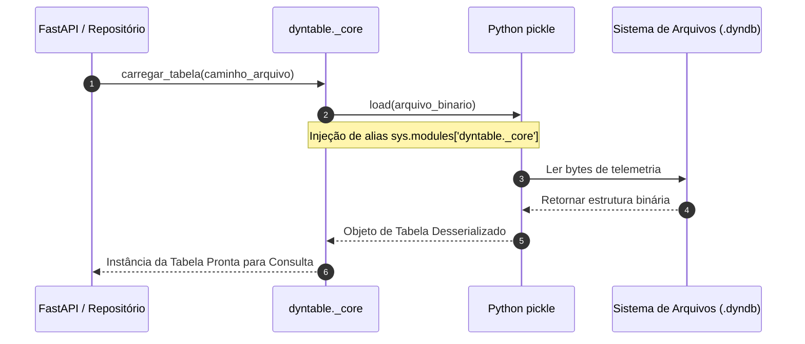

# 📦 Especificação Técnica: Motor de Tabelas Dinâmicas (`dyntable_engine`)

## 1. 🎯 Resumo Executivo & Responsabilidade Única
O módulo **`dyntable_engine`** é o componente de baixo nível responsável pelo armazenamento, estruturação e desserialização de dados de telemetria IoT no backend. Sua **responsabilidade única** é abstrair a manipulação de dados em memória e arquivos binários proprietários (`.dyndb`), garantindo suporte retrocompatível a estruturas salvas em versões anteriores através de aliasing dinâmico de módulos Python durante a desserialização via `pickle`.

---

## 2. 📊 Arquitetura Visual & Diagrama de Sequência (Mermaid)



---

## 3. 📋 Análise de Requisitos (RFs e RNFs com ID)

| ID | Tipo | Descrição do Requisito | Critério de Aceite |
| :--- | :--- | :--- | :--- |
| **RF-DYN-01** | Funcional | Carregar arquivos de tabela no formato proprietário `.dyndb`. | Retornar os dados parseados em coleções consultáveis sem erro de importação. |
| **RF-DYN-02** | Funcional | Mapear dinamicamente módulos legados de serialização. | Garantir que instâncias antigas buscando `dyntable._core` sejam redirecionadas transparentemente. |
| **RNF-DYN-01**| Desempenho| Desserialização de alta velocidade em memória. | Leitura de tabelas com milhares de registros em tempo inferior a 100ms. |
| **RNF-DYN-02**| Confiabilidade| Isolamento de falha na leitura de dados corrompidos. | Lançar exceção customizada sem derrubar o processo principal da API. |

---

## 4. 🔑 Dicionário de Variáveis, Atributos & Tipagem de Dados

| Atributo / Variável | Tipo de Dado | Descrição & Escopo | Exemplo / Valor Padrão |
| :--- | :--- | :--- | :--- |
| `sys.modules['dyntable._core']` | `module` | Alias em tempo de execução para mapear caminhos legados. | `dyntable.data._core` |
| `table_name` | `str` | Identificador único da tabela de sensores. | `"dados_temperatura_pelourinho"` |
| `schema` | `Dict[str, str]`| Mapeamento de colunas e tipos de dados IoT. | `{"sensor_id": "string", "temp": "float"}` |
| `records` | `List[Dict]` | Lista de leituras de telemetria contidas na tabela. | `[{"id": 1, "val": 25.4}]` |

---

## 5. 🔄 Fluxo de Dados & Contratos de Interface (Public API)

### Método: `load_table(file_path: str) -> DynamicTable`
* **Entrada:** `file_path` (Caminho absoluto do arquivo `.dyndb` ou `.pickle`).
* **Saída:** Objeto `DynamicTable` contendo metadados e registros.
* **Exceções Lançadas:** `FileNotFoundError`, `UnpicklingError`.

```python
# Contrato de Uso Interno
from dyntable import load_table

table = load_table("/infra/dados/temperatura.dyndb")
records = table.get_records()
```

---

## 6. 🛡️ Matriz de Resiliência, Casos de Borda & Tolerância a Falhas

| Caso de Borda / Falha potencial | Impacto no Sistema | Estratégia de Mitigação / Solução Aplicada |
| :--- | :--- | :--- |
| **Arquivo `.dyndb` de versão legada (`ModuleNotFoundError`)** | Falha na inicialização do DataLake e erro 500 na API. | Injeção dinâmica em `sys.modules` de `dyntable._core` antes do unpickling. |
| **Arquivo corrompido ou truncado durante escrita** | Exceção de leitura ao abrir a tabela. | Fallback para leitura de backup temporário e registro de log de advertência. |
| **Estouro de memória em arquivos gigantescos** | Risco de Out-Of-Memory (OOM) no servidor. | Leitura paginada e streaming de registros por demanda. |

---

## 7. 🧪 Estratégia de Testabilidade & Cobertura (QA)

* **Testes Unitários:** Executados via `pytest backend/tests/test_dyntable.py`.
* **Cenários Cobertos:**
  1. Teste de regressão com arquivos `.dyndb` legados da Etapa 1.
  2. Teste de inserção e recuperação de dicionários com tipos mistos (int, float, string).
  3. Validação da estabilidade do aliasing de módulos concorrentes.
