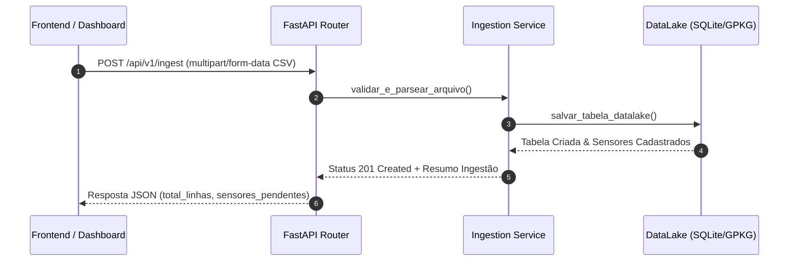

# 📦 Especificação Técnica: API REST FastAPI (`fastapi_api`)

## 1. 🎯 Resumo Executivo & Responsabilidade Única
O módulo **`fastapi_api`** é o ponto central de serviços HTTP do backend do Gêmeo Digital. Sua **responsabilidade única** é expor endpoints REST seguros e assíncronos para ingestão de dados de telemetria IoT (CSV/Excel), gerenciamento de tabelas ativas no DataLake, cadastro e atualização de coordenadas de sensores, e orquestração de atualizações espaciais.

---

## 2. 📊 Arquitetura Visual & Diagrama de Sequência (Mermaid)



---

## 3. 📋 Análise de Requisitos (RFs e RNFs com ID)

| ID | Tipo | Descrição do Requisito | Critério de Aceite |
| :--- | :--- | :--- | :--- |
| **RF-API-01** | Funcional | Receber arquivos CSV/Excel e ingerir no DataLake. | Aceitar múltiplos formatos e responder com status 201 e estatísticas da tabela. |
| **RF-API-02** | Funcional | Atualizar coordenadas de sensores (`PATCH /sensors/{id}`). | Persistir lat/long e acionar a sincronização imediata com o arquivo GeoPackage. |
| **RF-API-03** | Funcional | Alternar tabela ativa exibida no dashboard (`POST /tables/{name}/active`). | Atualizar ponteiro global de dados ativos e retornar os novos sensores. |
| **RNF-API-01**| Segurança | Suporte a chamadas Cross-Origin (CORS). | Permitir requisições da porta do frontend sem bloqueio de navegador. |
| **RNF-API-02**| Desempenho| Processamento assíncrono não bloqueante (`async/await`). | Manter resposta da API em < 50ms para consultas de lista de sensores. |

---

## 4. 🔑 Dicionário de Variáveis, Atributos & Tipagem de Dados

| Atributo / Variável | Tipo de Dado | Descrição & Escopo | Exemplo / Valor Padrão |
| :--- | :--- | :--- | :--- |
| `sensor_id` | `str` | Identificador único do sensor de telemetria IoT. | `"TEMP_PELO_01"` |
| `latitude` | `float` | Coordenada geográfica de latitude (WGS84). | `-12.9714` |
| `longitude` | `float` | Coordenada geográfica de longitude (WGS84). | `-38.5123` |
| `active_table` | `str` | Nome da tabela atualmente selecionada no DataLake. | `"dados_temperatura_salvador"` |
| `file` | `UploadFile` | Stream de arquivo enviado via formulário HTML. | `multipart/form-data` |

---

## 5. 🔄 Fluxo de Dados & Contratos de Interface (Public API)

### Principais Endpoints HTTP Expostos:

#### 1. Ingestão de Telemetria
* **Endpoint:** `POST /api/v1/ingest`
* **Request:** Form-data com campo `file` (CSV/Excel).
* **Response (201 Created):**
```json
{
  "status": "success",
  "table_name": "dados_temperatura_pelourinho",
  "total_records": 1500,
  "pending_sensors": ["SENSOR_03", "SENSOR_04"]
}
```

#### 2. Atualização de Coordenadas
* **Endpoint:** `PATCH /api/v1/sensors/{sensor_id}`
* **Request Body:** `{"latitude": -12.9714, "longitude": -38.5123}`
* **Response (200 OK):** `{"status": "updated", "sensor_id": "SENSOR_03"}`

---

## 6. 🛡️ Matriz de Resiliência, Casos de Borda & Tolerância a Falhas

| Caso de Borda / Falha potencial | Impacto no Sistema | Estratégia de Mitigação / Solução Aplicada |
| :--- | :--- | :--- |
| **Envio de CSV com colunas corrompidas ou sem ID** | Erro de parseamento ao salvar no banco. | Validação prévia com Pydantic e captura de erro com resposta HTTP 400 Bad Request. |
| **Requisições de redirecionamento 307 com perda de porta** | O navegador tenta acessar a porta 80 em vez da 8080 (`ERR_CONNECTION_REFUSED`). | Ajuste do middleware de cabeçalhos Nginx de `$host` para `$http_host`. |
| **Concorrência ao atualizar coordenadas de sensores** | Risco de condição de corrida na escrita do JSON de metadados. | Bloqueio por trava de arquivo (File Lock / Mutex) durante a gravação de metadados. |

---

## 7. 🧪 Estratégia de Testabilidade & Cobertura (QA)

* **Ferramenta:** Pytest com `httpx.AsyncClient` para testes de integração de API.
* **Cenários Cobertos:**
  1. Teste de rotas de Healthcheck (`GET /healthcheck`).
  2. Simulação de upload de arquivo CSV real (`dados_temperatura_salvador_pelourinho.csv`).
  3. Validação de atualização de latitude e longitude via requisição PATCH.
