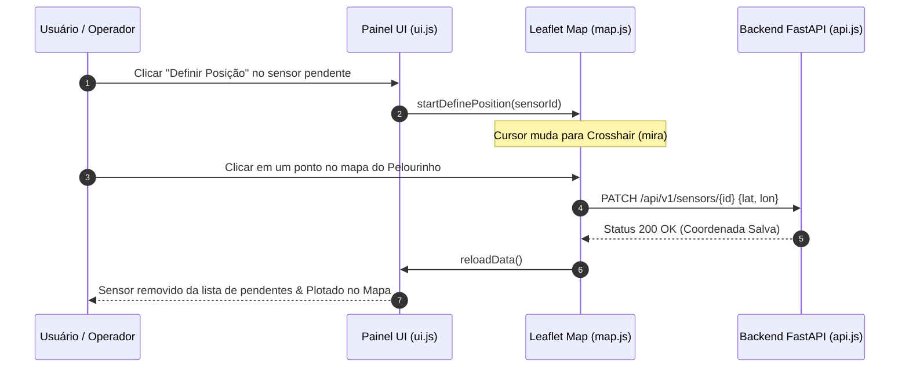

# 📦 Especificação Técnica: Painel de Geolocalização & Gestão (`frontend_georeferenciamento`)

## 1. 🎯 Resumo Executivo & Responsabilidade Única
O módulo **`frontend_georeferenciamento`** é a camada de interação avançada do usuário no dashboard web (`ui.js` e `app.js`). Sua **responsabilidade única** é gerenciar o ciclo de vida dos sensores sem coordenadas (sensores pendentes), prover uma interface interativa de atribuição de latitude/longitude por clique no mapa (modo crosshair/mira) e permitir a troca e ativação de diferentes tabelas de dados no DataLake.

---

## 2. 📊 Arquitetura Visual & Diagrama de Sequência (Mermaid)



---

## 3. 📋 Análise de Requisitos (RFs e RNFs com ID)

| ID | Tipo | Descrição do Requisito | Critério de Aceite |
| :--- | :--- | :--- | :--- |
| **RF-GEO-01** | Funcional | Listar sensores ingeridos que não possuem coordenadas prévias. | Exibir um painel lateral dinâmico "Sensores Pendentes" com os IDs encontrados. |
| **RF-GEO-02** | Funcional | Permitir a alocação geográfica de um sensor por clique no mapa. | Capturar o evento `click` no Leaflet, obter lat/long e enviar para o backend. |
| **RF-GEO-03** | Funcional | Selecionar e alternar a tabela ativa do DataLake. | Exibir modal/dropdown com as tabelas disponíveis e atualizar o mapa ao selecionar. |
| **RNF-GEO-01**| Usabilidade| Feedback visual claro durante o modo de definição de posição. | Exibir banner explicativo "Clique no mapa para posicionar o sensor" e cursor customizado. |
| **RNF-GEO-02**| Reatividade| Atualização da interface sem necessidade de dar F5 na página. | Recarregar os dados via chamadas AJAX/Fetch assíncronas. |

---

## 4. 🔑 Dicionário de Variáveis, Atributos & Tipagem de Dados

| Atributo / Variável | Tipo de Dado | Descrição & Escopo | Exemplo / Valor Padrão |
| :--- | :--- | :--- | :--- |
| `pendingSensors` | `Array[String]`| Lista contendo os IDs dos sensores sem georeferenciamento. | `["SENSOR_TEMP_03", "SENSOR_04"]` |
| `activeSensorId` | `String \| null`| ID do sensor atualmente em processo de posicionamento. | `"SENSOR_TEMP_03"` |
| `isDefiningPosition`| `Boolean` | Flag indicando se o modo de clique no mapa está ativado. | `true` |
| `tablesList` | `Array[Object]`| Lista de tabelas cadastradas no DataLake central. | `[{"name": "tabela1", "active": true}]` |

---

## 5. 🔄 Fluxo de Dados & Contratos de Interface (Public API)

### Funções Principais do Módulo `ui.js`:

#### 1. Renderização da Lista de Sensores Pendentes
```javascript
export function renderPendingList(pendingSensors);
// Constrói dinamicamente os cards HTML na barra lateral com o botão "Definir Posição"
```

#### 2. Ativação do Modo de Captura no Mapa
```javascript
export function handleDefineClick(sensorId);
// Prepara o estado da aplicação e chama o escutador de eventos do Leaflet
```

---

## 6. 🛡️ Matriz de Resiliência, Casos de Borda & Tolerância a Falhas

| Caso de Borda / Falha potencial | Impacto no Sistema | Estratégia de Mitigação / Solução Aplicada |
| :--- | :--- | :--- |
| **Usuário clica em "Definir Posição" e desiste sem clicar no mapa** | O cursor continuaria em modo mira, travando a navegação. | Adição de botão "Cancelar" no banner visual e tecla `ESC` para abortar o modo. |
| **Falha de rede ao enviar o PATCH das coordenadas** | A coordenada não é salva no servidor e o sensor continua pendente. | Alerta visual de erro (Toast/Notification) solicitando nova tentativa do usuário. |
| **Nenhuma tabela cadastrada no DataLake** | Painel fica sem dados para exibir. | Exibição de estado vazio ("Empty State") amigável orientando o upload de um CSV. |

---

## 7. 🧪 Estratégia de Testabilidade & Cobertura (QA)

* **Testes de Integração JS:** Validação das funções DOM e manipuladores de evento.
* **Cenários Cobertos:**
  1. Simulação de clique no botão "Definir Posição" e verificação da alteração de classe do cursor.
  2. Teste da função `renderPendingList` com arrays vazios e preenchidos.
  3. Validação do envio do payload JSON correto no método `patchSensorCoordinates`.
