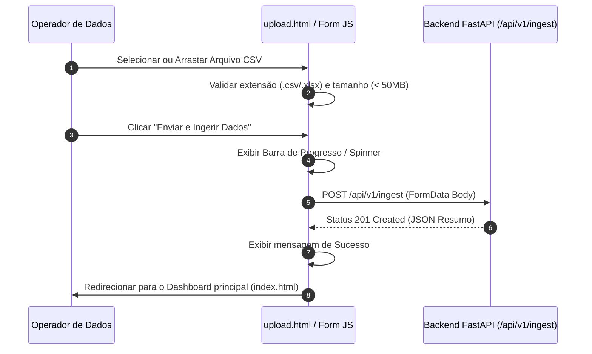

# 📦 Especificação Técnica: Portal de Upload & Ingestão (`frontend_ingestao_upload`)

## 1. 🎯 Resumo Executivo & Responsabilidade Única
O módulo **`frontend_ingestao_upload`** é a interface web dedicada à recepção de novos conjuntos de dados de telemetria IoT (`upload.html`). Sua **responsabilidade única** é fornecer um formulário interativo de seleção de arquivos (drag-and-drop ou seletor padrão), realizar validações primárias no navegador (tamanho e extensão `.csv`/`.xlsx`), enviar os dados de forma assíncrona para o backend e redirecionar o usuário de volta ao dashboard com feedback de progresso.

---

## 2. 📊 Arquitetura Visual & Diagrama de Sequência (Mermaid)



---

## 3. 📋 Análise de Requisitos (RFs e RNFs com ID)

| ID | Tipo | Descrição do Requisito | Critério de Aceite |
| :--- | :--- | :--- | :--- |
| **RF-UPL-01** | Funcional | Permitir o upload de arquivos de telemetria nos formatos CSV e Excel. | Suportar extensões `.csv`, `.xls` e `.xlsx`. |
| **RF-UPL-02** | Funcional | Prover zona de solicitação por arrasto ("Drag and Drop"). | Destacar a área de drop visualmente quando um arquivo for arrastado sobre ela. |
| **RF-UPL-03** | Funcional | Notificar o usuário sobre o resultado do processamento. | Exibir caixa de diálogo ou alerta com total de linhas inseridas e sensores detectados. |
| **RNF-UPL-01**| Usabilidade| Interface limpa e acessível com orientações de formato. | Exibir instruções sobre colunas esperadas (`timestamp`, `sensor_id`, `valor`). |
| **RNF-UPL-02**| Desempenho| Upload não bloqueante com indicador visual de carregamento. | Desabilitar botão de envio e mostrar spinner para evitar múltiplos envios acidentais. |

---

## 4. 🔑 Dicionário de Variáveis, Atributos & Tipagem de Dados

| Atributo / Variável | Tipo de Dado | Descrição & Escopo | Exemplo / Valor Padrão |
| :--- | :--- | :--- | :--- |
| `selectedFile` | `File \| null` | Objeto de arquivo selecionado no input HTML. | `dados_temperatura.csv` |
| `maxAllowedSize` | `Number` | Limite máximo de tamanho de arquivo em bytes. | `52428800` (50 MB) |
| `allowedExtensions`| `Array[String]`| Lista de extensões de arquivo válidas para ingestão. | `[".csv", ".xls", ".xlsx"]` |
| `isUploading` | `Boolean` | Flag indicando se a requisição HTTP POST está em andamento.| `false` |

---

## 5. 🔄 Fluxo de Dados & Contratos de Interface (Public API)

### Formulário HTML e Manipulador JS:

#### 1. Envio do Formulário via Fetch API
```javascript
async function handleUploadSubmit(event) {
    event.preventDefault();
    const formData = new FormData();
    formData.append('file', selectedFile);

    const response = await fetch('/api/v1/ingest', {
        method: 'POST',
        body: formData
    });
    const result = await response.json();
}
```

---

## 6. 🛡️ Matriz de Resiliência, Casos de Borda & Tolerância a Falhas

| Caso de Borda / Falha potencial | Impacto no Sistema | Estratégia de Mitigação / Solução Aplicada |
| :--- | :--- | :--- |
| **Tentativa de upload de arquivo executável ou de formato inválido (ex: `.pdf`, `.exe`)** | Risco de erro crítico no backend ou falha de parsing. | Bloqueio imediato no client-side com mensagem de erro antes de realizar a requisição HTTP. |
| **Tentativa de envio de arquivo vazio (0 bytes)** | Ingestão desnecessária no banco de dados. | Validação do atributo `file.size > 0` no manipulador do formulário. |
| **Queda de conexão durante o envio de um arquivo grande** | Requisição HTTP pendente ou interrompida. | Timeout configurado na requisição e opção de botão "Tentar Novamente". |

---

## 7. 🧪 Estratégia de Testabilidade & Cobertura (QA)

* **Testes Manuais e E2E:** Validação de fluxo completo de ingestão no navegador.
* **Cenários Cobertos:**
  1. Teste de validação do componente Drag and Drop com arquivos válidos e inválidos.
  2. Verificação do redirecionamento automático para `index.html` após ingestão com sucesso.
  3. Inspeção do tratamento de erros HTTP 400/500 exibidos na tela.
