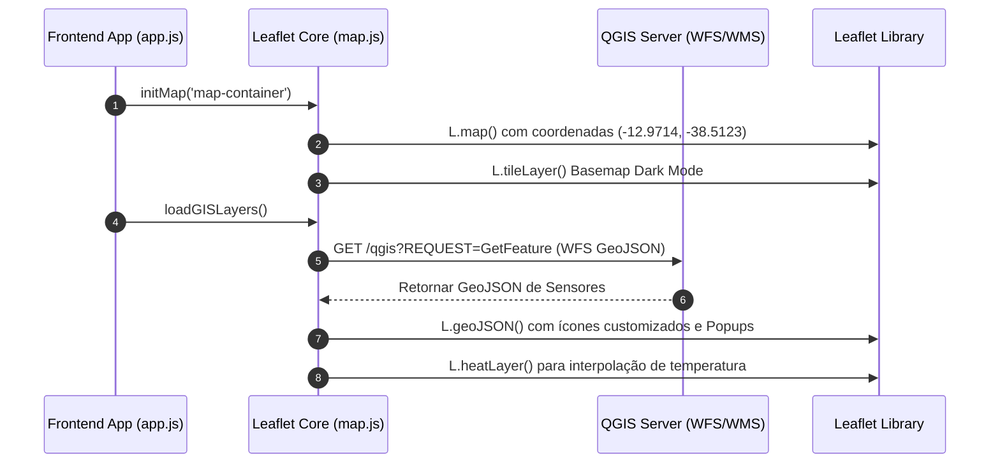

# 📦 Especificação Técnica: Core de Cartografia Leaflet (`frontend_mapa_leaflet`)

## 1. 🎯 Resumo Executivo & Responsabilidade Única
O módulo **`frontend_mapa_leaflet`** é o motor de visualização cartográfica interativa da aplicação web. Sua **responsabilidade única** é inicializar o mapa centralizado no Pelourinho (Salvador/BA), gerenciar as camadas de fundo (Tiles OpenStreetMap/CartoDB Dark), consumir e renderizar as camadas de vetores WFS e WMS servidas pelo QGIS Server, e renderizar camadas analíticas de mapa de calor (Heatmap).

---

## 2. 📊 Arquitetura Visual & Diagrama de Sequência (Mermaid)



---

## 3. 📋 Análise de Requisitos (RFs e RNFs com ID)

| ID | Tipo | Descrição do Requisito | Critério de Aceite |
| :--- | :--- | :--- | :--- |
| **RF-MAP-01** | Funcional | Renderizar mapa interativo focado no Pelourinho, Salvador/BA. | Exibir o mapa com zoom adequado (nível 16) e controles de navegação suaves. |
| **RF-MAP-02** | Funcional | Exibir camada espacial vetorial via WFS do QGIS Server. | Plotar os marcadores de sensores com popups informativos de telemetria. |
| **RF-MAP-03** | Funcional | Renderizar camada de mapa de calor dinâmico (Heatmap). | Desenhar manchas térmicas gradientes (azul/amarelo/vermelho) com base nos valores lidos. |
| **RNF-MAP-01**| Usabilidade| Estética moderna com suporte a modo escuro (Dark Mode). | Utilizar tiles CartoDB Dark Matter para alto contraste de visualização. |
| **RNF-MAP-02**| Desempenho| Renderização fluida a 60 FPS durante panning e zoom. | Limitar redesenho de camadas de calor e otimizar vetores GeoJSON. |

---

## 4. 🔑 Dicionário de Variáveis, Atributos & Tipagem de Dados

| Atributo / Variável | Tipo de Dado | Descrição & Escopo | Exemplo / Valor Padrão |
| :--- | :--- | :--- | :--- |
| `map` | `L.Map` | Instância global do objeto de mapa do Leaflet. | `L.map('map')` |
| `sensorLayer` | `L.GeoJSON` | Camada de marcadores de sensores georeferenciados. | `L.geoJSON(data)` |
| `heatLayer` | `L.HeatLayer` | Camada gráfica de gradiente térmico por interpolação. | `L.heatLayer(points)` |
| `pelourinhoCoords` | `Array[float]` | Coordenadas centrais da área de monitoramento em Salvador. | `[-12.9714, -38.5123]` |

---

## 5. 🔄 Fluxo de Dados & Contratos de Interface (Public API)

### Funções Expostas no Módulo `map.js`:

#### 1. Inicialização do Mapa
```javascript
// Contrato de Execução
export function initMap(containerId);
// Parâmetro: containerId (String ID do elemento HTML <div>)
```

#### 2. Atualização de Camadas de Sensores
```javascript
export function updateSensorMarkers(geoJsonData);
// Atualiza os marcadores na tela sem recarregar a página completa
```

---

## 6. 🛡️ Matriz de Resiliência, Casos de Borda & Tolerância a Falhas

| Caso de Borda / Falha potencial | Impacto no Sistema | Estratégia de Mitigação / Solução Aplicada |
| :--- | :--- | :--- |
| **Falha ou timeout na resposta WFS do QGIS Server** | O mapa ficaria em branco sem nenhum sensor plotado. | Silenciamento de exceção com fallback automático para consulta da API REST FastAPI. |
| **Ausência de conexão com a internet para carregar os tiles** | Mapa base não carrega (fundo cinza). | Cache local de tiles basemap e mensagens de alerta visual de conectividade. |
| **Dados de temperatura extremos ou inválidos no Heatmap** | Distorção visual das manchas térmicas. | Clamping e normalização dos valores numéricos entre o mínimo e máximo esperados. |

---

## 7. 🧪 Estratégia de Testabilidade & Cobertura (QA)

* **Testes de Interface (UI/E2E):** Validação visual via navegador e inspeção de DOM.
* **Cenários Cobertos:**
  1. Verificação da correta atribuição do contêiner `#map` no carregamento da página.
  2. Teste de alternância entre visibilidade de camadas (Layer Control toggle).
  3. Inspeção do disparo de requisições WFS no console da aba Network.
