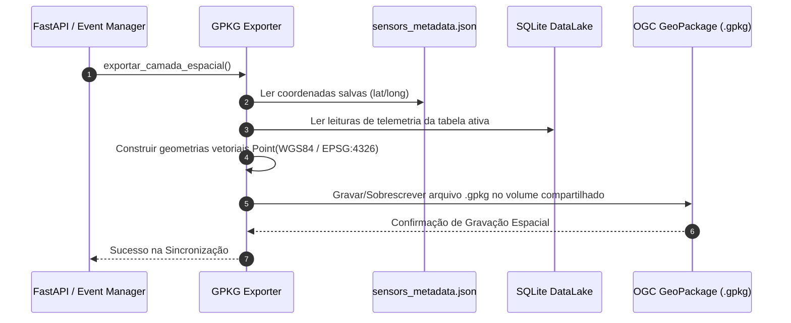

# 📦 Especificação Técnica: Exportador GeoPackage (`gpkg_exporter`)

## 1. 🎯 Resumo Executivo & Responsabilidade Única
O módulo **`gpkg_exporter`** é o componente de ponte geográfica do backend do Gêmeo Digital. Sua **responsabilidade única** é transformar tabelas alfanuméricas de telemetria do DataLake e metadados de coordenadas em uma camada espacial vetorial no padrão OGC **GeoPackage (`.gpkg`)**, garantindo que o QGIS Server possa ler e renderizar as feições geograficamente em tempo real.

---

## 2. 📊 Arquitetura Visual & Diagrama de Sequência (Mermaid)



---

## 3. 📋 Análise de Requisitos (RFs e RNFs com ID)

| ID | Tipo | Descrição do Requisito | Critério de Aceite |
| :--- | :--- | :--- | :--- |
| **RF-GPKG-01**| Funcional | Gerar arquivo espacial `.gpkg` com pontos georeferenciados. | Criar feições `Point` válidas com sistema de referência EPSG:4326 (WGS84). |
| **RF-GPKG-02**| Funcional | Associar leituras de sensores aos seus respectivos pontos. | Incluir atributos de temperatura, umidade e timestamp na tabela de atributos do GPKG. |
| **RNF-GPKG-01**| Desempenho| Regeneração atômica e rápida do GeoPackage. | Concluir a escrita da camada em menos de 300ms após atualização de coordenada. |
| **RNF-GPKG-02**| Integridade| Evitar lock de arquivo durante leitura concorrente pelo QGIS Server. | Utilizar escrita temporária e substituição atômica de arquivos. |

---

## 4. 🔑 Dicionário de Variáveis, Atributos & Tipagem de Dados

| Atributo / Variável | Tipo de Dado | Descrição & Escopo | Exemplo / Valor Padrão |
| :--- | :--- | :--- | :--- |
| `gpkg_path` | `str` | Caminho absoluto do arquivo GeoPackage exportado. | `/infra/dados/estacao_funcional.gpkg` |
| `geom` | `Geometry` | Objeto espacial vetorial representando o sensor no espaço. | `POINT(-38.5123 -12.9714)` |
| `crs` | `str` | Sistema de Referência de Coordenadas em formato EPSG. | `"EPSG:4326"` |
| `sensors_metadata`| `Dict` | Dicionário em memória com o mapeamento `sensor_id -> {lat, lon}`. | `{"SENSOR_01": {"lat": -12.9, "lon": -38.5}}` |

---

## 5. 🔄 Fluxo de Dados & Contratos de Interface (Public API)

### Método Principal: `export_to_geopackage(table_name: str) -> bool`
* **Entrada:** `table_name` (Nome da tabela ativa a ser exportada).
* **Saída:** `True` se o arquivo `.gpkg` foi atualizado com sucesso.
* **Comportamento:** Une os dados de séries temporais da tabela com o arquivo `sensors_metadata.json` e grava a camada vetorial no diretório compartilhado `/infra/dados/`.

```python
# Exemplo de Invocação no Backend
from qgis_bridge.table_manager import export_to_geopackage

success = export_to_geopackage("dados_temperatura_pelourinho")
```

---

## 6. 🛡️ Matriz de Resiliência, Casos de Borda & Tolerância a Falhas

| Caso de Borda / Falha potencial | Impacto no Sistema | Estratégia de Mitigação / Solução Aplicada |
| :--- | :--- | :--- |
| **Sensor cadastrado sem latitude ou longitude (`NULL`)** | Impossibilidade de criar a geometria de ponto GIS. | Ignorar o sensor na camada espacial e adicioná-lo à lista de `PENDING_SENSORS`. |
| **QGIS Server lendo o arquivo `.gpkg` no momento da escrita** | Erro de bloqueio de arquivo no Windows/Linux (`PermissionError`). | Gravar em um arquivo temporário `.gpkg.tmp` e renomear atomicamente. |
| **Coordenadas inválidas fora dos limites de Salvador/BA** | Ponto plotado fora da área de interesse do mapa. | Validação geográfica de limites (BBox check) antes de confirmar a gravação. |

---

## 7. 🧪 Estratégia de Testabilidade & Cobertura (QA)

* **Ferramenta:** Pytest integrado com biblioteca `fiona` / `geopandas` / `sqlite3`.
* **Cenários Cobertos:**
  1. Verificação da existência das tabelas espaciais OGC no banco GeoPackage gerado.
  2. Validação da contagem de pontos gerados em relação ao total de sensores georeferenciados.
  3. Teste de escrita atômica para garantir ausência de corrupção sob concorrência.
