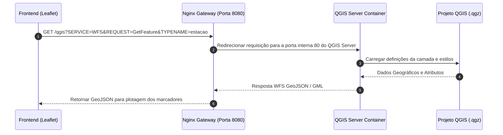

# 📦 Especificação Técnica: Servidor GIS Headless (`qgis_server`)

## 1. 🎯 Resumo Executivo & Responsabilidade Única
O módulo **`qgis_server`** é o motor de renderização cartográfica e publicação de serviços web geográficos (OGC). Sua **responsabilidade única** é executar uma instância headless de alta performance do QGIS Server dentro de um contêiner Docker, fornecendo endpoints padronizados para **WMS (Web Map Service)** para renderização de imagens e **WFS (Web Feature Service)** para disponibilização de dados vetoriais GeoJSON para o frontend.

---

## 2. 📊 Arquitetura Visual & Diagrama de Sequência (Mermaid)



---

## 3. 📋 Análise de Requisitos (RFs e RNFs com ID)

| ID | Tipo | Descrição do Requisito | Critério de Aceite |
| :--- | :--- | :--- | :--- |
| **RF-QGS-01** | Funcional | Responder a requisições WMS (GetMap, GetCapabilities). | Retornar tiles de imagem (PNG/JPEG) renderizados com os estilos do projeto. |
| **RF-QGS-02** | Funcional | Responder a requisições WFS (GetFeature) em formato GeoJSON. | Retornar feições vetoriais com geometria `Point` e atributos de telemetria. |
| **RNF-QGS-01**| Conformidade| Aderência estrita aos padrões OGC (Open Geospatial Consortium). | Suportar versões WMS 1.3.0 e WFS 1.1.0/2.0.0. |
| **RNF-QGS-02**| Desempenho| Tempo de resposta inferior a 200ms para requisições de feições vetoriais. | Otimização de renderização FCGI em ambiente Linux headless. |

---

## 4. 🔑 Dicionário de Variáveis, Atributos & Tipagem de Dados

| Atributo / Variável | Tipo de Dado | Descrição & Escopo | Exemplo / Valor Padrão |
| :--- | :--- | :--- | :--- |
| `QGIS_PROJECT_FILE` | `str` | Variável de ambiente com o caminho do projeto QGIS. | `/infra/dados/estacao_funcional.qgz` |
| `MAX_CACHE_LAYERS` | `int` | Quantidade máxima de camadas mantidas em memória cache. | `50` |
| `SERVICE` | `str` | Parâmetro HTTP OGC indicando o serviço solicitado. | `"WMS"` ou `"WFS"` |
| `REQUEST` | `str` | Operação OGC executada pelo servidor de mapas. | `"GetFeature"` ou `"GetMap"` |

---

## 5. 🔄 Fluxo de Dados & Contratos de Interface (Public API)

### Exemplo de Chamada de Interface WFS (GetFeature):

```http
GET /qgis?SERVICE=WFS&VERSION=1.1.0&REQUEST=GetFeature&TYPENAME=estacao_funcional&OUTPUTFORMAT=GeoJSON HTTP/1.1
Host: 137.131.211.210:8080
```

#### Resposta Esperada (GeoJSON):
```json
{
  "type": "FeatureCollection",
  "features": [
    {
      "type": "Feature",
      "geometry": { "type": "Point", "coordinates": [-38.5123, -12.9714] },
      "properties": { "sensor_id": "TEMP_PELO_01", "temperatura": 26.5 }
    }
  ]
}
```

---

## 6. 🛡️ Matriz de Resiliência, Casos de Borda & Tolerância a Falhas

| Caso de Borda / Falha potencial | Impacto no Sistema | Estratégia de Mitigação / Solução Aplicada |
| :--- | :--- | :--- |
| **Solicitação WFS com nome de camada inexistente (`TYPENAME` incorreto)** | Retorno de documento XML com aviso de exceção OGC (`ServiceException`). | Captura de exceção no frontend com fallback para a API REST. |
| **Sobrecarga de requisições WMS simultâneas em hardware limitado** | Alto consumo de CPU e lentidão de resposta. | Limitação de conexões paralelas no Nginx e cache de imagens estáticas. |
| **Reinício do contêiner do QGIS Server** | Queda temporária nos serviços de mapa. | Recuperação instantânea sem perda de estado, pois o projeto fica persistido em volume. |

---

## 7. 🧪 Estratégia de Testabilidade & Cobertura (QA)

* **Testes de Protocolo HTTP e OGC:** Executados via cURL ou ferramentas de teste API (Postman).
* **Cenários Cobertos:**
  1. Chamada de `GetCapabilities` para validar a disponibilidade do serviço WMS.
  2. Chamada de `GetFeature` com `OUTPUTFORMAT=GeoJSON` para validar a estrutura dos vetores.
  3. Validação da latência de resposta sob chamadas repetitivas.
