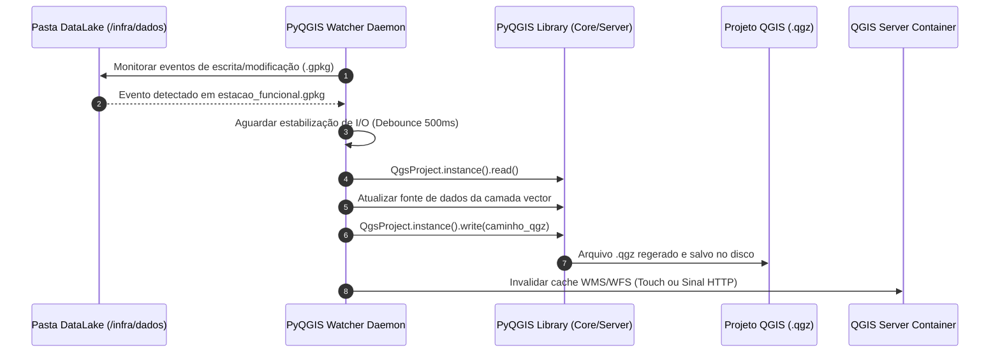

# 📦 Especificação Técnica: Watcher GIS Headless (`qgis_watcher_daemon`)

## 1. 🎯 Resumo Executivo & Responsabilidade Única
O módulo **`qgis_watcher_daemon`** é o serviço autônomo de monitoramento espacial e sincronização de projetos GIS (`watcher_headless.py`). Sua **responsabilidade única** é escutar continuamente o diretório do DataLake em busca de modificações nos arquivos GeoPackage (`.gpkg`), utilizar a biblioteca PyQGIS para regerar a estrutura interna do projeto de engenharia (`.qgz`) sem necessidade de interface gráfica e notificar a instância do QGIS Server para atualizar suas camadas WFS/WMS instantaneamente.

---

## 2. 📊 Arquitetura Visual & Diagrama de Sequência (Mermaid)



---

## 3. 📋 Análise de Requisitos (RFs e RNFs com ID)

| ID | Tipo | Descrição do Requisito | Critério de Aceite |
| :--- | :--- | :--- | :--- |
| **RF-WAT-01** | Funcional | Monitorar em tempo real alterações nos arquivos GeoPackage do DataLake.| Detectar modificações de arquivos em menos de 1 segundo utilizando `watchdog` ou polling ativo. |
| **RF-WAT-02** | Funcional | Regenerar o arquivo de projeto `.qgz` headless usando PyQGIS. | Atualizar as referências das camadas vetoriais sem corromper estilos ou simbologias pré-configuradas. |
| **RNF-WAT-01**| Autonomia | Execução em segundo plano como daemon em contêiner Docker. | Reiniciar automaticamente em caso de falha inesperada (`restart: always`). |
| **RNF-WAT-02**| Eficiência | Evitar múltiplas atualizações redundantes durante escritas contínuas. | Aplicar lógica de debounce/coalescência de eventos de sistema de arquivos. |

---

## 4. 🔑 Dicionário de Variáveis, Atributos & Tipagem de Dados

| Atributo / Variável | Tipo de Dado | Descrição & Escopo | Exemplo / Valor Padrão |
| :--- | :--- | :--- | :--- |
| `WATCH_DIR` | `str` | Diretório do DataLake compartilhado monitorado pelo daemon. | `/infra/dados` |
| `QGZ_PATH` | `str` | Caminho do arquivo de projeto QGIS consumido pelos servidores. | `/infra/dados/projeto_pelourinho.qgz` |
| `qgs_app` | `QgsApplication`| Instância da aplicação PyQGIS headless em memória. | `QgsApplication([], False)` |
| `debounce_delay` | `float` | Tempo de espera em segundos para confirmar a escrita do GPKG. | `0.5` |

---

## 5. 🔄 Fluxo de Dados & Contratos de Interface (Public API)

### Loop Principal de Execução (`watcher_headless.py`):

```python
# Estrutura do Loop Daemon
import time
from qgis.core import QgsApplication, QgsProject

def start_watcher():
    QgsApplication.setPrefixPath("/usr", True)
    qgs = QgsApplication([], False)
    qgs.initQgis()
    
    print("Watcher GIS iniciado e escutando /infra/dados...")
    # Loop de escuta e atualização do projeto .qgz
```

---

## 6. 🛡️ Matriz de Resiliência, Casos de Borda & Tolerância a Falhas

| Caso de Borda / Falha potencial | Impacto no Sistema | Estratégia de Mitigação / Solução Aplicada |
| :--- | :--- | :--- |
| **Tentativa de ler o arquivo `.gpkg` enquanto o backend ainda está gravando** | Erro de leitura no PyQGIS ou arquivo corrompido. | Algoritmo de retry com espera exponencial até que o tamanho do arquivo se estabilize. |
| **Ausência do arquivo de projeto inicial `.qgz`** | O Watcher não encontra o projeto base para atualizar. | Criação automática de um projeto `.qgz` padrão com extensão espacial de Salvador. |
| **Vazamento de memória no PyQGIS durante atualizações contínuas** | Aumento gradual de consumo de RAM no contêiner. | Chamada explícita a `QgsProject.instance().clear()` e coleta de lixo periódica do Python. |

---

## 7. 🧪 Estratégia de Testabilidade & Cobertura (QA)

* **Testes de Integração de Sistema:** Executados dentro do contêiner Docker `gd-qgis-watcher`.
* **Cenários Cobertos:**
  1. Simulação de alteração do arquivo `.gpkg` via script externo e verificação da alteração do timestamp do `.qgz`.
  2. Validação da correta inicialização da biblioteca PyQGIS em ambiente Linux Headless.
  3. Verificação da resiliência do daemon após múltiplos eventos simultâneos de escrita.
