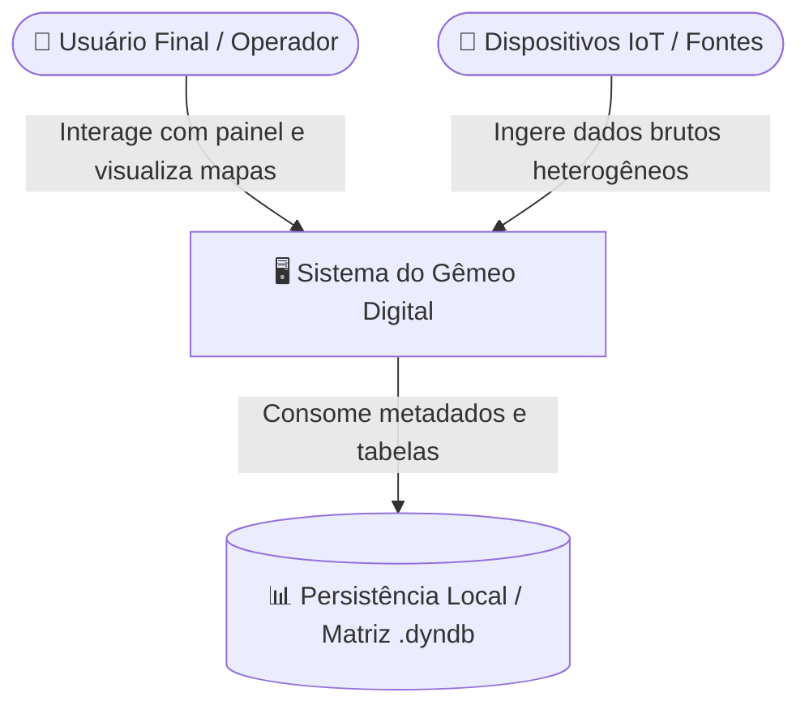

# Documentação Técnica de Arquitetura: Gêmeo Digital IoT

Este documento estabelece as diretrizes arquiteturais, a modelagem de contêineres e os fluxos de dados conceituais para a visualização geoespacial do Gêmeo Digital da UNIFACS, utilizando uma abordagem desacoplada baseada no **Modelo C4**.

---

## 1. Visão de Contexto (Modelo C4 - Nível 1)

A visão de contexto descreve a fronteira do sistema do Gêmeo Digital, ilustrando como o usuário final e as fontes de dados de entrada interagem com a aplicação de forma geral.



* **Usuário Final / Operador:** Interage exclusivamente com o painel no navegador web, emitindo requisições de controle e visualização.
* **Sistema do Gêmeo Digital:** O ecossistema de software que processa os dados, renderiza o mapa e serve a interface.
* **Fontes de Ingestão:** Arquivos estáticos (como Excel ou JSON) ou fluxos ativos (IoT real via MQTT/HTTP) que alimentam o banco de dados.

---

## 2. Visão de Contêineres (Modelo C4 - Nível 2)

A infraestrutura é modularizada usando contêineres **Docker** isolados que operam de forma assíncrona através de uma topologia em **Estrela (Hub-and-Spoke)**, orbitando o volume de dados compartilhado.

```mermaid
flowchart TD
    %% Nós de Entrada e Saída
    WebClient["🖥️ Frontend Web Container<br>(HTML5 / Vanilla CSS / Leaflet.js)"]
    
    %% Subgraph para Contêineres de Aplicação
    subgraph AppContainers ["🐳 Containers de Aplicação (Docker)"]
        API["⚡ API Backend / Adaptador<br>(FastAPI / Python)"]
        QGIS_Server["🗺️ Servidor de Mapas<br>(QGIS Server Headless)"]
    end
    
    %% Subgraph para Armazenamento / Volumes
    subgraph Storage ["💾 Datalake / Volumes Compartilhados"]
        DynDB[("📊 Matriz Dinâmica<br>(.dyndb)")]
        GPKG[("🌍 Cache Espacial GeoPackage<br>(.gpkg)")]
        StatusJSON[("📄 Telemetria Status<br>(status.json)")]
    end

    %% Fluxos de Comunicação
    WebClient -->|1. Requisição REST/JSON| API
    WebClient -->|4. Requisição WMS/WFS| QGIS_Server
    WebClient -->|6. Consulta API (Status HTTP)| API
    
    API -->|2. Lê dados| DynDB
    API -->|3. Atualiza cache| GPKG
    API -->|3b. Grava timestamp| StatusJSON
    API -->|7. Lê timestamp| StatusJSON
    
    QGIS_Server -->|5. Lê mapa cacheado| GPKG
```

---

## 3. Detalhamento Conceitual da Stack Tecnológica

Para fundamentar as decisões arquiteturais frente à banca e ao orientador, detalhamos abaixo a função e o papel de cada tecnologia no MVP:

### A. Docker (Ambiente de Contêineres)
* **O que é:** Uma tecnologia de virtualização a nível de sistema operacional que empacota o software em unidades padronizadas chamadas contêineres.
* **Por que usar:** Ele isola as dependências de cada componente. Se o QGIS Server sofrer uma sobrecarga ou cair, a API FastAPI e a interface web continuam rodando de forma independente. Isso atende perfeitamente à exigência de **modularidade granular extrema**.

### B. FastAPI + Python (Backend e Adaptador)
* **O que é:** Um framework web moderno, extremamente rápido e assíncrono para Python, projetado para construir APIs REST com alta performance.
* **Por que usar:** O Python possui as bibliotecas geoespaciais mais robustas do mercado (GDAL, Fiona, SpatiaLite). O FastAPI é leve e performático, consumindo pouquíssima RAM em comparação a frameworks tradicionais como Django, sendo ideal para rodar em clusters como o Kubernetes.

### C. QGIS Server Headless (Servidor de Mapas)
* **O que é:** Uma versão sem interface gráfica (headless) do QGIS Desktop que roda no servidor como um serviço web de mapas.
* **Por que usar:** Ele consome os mesmos arquivos de projeto (`.qgz`/`.qgs`) que o QGIS Desktop gera localmente, mas atua apenas como uma API geradora de imagens de mapa sob demanda (WMS) e dados vetoriais (WFS). Isso elimina a necessidade de rodar ambientes gráficos pesados de desktop via VNC dentro de clusters Kubernetes.

### D. Leaflet.js (Interface Frontend)
* **O que é:** A biblioteca JavaScript de código aberto mais popular e leve do mercado para exibição de mapas interativos em navegadores web.
* **Por que usar:** Diferente do OpenLayers (que é completo, porém pesado), o Leaflet é focado em performance mobile e web simples. Ele solicita e exibe os blocos de imagens PNG enviados pelo QGIS Server de maneira fluida, mantendo a interface leve para o usuário final.

### E. Matriz `.dyndb` (Persistência Principal do Gêmeo Digital)
* **O que é:** Uma estrutura de banco de dados não-relacional flexível do projeto, organizada em formato de matriz dinâmica para armazenar as medições e status dos sensores sem um esquema físico rígido.
* **Por que usar:** Representa o ponto de verdade atual dos dados do Gêmeo Digital, onde os dados brutos e IoT residem antes do processamento espacial.

### F. GeoPackage `.gpkg` (Cache Espacial Indexado)
* **O que é:** Um formato de arquivo aberto baseado em padrões da OGC, que armazena dados geoespaciais dentro de um contêiner **SQLite** binário e compacto.
* **Por que usar:** Ao contrário do GeoJSON (que é texto puro e pesado), o GeoPackage possui **indexação espacial R-Tree**. Isso significa que o QGIS Server consegue localizar e ler instantaneamente apenas os sensores que estão visíveis na tela atual do usuário, sem precisar carregar a tabela inteira do banco na RAM.

---

## 4. O Padrão "Adapter" e a Estratégia da "Caixa Postal"

O arquivo `.dyndb` armazena os dados brutos de sensores de forma puramente relacional. Como o QGIS Server não sabe ler este formato nativamente, o FastAPI assume a função de **Adapter (Adaptador / Tradutor)** e utiliza a estratégia da **"Caixa Postal"** para entregar as informações de forma eficiente:

* **Conceito da "Caixa Postal" (GeoPackage Compartilhado):** Em vez de fazer o QGIS Server consultar o FastAPI via requisição de rede interna a cada movimento de mapa (o que sobrecarregaria o servidor com requisições encadeadas e lentidão por parsing de JSON), o FastAPI atua de forma assíncrona. 
* **Fluxo Assíncrono:** A API do FastAPI lê as atualizações da matriz `.dyndb`, traduz as coordenadas e os dados e os grava ("deposita") no arquivo GeoPackage (`.gpkg`). O QGIS Server simplesmente vai até essa "caixa postal" local (no volume Docker compartilhado) sempre que precisa gerar o mapa para o usuário.
* **Isolamento de Banco:** Se no futuro a persistência em `.dyndb` for trocada por um banco robusto como PostgreSQL/PostGIS, apenas a lógica de leitura do FastAPI é ajustada. O QGIS Server e o Leaflet continuam lendo o `.gpkg` sem nenhuma alteração de código ou de configuração.

---

## 5. Garantia de Alta Performance e Concorrência (Prevenção de Locks no GeoPackage)

Como o GeoPackage (`.gpkg`) é baseado internamente em **SQLite** (um banco de dados em arquivo único local), ele poderia sofrer com problemas de concorrência e travamentos de arquivo (*File Lock*) sob atualizações simultâneas de tempo real. No entanto, o comportamento operacional e a telemetria do sistema foram projetados para mitigar esses cenários de forma simples e robusta no MVP:

### A. Sincronização Periódica Programada
* **Funcionamento:** Dado que as atualizações de coleta do Gêmeo Digital ocorrem em intervalos planejados de **30 a 60 minutos**, a concorrência por escrita contínua é eliminada.
* **Simplificação:** Em vez de manter lógicas complexas de buffers em memória RAM para múltiplos eventos IoT simultâneos, o FastAPI simplesmente roda uma rotina em lote agendada (ex: via *BackgroundTasks* ou agendador interno simples) que gasta poucos segundos a cada meia hora escrevendo os dados acumulados no `.gpkg`. Durante todo o restante do intervalo, o arquivo físico permanece 100% livre e disponível para a leitura direta e veloz do QGIS Server.

### B. Ativação do Modo WAL (Write-Ahead Logging) no GeoPackage
* **Funcionamento:** Mantido ativado por segurança e boas práticas de engenharia.
* **Mecanismo:** Garante que, mesmo no instante exato de poucos segundos em que a API realiza a sincronização a cada 30-60 minutos, as gravações ocorram em um log de apoio temporário (`-wal`). Isso impede que leituras simultâneas do QGIS Server para renderização de telas do Leaflet sejam bloqueadas ou gerem travamentos de banco.

### C. Telemetria de Sincronização Desacoplada (status.json)
* **Funcionamento:** Em sistemas assíncronos, se o integrador travar, o usuário final pode ficar visualizando dados defasados sem perceber. Para evitar isso com simplicidade e sem sobrecarga do banco de dados, implementa-se um arquivo de status.
* **Mecanismo:** Ao concluir a gravação de dados novos no `.gpkg`, o FastAPI salva um pequeno arquivo estático estruturado (`status.json`) na mesma pasta compartilhada do volume Docker:
  ```json
  {
    "ultima_atualizacao": "22/05/2026 20:00:00",
    "status": "sucesso"
  }
  ```
* **UX no Frontend:** O JavaScript da interface (Leaflet) realiza uma chamada de rede HTTP rápida ao endpoint do FastAPI (`/api/v1/status`). A API lê o arquivo de telemetria local e devolve o timestamp de sincronização. O frontend então exibe no canto do mapa uma mensagem informativa: *"Última atualização às 20:00"*. Se houver falha de rede ou de sincronização, o timestamp congelado alerta os operadores visualmente sobre a defasagem dos dados.

---

## 6. Fluxo de Dados de Ponta a Ponta

O processamento e exibição de dados seguem este fluxo de passos lógicos:

```
[Ingestão] ──(Gravação)──► [Matriz .dyndb]
                                │
                                ▼ (FastAPI inicia rotina a cada 30/60 min)
                       [FastAPI Adapter] ──(Modo WAL)
                                │
                     ┌──────────┴──────────┐
                     ▼ (Grava GPKG)        ▼ (Escreve Timestamp)
             [GeoPackage .gpkg]     [status.json]
                     │                     ▲
                     │                     │ (Consulta API HTTP / Leitura)
                     │              [FastAPI Adapter]
                     │                     ▲
                     │                     │ (Resposta JSON)
                     │              [Leaflet.js Frontend]
                     ▼ (Leitura Local)     ▲
             [QGIS Server WMS] ◄───────────┘ (Requisição GetMap)
```

1. **Ingestão:** O `DataIngestor` recebe novos dados (Excel/JSON/MQTT) e escreve na matriz `.dyndb` do Datalake.
2. **Atualização Otimizada:** O FastAPI aciona a rotina agendada (a cada 30-60 min), lê a matriz usando o `DynDBAdapter`, grava a tradução geoespacial via modo **WAL** no arquivo `.gpkg` e gera o `status.json`.
3. **Solicitação do Mapa:** O usuário interage com a tela. O Leaflet dispara uma requisição HTTP `GetMap` (WMS) para o contêiner do QGIS Server e, paralelamente, faz uma chamada de API ao FastAPI para consultar a data do `status.json` e atualizar o rodapé de telemetria do mapa.
4. **Renderização:** O QGIS Server lê localmente a região visível no GeoPackage indexado em disco, renderiza a imagem PNG e a devolve via rede.
5. **Visualização:** O Leaflet exibe a imagem do mapa atualizada e o carimbo de data no painel do usuário.

---

## 7. Dinamicidade e Auto-Introspecção (Zero-Code)

A dinamicidade de atributos do mapa no frontend é garantida via auto-introspecção em tempo de execução:
* **Autodescoberta:** Ao carregar a tela, o Leaflet faz uma chamada de metadados WFS ao QGIS Server para obter os atributos dos sensores.
* **Interface Dinâmica:** O JavaScript do navegador analisa as chaves de propriedades encontradas no JSON (ex: `['temperatura', 'umidade', 'co2']`) e monta os seletores e filtros na tela dinamicamente.
* **Zero Código Adicional:** Se um novo tipo de sensor ou coluna for inserido no `.dyndb` e sincronizado com o `.gpkg`, o painel web criará os novos botões e controles automaticamente, sem necessidade de reescrever código no frontend.
